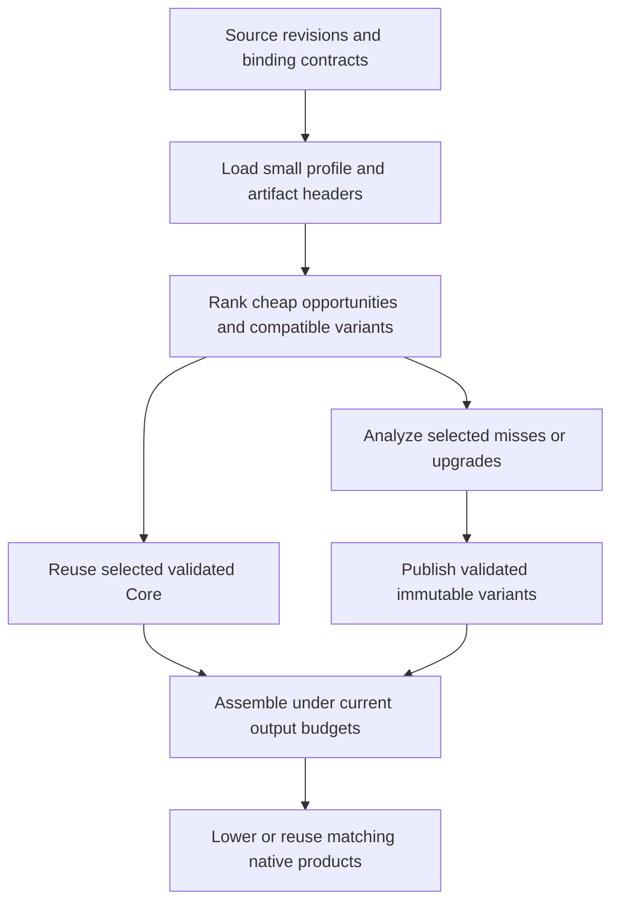

# PGO and persistent incremental optimization

This ADR is an append-only decision log. It covers profile-guided optimization
(PGO) in Core and reuse of optimized code across builds. Execution work is tracked
in [TODO.md](../../TODO.md#p2-source-closure-and-generated-code-profitability).

## D000 — 2026-09-22 — Log protocol and scope

**Status:** Adopted for this document. **Supersedes:** None.

Keep each record's date, ID, status, reasoning, and evidence unchanged after it is
committed. Append a new numbered record to accept, reject, correct, or supersede a
proposal; identify the affected record explicitly. The latest explicit decision
for a subject governs. Do not turn old proposals into accepted decisions by
editing their status. Future implementation findings belong in new records;
benchmark logs and generated artifacts remain outside tracked documentation.

The user requested VM-based PGO feeding our optimizer, reusable optimized functions
or modules, and a plan for spending additional optimization effort over time.
D001 onward propose the architecture; this ADR does not claim those features are
implemented. Creating the design does not start training, background optimization,
or a benchmark campaign.

## D001 — 2026-09-22 — Separate better decisions from reusable work

**Status:** Proposed. **Supersedes:** None.

PGO answers “where does this program execute?” Persistent optimization answers
“which compiler work can the next build reuse?” They share identities and artifact
infrastructure, but solve different problems. Meriyah can be valuable to cache
because it is unchanged across many builds, even when parser execution is a small
part of a particular application's runtime.

Current foundations, inspected at `d5861001`:

| Existing mechanism                                                              | What it already avoids                                                            | Missing capability                                                    |
| ------------------------------------------------------------------------------- | --------------------------------------------------------------------------------- | --------------------------------------------------------------------- |
| [Frontend artifacts](../../src/build-frontend-cache.ts)                         | An exact whole-program hit skips graph construction, Core, and lowering           | Reusing an unchanged library after an application edit                |
| [Dependency fragments](../../src/dependency-fragment-cache.ts)                  | Reuses development-mode dependency images; groups overlapping dependency closures | Full-optimization Core artifacts for the ordinary production pipeline |
| [Core analysis manager](../../src/compiler/core/core-analysis-manager.ts)       | Reuses results against mutation versions inside a compilation                     | Persistent identities, dependencies, and serialization across builds  |
| [Compiler artifact codec](../../src/compiler/target/compiler-artifact-codec.ts) | Restores lowered `ProgramImage` and native plans                                  | Restoring Core that can receive further optimization                  |
| [Generated-object cache](../../src/local-build.ts)                              | Reuses matching C objects                                                         | Skipping Core and emission before an object lookup                    |
| [VM profiling](../../runtime/src/profile.c)                                     | Counts execution and diagnostic events                                            | A small training format consumed by Core scheduling                   |

Build one persistent Core artifact model with optional lowered/native products,
rather than another independent compiler pipeline. Keep existing whole-image and
object hits as fast paths. Reuse valid expensive results before resolving optional
proofs, and optimize only selected misses or explicitly selected upgrades.

An “ultra optimized” artifact is a candidate with recorded costs and assumptions,
not a promise that more compiler work made it faster. Runtime, build time, code
size, and storage remain separate measurements.

## D002 — 2026-09-22 — Stable origins, exact revisions, separate validity

**Status:** Proposed. **Supersedes:** None.

Assign identities before optimization, using the frontend's coherent source
snapshot. Compilation-local function, value, instruction, and constant indexes
remain cheap integers; persistent identities map to those indexes on import.

| Identity          | Proposed contents and purpose                                                                                                                           |
| ----------------- | ------------------------------------------------------------------------------------------------------------------------------------------------------- |
| Module key        | Resolved package/workspace identity, module-relative path, module goal, and relevant resolution conditions; independent of the checkout's absolute path |
| Function key      | Module key and lexical declaration path, including a local disambiguator for anonymous or repeated declarations                                         |
| Function revision | Body, parameters, strictness, lexical binding/capture structure, and source interpretation identity                                                     |
| Site key          | Function key/revision plus a local preoptimization call-site ID; not an optimized instruction ordinal or line number                                    |
| Artifact validity | Input revision, producer/schema, semantic policy, binding contract, and every external assumption consumed                                              |
| Variant identity  | Validity manifest, optimization recipe, consumed profile slice, and resulting content digests                                                           |

V1 matches exact function revisions. An insertion outside a function should not
invalidate that function merely by shifting source lines or global function IDs.
Ambiguous lexical matching is a miss. Edits inside a function may invalidate all
its site counts initially; fuzzy matching is deferred. Normalize identifiers for
storage, not observable filesystem/module-resolution behavior. Identical package
contents may share code, while distinct resolved module instances retain separate
bindings, state, and initialization.

Keep origin and optimized-instance identity separate. An inlined clone retains its
source origin and records its caller/clone provenance. Aggregated origin counts
must not be counted once per emitted instruction. New synthetic operations have
unknown frequency unless a defined derivation is available.

Today's [profile metadata](../../src/compiler/target/profile-metadata.ts) derives
origins after lowering from source text, operation kind, and occurrence order.
Those diagnostic origins cannot serve as the new validity contract.

Profile compatibility is weaker than optimized-code validity. A graph digest
belongs in capture provenance, but must not invalidate every unchanged function's
profile after one application edit. A profile mismatch loses a scheduling hint;
an assumption mismatch prevents reuse of the affected optimized variant.

## D003 — 2026-09-22 — Minimal VM training and explicit profile consumption

**Status:** Proposed. **Supersedes:** None.

The first training mode records function entries and original call attempts. It
uses VM hooks, but does not enable the existing twelve-category diagnostic
counter allocation for every instruction. It records no receiver values, type or
target histograms, object identities, branch probabilities, or allocation traces.
Add such data only with an identified optimizer consumer.

Define counter semantics before implementing hooks:

- Count an invocation after callee/argument evaluation, including spread iteration,
  succeeds and immediately before dispatch. Include ordinary calls, construction,
  `super`, and tagged-template invocation. A failed dispatch still counts; an
  argument-evaluation throw or optional-call short circuit does not.
- Count function entry on invocation before parameter initialization can throw,
  including entry through native builtins or host callbacks. Generator and async
  invocation counts once; resumes do not count again. This measures invocation
  exposure, not generator-body execution: the parameter prologue can run even
  when the resulting generator is never resumed.
- V1 training disables optional call expansion and preserves explicit origin
  events across required lowering. Counter anchors cannot disappear through
  folding, cloning, or dead-code cleanup while their original event can execute.
  Keep training-only event semantics out of production optimization.
- Use dense bounded counter arrays and unsigned 64-bit counts. Overflow saturates
  and is reported, rather than wrapping. The manifest maps slots to stable keys.

A capture contains schema and counter-semantics versions, a unique run ID,
producer/image identity, semantic configuration, module/function revisions, site
coverage, workload group, counts, and completion/overflow information. Publish a
complete manifest only after its counter payload and checksum are available.
Record incomplete captures distinctly; V1 merge rejects them.

The user explicitly selects training inputs and merges captures into an immutable
profile. Merge deduplicates run IDs, retains provenance, and applies recorded
workload weights. Equal run weights are the initial policy; longer runs naturally
contain more events. Do not normalize by VM elapsed time or silently append every
capture found in a cache directory. Later normalization by completed work units
requires an explicit workload contract and a new decision.

Profile use reports matched, unmatched, ambiguous, uninstrumented, and observed-zero
sites separately. A missing count is never zero. A completed run's zero means
“not observed in this workload,” never “unreachable” or “safe to remove.” Training
and consumption require compatible semantic configuration, including primordial,
realm, eval, and host-surface policy.

VM counts describe exposure, not native costs. They cannot determine register
pressure, instruction-cache behavior, allocation savings, or native guard cost.
Workloads sensitive to timing, I/O, or concurrency also need holdout evidence.

## D004 — 2026-09-22 — Consult heat before expensive analysis

**Status:** Proposed. **Supersedes:** None.

Use measured call exposure in the cross-call profitability score, and use function
exposure to order cheap specialization opportunities before proof resolution.
The integration seam already exists before `opportunity.resolve()` in
[region selection](../../src/compiler/core/core-ir-region-selection.ts).

The intended flow is:



V1 heat improves ordering, not eligibility or proof strength. Estimated saved work
still subtracts retained guards and materialization costs. Without hit/miss data,
an open target has no measured success probability; keep conservative static
confidence rules. Do not multiply a measured site count by loop depth again.

Do not compare raw observed counts with arbitrary static weights as if both were
measurements. Rank matched sites on a common weighted-workload scale, and keep a
bounded, explicit allowance for unknown sites using static ordering. Its share is
a policy input to calibrate, not a hidden fallback that forces analysis everywhere.
Function-entry counts can support cheap estimates for uncounted operations, but
must not make every sibling region as hot as the function's busiest call or imply
that a generator body executed. Without body-specific observations, generator
regions retain static/unknown scheduling rather than inheriting creation counts.

Preserve lazy discovery when comparing opportunities across functions. A bounded
lookahead can prevent one admitted function from spending the budget on all its
weak siblings before another function is considered. Do not eagerly prove every
candidate to obtain an exact global ordering.

Report why each selected or skipped family received work: measured exposure,
static fallback, cached variant, exhausted work budget, incompatible assumptions,
or output-growth limit. Keep these summaries cheap; detailed per-site diagnostics
remain opt-in. Mandatory lowering and correctness checks do not depend on heat.

## D005 — 2026-09-22 — Reusable module contracts with function variants inside

**Status:** Proposed. **Supersedes:** None.

Start with a module artifact that owns initialization, imports/exports, lexical
cells, and shared data. Group initialization cycles or inseparable shared state
when required. Store function bodies separately inside that container so one
changed or upgraded function does not require rewriting a giant package blob.
The same mechanism applies to application modules and third-party packages.

Distinguish module initialization cycles from call-graph strongly connected
components (SCCs). Recursive call summaries converge together and publish
consistently, but need not force all parser functions into one permanently
indivisible artifact. A function is independently reusable only under its enclosing
module/capture contract. Never cache runtime module instances, mutable parser
state, closures, or heap objects as compiler artifacts.

Maintain two forms under one manifest model:

1. **Conservative reusable code.** Exports admit arbitrary valid callers and
   arguments; outside writes, escapes, and calls have declared conservative
   contracts. Optimize internal code under explicit language/world policy.
2. **Application-specific variants.** Narrow parameters, inline external bodies,
   remove adapters, or fold external values only with recorded dependencies on the
   particular facts that authorize those changes. Retain a conservative baseline.

This is an explicit new boundary. Current “local” passes are not automatically
context-independent: [optimizeCore](../../src/compiler/core/optimize.ts) specializes
platform constants, uses compilation facts, and prunes module/platform state.
Do not serialize an arbitrary intermediate Core object and label it reusable.

The initial persistent format stores canonical Core, symbols and relocation
tables, module contracts, typed summaries, and completed optimized variants.
Optional proven recipe payloads may be reused only when their proof contract is
portable and validated; initially, unsupported recipe families are rediscovered
on demand. Full global reachability and final plan selection remain assembly work.
Importing cached bodies must not silently run the whole local optimizer over them
again; only changed inputs or selected further work should wake those passes.

Program-global function IDs, slots, captures, strings, templates, source positions,
fact references, and specialized-entry references all need explicit relocation.
The current [attribute relocation metadata](../../src/compiler/core/core-ir.ts)
handles local IDs and is insufficient for this format. Opaque fact payloads need
typed serialization contracts. Register allocation, transient analysis handles,
mutable editor state, and solver queues are not persisted as Core artifacts.

Load small manifests and summaries first. Decode only selected bodies and required
initializers. Memoize dependency validation within a build; do not recursively
deserialize every dependency to prove a cache hit. Recompute volatile memory and
provenance analysis only for newly requested proofs. Persisting complete memory
graphs is deferred unless measurements show that loading and validating them is
cheaper than their demand-driven reconstruction.

## D006 — 2026-09-22 — Record what an optimization depended on

**Status:** Proposed. **Supersedes:** None.

An optimized function can stop mentioning the very code that made its optimization
legal. Record dependencies when a transform consumes facts, rather than trying to
recover them afterward from the optimized body.

| Change                              | Dependency retained with the variant                                                   |
| ----------------------------------- | -------------------------------------------------------------------------------------- |
| Inline a function                   | Imported body revision and its binding/environment contract                            |
| Fold a call or narrow its effects   | Consumed summary content and relevant target-set contract                              |
| Narrow a parameter from its callers | Incoming-call completeness, escape/reachability, and argument facts                    |
| Fold a global or captured value     | Binding identity, value, initializer/write-set proof, and capture layout               |
| Remove a primordial guard           | Relevant primordial/realm policy and intrinsic catalog contract                        |
| Specialize a guarded operation      | Guard, fallback, materialization requirements, and consumed static facts               |
| Omit generic code or an initializer | Current assembly's reachability/closure proof; never infer this from a package profile |

Separate baseline input, assumptions, and optimization policy/profile identity.
Use content fingerprints of consumed summaries: if a dependency changes but the
summary a caller used is identical, that caller can remain valid. An inlined caller
still depends on the imported body even when the public summary is unchanged.
Maintain reverse dependency indexes for targeted invalidation.

Start conservatively. Until fact-dependency recording is complete for a transform,
its application-specific variant depends on the full relevant compilation context
or is ineligible for cross-build reuse. A successful structural verifier does not
prove that an external assumption still holds. Validate both.

Producer/schema identity is mandatory. Existing
[producer fingerprints](../../src/compiler-cache-identity.ts) safely include
transitive compiler code. Initially an optimizer implementation change can invalidate
optimized Meriyah too, even if Meriyah's source is unchanged. Distinguish the
compiler producing an artifact from the compiler source being compiled as input.
Do not promise reuse across arbitrary compiler revisions or ignore bug fixes to
improve hit rates. Later stage-specific producer cones can preserve constructed
Core across optimizer-only changes without inventing a legacy compatibility layer.

Profile identity records only the slice and policy actually consumed by a variant.
An unrelated new training capture should not force regeneration of every body.
Changed profile guidance may make a variant less useful without making its code
incorrect; its static assumptions still determine semantic validity.

## D007 — 2026-09-22 — Progressive optimization produces immutable alternatives

**Status:** Proposed. **Supersedes:** None.

Keep a canonical baseline and publish immutable successors at completed, verified
phase boundaries. A later build can reuse a compatible successor and spend spare
work budget on additional eligible transformations. If dependencies or ordering
requirements changed, restart that work from the baseline. Never repeatedly narrow
the only stored body and assume earlier decisions can be undone.

The first upgrade implementation reruns a selected module/function family from
canonical Core with a stronger recipe. Actual continuation is a later step: record
completed phase/recipe identity, persistent input revisions and consumed-assumption
fingerprints, cumulative growth, and coarse unfinished opportunities. Process-local
Core mutation counters cannot validate a saved checkpoint. Resume only passes whose preconditions admit the stored
checkpoint. Do not persist a JavaScript closure, `CoreAnalysisManager`, active edit,
or arbitrary midpoint of a fixed-point solver.

Budget exhaustion leaves valid code and explicitly unfinished work. Distinguish
not attempted, budget-limited, disproved, unsupported, and currently unprofitable.
Negative results depend on inputs and policy; “not enough budget last time” must
not become “never try again.” Count only completed atomic transformations when
publishing a checkpoint. Wall-clock cancellation can stop at a safe boundary;
deterministic work units govern reproducible selection.

Use two ledgers:

- **Fresh compiler work:** charge lookup, validation, decoding, and analysis actually
  performed now. Do not charge a hit for the analysis that produced it previously.
- **Selected output cost:** charge cached and fresh expansions equally, including
  fallbacks, code/data growth, and selected ABI siblings. Reuse cannot bypass the
  current program's output budget. Cumulative variants record total growth from
  baseline, not just the latest upgrade's delta.

A higher-budget variant need not dominate a compact one. Retain a bounded set of
useful alternatives with assumptions, code size, construction cost, and native
results on named workloads. Selection chooses one compatible body per required
variant contract, accounting for shared code once. Limit variant count and bytes;
never grow the cache with every budget value or profile run. “More transforms” is
not a promotion criterion.

An explicit bounded improvement operation selects a module/function family and
produces a candidate variant. Defaults do not start a daemon or consume idle laptop
time. Automatic background work, if wanted later, needs a separate resource and
scheduling decision. Extending optimization may amortize across future executions
and future builds, but those benefits must be measured separately.

## D008 — 2026-09-22 — Reproducible selection and native reuse

**Status:** Proposed. **Supersedes:** None.

Use the existing content-addressed artifact store, leases, atomic publication, and
bounded pruning infrastructure. Add typed artifact families, not a parallel global
cache. A mutable index may advertise available variants; it cannot mutate code an
active build has selected. Validate imports before exposing them to optimization.
Corrupt or incompatible entries are misses with a reason.

At build start, pin profile/policy/input recipes and a snapshot of available
immutable variants. Newly selected misses or upgrades publish validated artifacts
before the resolved manifest records their output digests. Finalize that manifest
before publishing the product, and include it in final build identity. Reproducible
builds consume a supplied resolved manifest and forbid replacement or upgrades;
exploratory builds may resolve a new one and must report it. Cache warmth alone
must not silently change a pinned build's output.
A pinned evicted artifact is rebuilt with the recorded deterministic recipe and
checked against its digest, or reported unavailable; do not silently substitute a
different “best available” variant. A wall-clock-limited exploratory upgrade is
reproducible through its pinned result, not through repeating the same time limit.

Core reuse and native-object reuse are separate milestones. Current C symbols and
references contain global numeric indexes. Even an unchanged Core body can emit
different C after an application inserts a function or constant. Existing object
keys correctly include C bytes, headers, flags, target, and toolchain; weakening
those keys would be incorrect.

Introduce stable module-local symbols and explicit code/data binding at assembly
to preserve reusable C/object bytes. Existing relocatable overlays are a seam to
study, not a general module ABI already available. Keep generic call adapters and
module instantiation semantics. Compare indirection/adapter cost against rebuild
savings; do not impose a per-operation lookup table without measuring its runtime
cost. A changed caller may still request a separately keyed cross-boundary inline.
Backend-specific products additionally validate runtime ABI, feature set, toolchain,
target, lowering policy, and instrumentation identity.

First avoid repeated Core work; then demonstrate stable emission and object hits.
Caching Core alone does not promise that native compilation or linking disappears.

## D009 — 2026-09-22 — Meriyah pilot and plan of attack

**Status:** Proposed. **Supersedes:** None.

The Meriyah pilot uses resolved source contents and dependencies, not merely the
package name/version. Train on representative parsing plus a full compiler input,
with a different syntax/error corpus held back. Preserve its exports, initializer,
internal parser state, callbacks, and error behavior under the module contract.
Apply the same machinery to a stable group of our own compiler modules afterward;
there must be no Meriyah-specific optimizer branch.

The desired edit cycle is concrete:

1. Build Meriyah's conservative reusable Core once; create and measure an optimized
   variant under a declared world policy.
2. Change application code. Match Meriyah's manifest, validate only its relevant
   dependencies, import the selected artifact, and skip its original Core
   construction/optimization. Resolve current application bindings and budgets.
3. Spend this build's optional work on changed or newly hot application code.
   Unchanged Meriyah may receive an explicitly selected upgrade, but is not forced
   back through every pass just because the global budget reset.
4. Change an imported fact used by Meriyah, its own contents, or its producer
   contract. Invalidate the affected variants; use the conservative alternative or
   rebuild. A changed profile can select a different valid variant.
5. After stable native binding exists, the application edit also reuses Meriyah's
   C/object products. Before then, report Core savings and remaining backend work
   separately.

Implement in reviewable stages. PGO and reusable Core share the identity foundation
but can be developed independently after it; neither requires a resumable solver.

| Stage                           | Deliverable                                                                                              | Exit evidence before expanding scope                                                                                       |
| ------------------------------- | -------------------------------------------------------------------------------------------------------- | -------------------------------------------------------------------------------------------------------------------------- |
| 0. Identity/contracts           | Stable module/function/site origins; explicit reusable-boundary policy and cache dependency taxonomy     | Unrelated function insertion preserves keys; changed capture or resolution contract does not                               |
| 1. VM training                  | Small counter format, exact attribution, atomic captures, deterministic explicit merge                   | Known entry/call counts; throws, callbacks, generators/async, partial files, overflow and duplicate runs covered           |
| 2. Core PGO use                 | Profile-weighted cross-call ordering and heat before lazy discovery                                      | Tight-budget selection follows measured exposure; unknown/zero stay distinct; expensive skipped proof work decreases       |
| 3. Persistent Core pilot        | Portable canonical and completed optimized module artifacts; relocation and conservative boundary checks | Small module round-trips into a differently numbered program; cold/warm outputs agree; invalid assumptions cause misses    |
| 4. Meriyah and own-module reuse | On-demand summary/body import, dependency invalidation, current-budget admission                         | Application-only edits avoid dependency Core work; module initialization and closure semantics remain correct              |
| 5. Native artifact stability    | Stable code/data interfaces and cacheable C/object products                                              | Insert early functions/constants without rebuilding unchanged library objects; measure call/adapter overhead               |
| 6. Bounded upgrades             | Explicit upgrade selection, immutable variants, evidence-based promotion, pinned manifests               | Reuse upgrades across builds; enforce cumulative output/storage budgets; interrupted publication preserves prior artifacts |
| 7. Incremental continuation     | Resume supported optimization families at verified phase boundaries                                      | A second work grant advances unfinished work without replaying completed analysis or retaining stale assumptions           |

Do not combine every stage into one compiler rewrite. At stage 4, useful persistent
reuse must already work even if stages 5–7 prove unnecessary or too costly.

## D010 — 2026-09-22 — Measure the right economics and preserve counterexamples

**Status:** Proposed. **Supersedes:** None.

The benefit of an upgrade is future runtime saved plus future rebuild work avoided,
less upgrade cost and recurring lookup/validation/load overhead. Include C
compilation, storage, and peak memory. This is an accounting model for experiments,
not another expensive optimizer analysis or a license to assume future reuse.
Report the number of uses/builds needed to recover the measured upgrade cost.

Separate the effects with a static/PGO × reuse-disabled/reuse-enabled comparison.
Also compare cached baseline-quality code with cached upgraded code. Hold producer,
input, budgets, configuration, and toolchain fixed. Cold and warm behavior are
different results; a cache hit is not evidence that PGO generated faster code.

| Experiment                           | Required observations and counterexamples                                                                                                   |
| ------------------------------------ | ------------------------------------------------------------------------------------------------------------------------------------------- |
| Exact repeat / application-only edit | End-to-end time, cache validation/load bytes, avoided Core work, emission/object/link time; include an early inserted function/constant     |
| Dependency edit                      | Same version string but changed contents; changed body with unchanged summary; unchanged body with changed capture/import facts             |
| World/producer changes               | Locked to mutable primordials, eval/realm/host policy, compiler implementation, Core schema, runtime ABI, target/toolchain                  |
| Profile changes                      | Unmatched and zero sites, different caller distribution, repeated/partial captures, cold error paths, unseen dynamic targets                |
| Selected upgrade                     | Native runtime on training and holdout inputs, startup, code/data size, compilation cost, RSS, cache bytes and amortization                 |
| Shared state                         | ESM cycles/live bindings, CommonJS initialization, duplicate package instances, callbacks, exceptions, async/generator resume and GC stress |
| Publication/reproduction             | Interrupted/concurrent writers, corrupt payloads, pinned artifact eviction, cache disabled/read-only, consistent resolved manifests         |

Warm reuse must skip the claimed Core work, not merely move it into dependency
validation. Small and one-shot programs must remain able to decline persistence
when hashing, loading, and verification cost more than recomputation. Native speed
acceptance needs repeated matched runs on holdouts; one diagnostic run establishes
feasibility only. Full standards/gate campaigns follow the existing authorization
and [testing policy](../testing.md), not this document's creation.

Related primary designs inform, but do not establish, these Maligator decisions:
[ThinLTO](https://clang.llvm.org/docs/ThinLTO.html) uses compact summaries before
selective cross-module optimization and supports backend caching.
[Rust's incremental compiler design](https://rustc-dev-guide.rust-lang.org/queries/incremental-compilation-in-detail.html)
explains stable IDs, dependency fingerprints, and the cost of computing them.
[Clang's PGO workflow](https://clang.llvm.org/docs/UsersManual.html#profile-guided-optimization)
separates training, profile merging, and later compilation. We reuse those general
lessons while defining JavaScript binding, module, and proof contracts explicitly.

## D011 — 2026-09-22 — Decisions intentionally left open

**Status:** Open. **Supersedes:** None.

Resolve these through the stages above and append the resulting decisions:

- The unknown-code allowance and workload weighting defaults; do not calibrate
  exclusively on self-compilation.
- The smallest portable fact/recipe families and conservative boundary policy;
  which additional context can be fingerprinted without reading every body.
- The module-native binding ABI and whether its indirection cost is acceptable.
- Artifact variant/byte limits and promotion criteria across runtime, startup,
  code size, and build cost; no universal “highest optimization level wins.”
- Which transformation families can actually resume safely from a checkpoint,
  versus cheaply restarting selected work from canonical Core.
- Final CLI/configuration names and whether background upgrades are desirable.
  Initial operations are explicit; there is no automatic worker in this proposal.

## D012 — 2026-09-22 — First function-origin checkpoint

**Status:** Accepted and implemented for diagnostic profile publication.
**Refines:** The function-origin portion of D002 and stage 0 in D009.
**Supersedes:** None; original call-site identities and reusable-code contracts
remain proposed.

Capture function origins after module linking and before Core construction mutates
the frontend. Carry immutable source snapshots, declaration paths, effective
strictness, function kind, and symbolic external-binding owners through Core.
The escaped metadata must not retain mutable AST, scope, or binding objects.
Renumbering functions and creating optimized instances preserve the source origin.

Separate a declaration's origin from its revision. The origin identifies the
resolved module and named lexical declaration path. The revision also includes
the exact function source, parsing context, and referenced external-binding
descriptors. Moving a captured variable to another owner or retargeting a named
ESM import changes the revision, even when the reader's text stays unchanged.
Changing the imported implementation alone need not change the reader's revision:
this is a source-profile identity, **not a certificate that cached proofs remain
valid**. Persistent Core still needs the producer and consumed-dependency contracts
specified in D005–D007.

Collection is opt-in through the existing profile compilation path. Ordinary
compilation neither traverses the source for origins nor hashes function bodies.
Profile compilation captures descriptors before they can be lost, but defers body
hashing until the sidecar is published. Only functions present in the runtime image
are hashed, once per shared source record. A module's immutable source string is
shared by its functions. This deliberately accepts source retention and a frontend
scan during profiling; it does not claim the training build's overhead is measured
or that overlapping nested bodies are each hashed only once.

The existing profile sidecar now uses schema 4 and binds function identities into
its capture checksum. Runtime function indices remain indices into that exact
build's table. Published identities distinguish:

- **Known:** one runtime function represents a mapped source origin.
- **Shared:** several runtime functions represent the same source origin; this
  does not provide separate original events or a unique cross-build instance match.
- **Ambiguous:** source declarations collide; surviving optimization does not
  retroactively make the source identity unique.
- **Unknown:** no supported source identity is available, with an explicit reason.

The report includes coverage for each state. Raw sampling/counter formats and
MALW/MALC payloads are unchanged; source snapshots stay out of runtime artifacts.
Existing diagnostic site identities remain heuristic post-optimization anchors.
They must not be reinterpreted as original PGO call sites.

Portable identities require an explicit map from physical files to unique resolved
module keys. Duplicate or empty keys fail instead of merging package instances.
The fallback uses physical paths and is labeled checkout-bound. A function with
any external binding owned by a checkout-bound module is also checkout-bound.
Automatic package/lockfile resolution keys and a public CLI surface remain open.

For this checkpoint, anonymous owners, class contexts, synthetic functions, dynamic
scope, and unresolved namespace/CommonJS import owners remain explicitly unknown.
Named declarations under duplicate owners are ambiguous. Non-function block scope
descriptors include a relative source offset, which can cause conservative misses
after unrelated edits within an enclosing function. These coverage limits are
preferable to inventing a match and must be visible when evaluating training input.

Focused acceptance covers unrelated insertion with runtime renumbering, body and
capture changes, named import retargeting, portable module keys, duplicate and
unknown cases, shared instances, UTF-16 source spans, immutable snapshots, and the
ordinary-build opt-out. It also checks that changing a function identity invalidates
the capture checksum and that metadata-only Core edits reach publication. These are
identity and diagnostic integration checks, not native PGO performance acceptance.

Next, add stable original call-site records and complete the resolution/context
descriptors needed by the selected training workloads. Then introduce the small VM
entry/call-attempt capture from D003, keeping original events distinct from
optimized instances. Only after attribution tests pass should Core use those
counts to rank work. Persistent Core reuse can develop against the same identity
foundation, but admission and proof validity remain separate requirements.

## D013 — 2026-09-22 — Original call-site identity and coverage

**Status:** Accepted and implemented for source capture and diagnostic publication.
**Refines:** D002 and D012. **Supersedes:** None.

Capture invocation sites in the same pre-lowering traversal as function origins.
A call key combines the original owner's exact identity/revision with function-local
UTF-16 offsets and invocation kind. Compilation-wide numeric references connect
Core calls to this table; clones must retain the original reference rather than
reinterpret a local ordinal against their new containing function. Source-call
references are stripped before runtime lowering.

Record ordinary/optional calls, construction, `super`, and tagged-template calls.
Compiler-generated iterator, initializer, and loader helper calls do not acquire a
source call identity. Retain explicit lowering coverage: direct eval and static
CommonJS require currently lack a general ordinary-call anchor. Top-level and
unsupported lexical owners remain unknown instead of inheriting a generated
wrapper's identity. These limits constrain profile coverage, not program behavior.

The diagnostic sidecar advances to schema 5 and includes original-call records in
its capture checksum. It does not claim execution counts for these records. Stable
keys survive unrelated insertion; changing the owning function invalidates its
call keys. VM training must add independent event anchors after argument/spread
completion, preserve those anchors through lowering, and report uninstrumented
sites separately from observed zero.

## D014 — 2026-09-22 — VM training capture and explicit merge

**Status:** Implemented; focused VM and format checks passed. **Refines:** D003.
**Supersedes:** None.

Training uses a separate `MAL_PGO` runtime feature and an interpreter image. It does
not enable the diagnostic sampler, allocation histograms, or compiler timers.
Optional Core transforms and frontend self-tail-call rewriting are disabled in
training. A fresh frame increments function entry before JavaScript parameter
initialization; generator/async resumes do not increment entry again. Original
invocation markers execute after argument and spread evaluation. An invalid callee
still records an attempt; an argument throw or optional-chain short circuit does
not. Hidden spread arrays define own properties so inherited setters cannot change
training behavior.

Counters are bounded unsigned 64-bit integers, with saturating arithmetic and an
explicit overflow flag. Raw schema/semantics version 1 contains dense function and
source-site arrays plus a capture identity. Actual emitted markers determine which
sites are instrumented. Uninstrumented, unknown-owner, and observed-zero sites are
separate coverage states. Wire schema advances to 59 for the training-only marker.
Runtime function IDs remain local to the capture; source identities own merging.

A run starts with an incomplete manifest. Only successful process completion plus
validated atomic raw publication produces a complete manifest. Normal fast exits
flush explicitly, independently of optional VM teardown. Unsupported runtime image
changes or nested VM execution invalidate the capture. Dynamic-code coverage is
not inferred from existing IDs.

Use explicit commands:

```sh
node ./src/index.ts run app.mjs --pgo-train --pgo-workload representative -- input.json
node ./src/index.ts pgo merge .cache/pgo/runs/<run-id> --out .cache/pgo/selected.json
node ./src/index.ts build app.mjs --production --pgo-use .cache/pgo/selected.json
```

Merge reads only the supplied complete captures, checks raw/map identities and
checksums, deduplicates run IDs, rejects conflicting duplicates, and orders inputs
deterministically. Counts sum with equal per-run weight and saturation. Merged
profiles are immutable: publishing the same content is idempotent; a different
profile requires another path. Training and diagnostic profiling, training and
profile use, and training deployment/wire-only artifacts are mutually exclusive.
`build --pgo-train` emits a training binary and `.pgo.json` map; `run --pgo-train`
owns the complete capture lifecycle.

Focused native coverage includes callbacks, default-parameter throws, failed
calls, throwing spread iterators, optional calls, recursion, generator creation and
resumption, async continuation, constructors, super, tagged templates, and mutable
array-prototype setters. Format coverage includes exact values above 2^53, partial
files, incomplete exits, corruption, duplicate inputs, and overflow.

## D015 — 2026-09-22 — Profile exposure selects compiler work

**Status:** Implemented; focused ordering and cache checks passed. **Refines:** D004.
**Supersedes:** None.

`--pgo-use` loads a validated merged profile. A memoized adapter matches exact
source function revisions and original source-call keys against constructed Core.
It lives outside compiler facts: profile observations never justify semantic
eligibility, guard removal, representation changes, or unreachable-code deletion.
Unmatched revisions remain unknown. Generator entry does not estimate body heat.
Calls copied into another owner and new specialized function IDs remain unknown;
verified equivalent-call rewrites preserve the original call reference.

Cross-call candidates use measured attempts instead of static loop frequency in
profitability scores, retaining existing guard and generated-code costs. Measured
and unknown candidates occupy distinct ordering categories. Static-argument
specialization skips observed-zero calls before asking for static-value analysis.
Late local/direct-entry opportunities use function-entry exposure; this is an
estimate for regions, not a claim to have counted each region. Heat admission runs
before lazy specialization proof resolution. Observed-zero work does not consume
the unknown allowance.

The shared candidate service reserves 20% of compiler-work and generated-code
budgets for unknown candidates; measured candidates get the remainder. Discovery
and application both consume their category's allowance across phases. The first
policy deliberately does not transfer unused allowance. Static scoring orders the
unknown category and remains a tie-break within measured exposure. Profile digest
and the scheduling/adapter implementation identity participate in frontend cache
keys; filenames do not.

Focused checks show a measured count of two beating a static-loop count of one,
a measured count of one beating an unknown loop, and only the hotter function
requesting a proof under a tight budget. Zero exposure requests no lazy local proof.
The remaining cross-call target/bridge discovery is partly eager; this stage does
not claim all compiler analysis has become demand driven. Representative workload
coverage, quota tuning, and end-to-end performance acceptance remain later work.

## D016 — 2026-09-22 — Persistent Core module pilot

**Status:** Implemented as an explicit compiler API; focused round-trip and native
checks passed. **Refines:** D005, D006 and stage 3 of D009. **Supersedes:** None.

`loadOrCompileCoreModule` accepts one JavaScript ESM source, a logical module key,
its current diagnostic path, and an explicit cache directory. The first boundary
supports strict functions, module-private mutable globals, live exported slots,
scalar constants/arithmetic, branches, and internal calls. Imports, unresolved
external globals, captured environments, classes, suspension, templates, opaque
facts, effect refinements, target representations, guards and switches are rejected
as unsupported. The caller retains responsibility for its ordinary fallback.

The persisted record contains canonical Core and a completed `conservative-local-v1`
variant. The recipe runs the local optimizer without application facts or program
flow. Exhausted work cannot publish a completed variant. It does not persist solver
queues, register allocation, or an interrupted pass. Cache identity covers lossless
UTF-16 source content, logical module key, boundary/schema, recipe limits, and a
dedicated transitive producer fingerprint including the codec and importer.

A warm hit validates and imports the selected optimized artifact, skipping source
parsing, semantic/Core frontend construction and completed local optimization.
Canonical Core is decoded only when requested. Artifact verification and relocation
still perform work; the pilot does not claim their cost is zero. Export-slot
projection is opt-in, so ordinary builds pay no extra export-table construction.

The codec uses an explicit opcode/attribute boundary. Import relocates functions,
private globals, strings, source positions, blocks and SSA values. Special numeric
values and UTF-16 units survive serialization. It validates in temporary Core before
mutating the destination, because Core editors do not support rollback. Each import
returns an initializer and live export slots; the caller invokes the initializer
before using them. Each module instance receives separate state.

Native acceptance imports canonical, cold optimized, and warm optimized variants
behind existing function/global/string/source-position IDs. All return the same
values, and mutating one instance leaves the others unchanged. The assembly builds
its current plan and lowers normally without rerunning the completed local recipe.
Source/recipe changes and corrupt receipts miss; unsupported boundaries fail before
destination mutation. Warm evidence reports zero frontend and optimizer functions.

This is a persistent Core pilot, not automatic Meriyah or dependency-graph reuse.
Stage 4 must integrate module selection, dependency contracts, initializers and
closure boundaries into ordinary builds, then measure reuse on representative
applications before widening this boundary.
