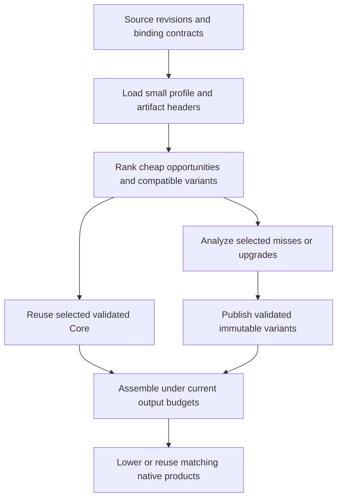

# PGO and persistent incremental optimization

This ADR is an append-only decision log. It covers profile-guided optimization
(PGO) in Core and reuse of optimized code across builds. Execution work is tracked
in [TODO.md](../../TODO.md#p2-source-closure-and-generated-code-profitability).

## D000 — 2026-09-22 — Log protocol and scope

**Status:** Adopted for this document. **Supersedes:** None.

Keep each record's date, ID, status, reasoning, and evidence unchanged after it is
committed. Append a new numbered record to accept, reject, correct, or supersede a
proposal; identify the affected record explicitly. The latest explicit decision
for a subject governs. Do not turn old proposals into accepted decisions by
editing their status. Future implementation findings belong in new records;
benchmark logs and generated artifacts remain outside tracked documentation.

The user requested VM-based PGO feeding our optimizer, reusable optimized functions
or modules, and a plan for spending additional optimization effort over time.
D001 onward propose the architecture; this ADR does not claim those features are
implemented. Creating the design does not start training, background optimization,
or a benchmark campaign.

## D001 — 2026-09-22 — Separate better decisions from reusable work

**Status:** Proposed. **Supersedes:** None.

PGO answers “where does this program execute?” Persistent optimization answers
“which compiler work can the next build reuse?” They share identities and artifact
infrastructure, but solve different problems. Meriyah can be valuable to cache
because it is unchanged across many builds, even when parser execution is a small
part of a particular application's runtime.

Current foundations, inspected at `d5861001`:

| Existing mechanism                                                              | What it already avoids                                                            | Missing capability                                                    |
| ------------------------------------------------------------------------------- | --------------------------------------------------------------------------------- | --------------------------------------------------------------------- |
| [Frontend artifacts](../../src/build-frontend-cache.ts)                         | An exact whole-program hit skips graph construction, Core, and lowering           | Reusing an unchanged library after an application edit                |
| [Dependency fragments](../../src/dependency-fragment-cache.ts)                  | Reuses development-mode dependency images; groups overlapping dependency closures | Full-optimization Core artifacts for the ordinary production pipeline |
| [Core analysis manager](../../src/compiler/core/core-analysis-manager.ts)       | Reuses results against mutation versions inside a compilation                     | Persistent identities, dependencies, and serialization across builds  |
| [Compiler artifact codec](../../src/compiler/target/compiler-artifact-codec.ts) | Restores lowered `ProgramImage` and native plans                                  | Restoring Core that can receive further optimization                  |
| [Generated-object cache](../../src/local-build.ts)                              | Reuses matching C objects                                                         | Skipping Core and emission before an object lookup                    |
| [VM profiling](../../runtime/src/profile.c)                                     | Counts execution and diagnostic events                                            | A small training format consumed by Core scheduling                   |

Build one persistent Core artifact model with optional lowered/native products,
rather than another independent compiler pipeline. Keep existing whole-image and
object hits as fast paths. Reuse valid expensive results before resolving optional
proofs, and optimize only selected misses or explicitly selected upgrades.

An “ultra optimized” artifact is a candidate with recorded costs and assumptions,
not a promise that more compiler work made it faster. Runtime, build time, code
size, and storage remain separate measurements.

## D002 — 2026-09-22 — Stable origins, exact revisions, separate validity

**Status:** Proposed. **Supersedes:** None.

Assign identities before optimization, using the frontend's coherent source
snapshot. Compilation-local function, value, instruction, and constant indexes
remain cheap integers; persistent identities map to those indexes on import.

| Identity          | Proposed contents and purpose                                                                                                                           |
| ----------------- | ------------------------------------------------------------------------------------------------------------------------------------------------------- |
| Module key        | Resolved package/workspace identity, module-relative path, module goal, and relevant resolution conditions; independent of the checkout's absolute path |
| Function key      | Module key and lexical declaration path, including a local disambiguator for anonymous or repeated declarations                                         |
| Function revision | Body, parameters, strictness, lexical binding/capture structure, and source interpretation identity                                                     |
| Site key          | Function key/revision plus a local preoptimization call-site ID; not an optimized instruction ordinal or line number                                    |
| Artifact validity | Input revision, producer/schema, semantic policy, binding contract, and every external assumption consumed                                              |
| Variant identity  | Validity manifest, optimization recipe, consumed profile slice, and resulting content digests                                                           |

V1 matches exact function revisions. An insertion outside a function should not
invalidate that function merely by shifting source lines or global function IDs.
Ambiguous lexical matching is a miss. Edits inside a function may invalidate all
its site counts initially; fuzzy matching is deferred. Normalize identifiers for
storage, not observable filesystem/module-resolution behavior. Identical package
contents may share code, while distinct resolved module instances retain separate
bindings, state, and initialization.

Keep origin and optimized-instance identity separate. An inlined clone retains its
source origin and records its caller/clone provenance. Aggregated origin counts
must not be counted once per emitted instruction. New synthetic operations have
unknown frequency unless a defined derivation is available.

Today's [profile metadata](../../src/compiler/target/profile-metadata.ts) derives
origins after lowering from source text, operation kind, and occurrence order.
Those diagnostic origins cannot serve as the new validity contract.

Profile compatibility is weaker than optimized-code validity. A graph digest
belongs in capture provenance, but must not invalidate every unchanged function's
profile after one application edit. A profile mismatch loses a scheduling hint;
an assumption mismatch prevents reuse of the affected optimized variant.

## D003 — 2026-09-22 — Minimal VM training and explicit profile consumption

**Status:** Proposed. **Supersedes:** None.

The first training mode records function entries and original call attempts. It
uses VM hooks, but does not enable the existing twelve-category diagnostic
counter allocation for every instruction. It records no receiver values, type or
target histograms, object identities, branch probabilities, or allocation traces.
Add such data only with an identified optimizer consumer.

Define counter semantics before implementing hooks:

- Count an invocation after callee/argument evaluation, including spread iteration,
  succeeds and immediately before dispatch. Include ordinary calls, construction,
  `super`, and tagged-template invocation. A failed dispatch still counts; an
  argument-evaluation throw or optional-call short circuit does not.
- Count function entry on invocation before parameter initialization can throw,
  including entry through native builtins or host callbacks. Generator and async
  invocation counts once; resumes do not count again. This measures invocation
  exposure, not generator-body execution: the parameter prologue can run even
  when the resulting generator is never resumed.
- V1 training disables optional call expansion and preserves explicit origin
  events across required lowering. Counter anchors cannot disappear through
  folding, cloning, or dead-code cleanup while their original event can execute.
  Keep training-only event semantics out of production optimization.
- Use dense bounded counter arrays and unsigned 64-bit counts. Overflow saturates
  and is reported, rather than wrapping. The manifest maps slots to stable keys.

A capture contains schema and counter-semantics versions, a unique run ID,
producer/image identity, semantic configuration, module/function revisions, site
coverage, workload group, counts, and completion/overflow information. Publish a
complete manifest only after its counter payload and checksum are available.
Record incomplete captures distinctly; V1 merge rejects them.

The user explicitly selects training inputs and merges captures into an immutable
profile. Merge deduplicates run IDs, retains provenance, and applies recorded
workload weights. Equal run weights are the initial policy; longer runs naturally
contain more events. Do not normalize by VM elapsed time or silently append every
capture found in a cache directory. Later normalization by completed work units
requires an explicit workload contract and a new decision.

Profile use reports matched, unmatched, ambiguous, uninstrumented, and observed-zero
sites separately. A missing count is never zero. A completed run's zero means
“not observed in this workload,” never “unreachable” or “safe to remove.” Training
and consumption require compatible semantic configuration, including primordial,
realm, eval, and host-surface policy.

VM counts describe exposure, not native costs. They cannot determine register
pressure, instruction-cache behavior, allocation savings, or native guard cost.
Workloads sensitive to timing, I/O, or concurrency also need holdout evidence.

## D004 — 2026-09-22 — Consult heat before expensive analysis

**Status:** Proposed. **Supersedes:** None.

Use measured call exposure in the cross-call profitability score, and use function
exposure to order cheap specialization opportunities before proof resolution.
The integration seam already exists before `opportunity.resolve()` in
[region selection](../../src/compiler/core/core-ir-region-selection.ts).

The intended flow is:



V1 heat improves ordering, not eligibility or proof strength. Estimated saved work
still subtracts retained guards and materialization costs. Without hit/miss data,
an open target has no measured success probability; keep conservative static
confidence rules. Do not multiply a measured site count by loop depth again.

Do not compare raw observed counts with arbitrary static weights as if both were
measurements. Rank matched sites on a common weighted-workload scale, and keep a
bounded, explicit allowance for unknown sites using static ordering. Its share is
a policy input to calibrate, not a hidden fallback that forces analysis everywhere.
Function-entry counts can support cheap estimates for uncounted operations, but
must not make every sibling region as hot as the function's busiest call or imply
that a generator body executed. Without body-specific observations, generator
regions retain static/unknown scheduling rather than inheriting creation counts.

Preserve lazy discovery when comparing opportunities across functions. A bounded
lookahead can prevent one admitted function from spending the budget on all its
weak siblings before another function is considered. Do not eagerly prove every
candidate to obtain an exact global ordering.

Report why each selected or skipped family received work: measured exposure,
static fallback, cached variant, exhausted work budget, incompatible assumptions,
or output-growth limit. Keep these summaries cheap; detailed per-site diagnostics
remain opt-in. Mandatory lowering and correctness checks do not depend on heat.

## D005 — 2026-09-22 — Reusable module contracts with function variants inside

**Status:** Proposed. **Supersedes:** None.

Start with a module artifact that owns initialization, imports/exports, lexical
cells, and shared data. Group initialization cycles or inseparable shared state
when required. Store function bodies separately inside that container so one
changed or upgraded function does not require rewriting a giant package blob.
The same mechanism applies to application modules and third-party packages.

Distinguish module initialization cycles from call-graph strongly connected
components (SCCs). Recursive call summaries converge together and publish
consistently, but need not force all parser functions into one permanently
indivisible artifact. A function is independently reusable only under its enclosing
module/capture contract. Never cache runtime module instances, mutable parser
state, closures, or heap objects as compiler artifacts.

Maintain two forms under one manifest model:

1. **Conservative reusable code.** Exports admit arbitrary valid callers and
   arguments; outside writes, escapes, and calls have declared conservative
   contracts. Optimize internal code under explicit language/world policy.
2. **Application-specific variants.** Narrow parameters, inline external bodies,
   remove adapters, or fold external values only with recorded dependencies on the
   particular facts that authorize those changes. Retain a conservative baseline.

This is an explicit new boundary. Current “local” passes are not automatically
context-independent: [optimizeCore](../../src/compiler/core/optimize.ts) specializes
platform constants, uses compilation facts, and prunes module/platform state.
Do not serialize an arbitrary intermediate Core object and label it reusable.

The initial persistent format stores canonical Core, symbols and relocation
tables, module contracts, typed summaries, and completed optimized variants.
Optional proven recipe payloads may be reused only when their proof contract is
portable and validated; initially, unsupported recipe families are rediscovered
on demand. Full global reachability and final plan selection remain assembly work.
Importing cached bodies must not silently run the whole local optimizer over them
again; only changed inputs or selected further work should wake those passes.

Program-global function IDs, slots, captures, strings, templates, source positions,
fact references, and specialized-entry references all need explicit relocation.
The current [attribute relocation metadata](../../src/compiler/core/core-ir.ts)
handles local IDs and is insufficient for this format. Opaque fact payloads need
typed serialization contracts. Register allocation, transient analysis handles,
mutable editor state, and solver queues are not persisted as Core artifacts.

Load small manifests and summaries first. Decode only selected bodies and required
initializers. Memoize dependency validation within a build; do not recursively
deserialize every dependency to prove a cache hit. Recompute volatile memory and
provenance analysis only for newly requested proofs. Persisting complete memory
graphs is deferred unless measurements show that loading and validating them is
cheaper than their demand-driven reconstruction.

## D006 — 2026-09-22 — Record what an optimization depended on

**Status:** Proposed. **Supersedes:** None.

An optimized function can stop mentioning the very code that made its optimization
legal. Record dependencies when a transform consumes facts, rather than trying to
recover them afterward from the optimized body.

| Change                              | Dependency retained with the variant                                                   |
| ----------------------------------- | -------------------------------------------------------------------------------------- |
| Inline a function                   | Imported body revision and its binding/environment contract                            |
| Fold a call or narrow its effects   | Consumed summary content and relevant target-set contract                              |
| Narrow a parameter from its callers | Incoming-call completeness, escape/reachability, and argument facts                    |
| Fold a global or captured value     | Binding identity, value, initializer/write-set proof, and capture layout               |
| Remove a primordial guard           | Relevant primordial/realm policy and intrinsic catalog contract                        |
| Specialize a guarded operation      | Guard, fallback, materialization requirements, and consumed static facts               |
| Omit generic code or an initializer | Current assembly's reachability/closure proof; never infer this from a package profile |

Separate baseline input, assumptions, and optimization policy/profile identity.
Use content fingerprints of consumed summaries: if a dependency changes but the
summary a caller used is identical, that caller can remain valid. An inlined caller
still depends on the imported body even when the public summary is unchanged.
Maintain reverse dependency indexes for targeted invalidation.

Start conservatively. Until fact-dependency recording is complete for a transform,
its application-specific variant depends on the full relevant compilation context
or is ineligible for cross-build reuse. A successful structural verifier does not
prove that an external assumption still holds. Validate both.

Producer/schema identity is mandatory. Existing
[producer fingerprints](../../src/compiler-cache-identity.ts) safely include
transitive compiler code. Initially an optimizer implementation change can invalidate
optimized Meriyah too, even if Meriyah's source is unchanged. Distinguish the
compiler producing an artifact from the compiler source being compiled as input.
Do not promise reuse across arbitrary compiler revisions or ignore bug fixes to
improve hit rates. Later stage-specific producer cones can preserve constructed
Core across optimizer-only changes without inventing a legacy compatibility layer.

Profile identity records only the slice and policy actually consumed by a variant.
An unrelated new training capture should not force regeneration of every body.
Changed profile guidance may make a variant less useful without making its code
incorrect; its static assumptions still determine semantic validity.

## D007 — 2026-09-22 — Progressive optimization produces immutable alternatives

**Status:** Proposed. **Supersedes:** None.

Keep a canonical baseline and publish immutable successors at completed, verified
phase boundaries. A later build can reuse a compatible successor and spend spare
work budget on additional eligible transformations. If dependencies or ordering
requirements changed, restart that work from the baseline. Never repeatedly narrow
the only stored body and assume earlier decisions can be undone.

The first upgrade implementation reruns a selected module/function family from
canonical Core with a stronger recipe. Actual continuation is a later step: record
completed phase/recipe identity, persistent input revisions and consumed-assumption
fingerprints, cumulative growth, and coarse unfinished opportunities. Process-local
Core mutation counters cannot validate a saved checkpoint. Resume only passes whose preconditions admit the stored
checkpoint. Do not persist a JavaScript closure, `CoreAnalysisManager`, active edit,
or arbitrary midpoint of a fixed-point solver.

Budget exhaustion leaves valid code and explicitly unfinished work. Distinguish
not attempted, budget-limited, disproved, unsupported, and currently unprofitable.
Negative results depend on inputs and policy; “not enough budget last time” must
not become “never try again.” Count only completed atomic transformations when
publishing a checkpoint. Wall-clock cancellation can stop at a safe boundary;
deterministic work units govern reproducible selection.

Use two ledgers:

- **Fresh compiler work:** charge lookup, validation, decoding, and analysis actually
  performed now. Do not charge a hit for the analysis that produced it previously.
- **Selected output cost:** charge cached and fresh expansions equally, including
  fallbacks, code/data growth, and selected ABI siblings. Reuse cannot bypass the
  current program's output budget. Cumulative variants record total growth from
  baseline, not just the latest upgrade's delta.

A higher-budget variant need not dominate a compact one. Retain a bounded set of
useful alternatives with assumptions, code size, construction cost, and native
results on named workloads. Selection chooses one compatible body per required
variant contract, accounting for shared code once. Limit variant count and bytes;
never grow the cache with every budget value or profile run. “More transforms” is
not a promotion criterion.

An explicit bounded improvement operation selects a module/function family and
produces a candidate variant. Defaults do not start a daemon or consume idle laptop
time. Automatic background work, if wanted later, needs a separate resource and
scheduling decision. Extending optimization may amortize across future executions
and future builds, but those benefits must be measured separately.

## D008 — 2026-09-22 — Reproducible selection and native reuse

**Status:** Proposed. **Supersedes:** None.

Use the existing content-addressed artifact store, leases, atomic publication, and
bounded pruning infrastructure. Add typed artifact families, not a parallel global
cache. A mutable index may advertise available variants; it cannot mutate code an
active build has selected. Validate imports before exposing them to optimization.
Corrupt or incompatible entries are misses with a reason.

At build start, pin profile/policy/input recipes and a snapshot of available
immutable variants. Newly selected misses or upgrades publish validated artifacts
before the resolved manifest records their output digests. Finalize that manifest
before publishing the product, and include it in final build identity. Reproducible
builds consume a supplied resolved manifest and forbid replacement or upgrades;
exploratory builds may resolve a new one and must report it. Cache warmth alone
must not silently change a pinned build's output.
A pinned evicted artifact is rebuilt with the recorded deterministic recipe and
checked against its digest, or reported unavailable; do not silently substitute a
different “best available” variant. A wall-clock-limited exploratory upgrade is
reproducible through its pinned result, not through repeating the same time limit.

Core reuse and native-object reuse are separate milestones. Current C symbols and
references contain global numeric indexes. Even an unchanged Core body can emit
different C after an application inserts a function or constant. Existing object
keys correctly include C bytes, headers, flags, target, and toolchain; weakening
those keys would be incorrect.

Introduce stable module-local symbols and explicit code/data binding at assembly
to preserve reusable C/object bytes. Existing relocatable overlays are a seam to
study, not a general module ABI already available. Keep generic call adapters and
module instantiation semantics. Compare indirection/adapter cost against rebuild
savings; do not impose a per-operation lookup table without measuring its runtime
cost. A changed caller may still request a separately keyed cross-boundary inline.
Backend-specific products additionally validate runtime ABI, feature set, toolchain,
target, lowering policy, and instrumentation identity.

First avoid repeated Core work; then demonstrate stable emission and object hits.
Caching Core alone does not promise that native compilation or linking disappears.

## D009 — 2026-09-22 — Meriyah pilot and plan of attack

**Status:** Proposed. **Supersedes:** None.

The Meriyah pilot uses resolved source contents and dependencies, not merely the
package name/version. Train on representative parsing plus a full compiler input,
with a different syntax/error corpus held back. Preserve its exports, initializer,
internal parser state, callbacks, and error behavior under the module contract.
Apply the same machinery to a stable group of our own compiler modules afterward;
there must be no Meriyah-specific optimizer branch.

The desired edit cycle is concrete:

1. Build Meriyah's conservative reusable Core once; create and measure an optimized
   variant under a declared world policy.
2. Change application code. Match Meriyah's manifest, validate only its relevant
   dependencies, import the selected artifact, and skip its original Core
   construction/optimization. Resolve current application bindings and budgets.
3. Spend this build's optional work on changed or newly hot application code.
   Unchanged Meriyah may receive an explicitly selected upgrade, but is not forced
   back through every pass just because the global budget reset.
4. Change an imported fact used by Meriyah, its own contents, or its producer
   contract. Invalidate the affected variants; use the conservative alternative or
   rebuild. A changed profile can select a different valid variant.
5. After stable native binding exists, the application edit also reuses Meriyah's
   C/object products. Before then, report Core savings and remaining backend work
   separately.

Implement in reviewable stages. PGO and reusable Core share the identity foundation
but can be developed independently after it; neither requires a resumable solver.

| Stage                           | Deliverable                                                                                              | Exit evidence before expanding scope                                                                                       |
| ------------------------------- | -------------------------------------------------------------------------------------------------------- | -------------------------------------------------------------------------------------------------------------------------- |
| 0. Identity/contracts           | Stable module/function/site origins; explicit reusable-boundary policy and cache dependency taxonomy     | Unrelated function insertion preserves keys; changed capture or resolution contract does not                               |
| 1. VM training                  | Small counter format, exact attribution, atomic captures, deterministic explicit merge                   | Known entry/call counts; throws, callbacks, generators/async, partial files, overflow and duplicate runs covered           |
| 2. Core PGO use                 | Profile-weighted cross-call ordering and heat before lazy discovery                                      | Tight-budget selection follows measured exposure; unknown/zero stay distinct; expensive skipped proof work decreases       |
| 3. Persistent Core pilot        | Portable canonical and completed optimized module artifacts; relocation and conservative boundary checks | Small module round-trips into a differently numbered program; cold/warm outputs agree; invalid assumptions cause misses    |
| 4. Meriyah and own-module reuse | On-demand summary/body import, dependency invalidation, current-budget admission                         | Application-only edits avoid dependency Core work; module initialization and closure semantics remain correct              |
| 5. Native artifact stability    | Stable code/data interfaces and cacheable C/object products                                              | Insert early functions/constants without rebuilding unchanged library objects; measure call/adapter overhead               |
| 6. Bounded upgrades             | Explicit upgrade selection, immutable variants, evidence-based promotion, pinned manifests               | Reuse upgrades across builds; enforce cumulative output/storage budgets; interrupted publication preserves prior artifacts |
| 7. Incremental continuation     | Resume supported optimization families at verified phase boundaries                                      | A second work grant advances unfinished work without replaying completed analysis or retaining stale assumptions           |

Do not combine every stage into one compiler rewrite. At stage 4, useful persistent
reuse must already work even if stages 5–7 prove unnecessary or too costly.

## D010 — 2026-09-22 — Measure the right economics and preserve counterexamples

**Status:** Proposed. **Supersedes:** None.

The benefit of an upgrade is future runtime saved plus future rebuild work avoided,
less upgrade cost and recurring lookup/validation/load overhead. Include C
compilation, storage, and peak memory. This is an accounting model for experiments,
not another expensive optimizer analysis or a license to assume future reuse.
Report the number of uses/builds needed to recover the measured upgrade cost.

Separate the effects with a static/PGO × reuse-disabled/reuse-enabled comparison.
Also compare cached baseline-quality code with cached upgraded code. Hold producer,
input, budgets, configuration, and toolchain fixed. Cold and warm behavior are
different results; a cache hit is not evidence that PGO generated faster code.

| Experiment                           | Required observations and counterexamples                                                                                                   |
| ------------------------------------ | ------------------------------------------------------------------------------------------------------------------------------------------- |
| Exact repeat / application-only edit | End-to-end time, cache validation/load bytes, avoided Core work, emission/object/link time; include an early inserted function/constant     |
| Dependency edit                      | Same version string but changed contents; changed body with unchanged summary; unchanged body with changed capture/import facts             |
| World/producer changes               | Locked to mutable primordials, eval/realm/host policy, compiler implementation, Core schema, runtime ABI, target/toolchain                  |
| Profile changes                      | Unmatched and zero sites, different caller distribution, repeated/partial captures, cold error paths, unseen dynamic targets                |
| Selected upgrade                     | Native runtime on training and holdout inputs, startup, code/data size, compilation cost, RSS, cache bytes and amortization                 |
| Shared state                         | ESM cycles/live bindings, CommonJS initialization, duplicate package instances, callbacks, exceptions, async/generator resume and GC stress |
| Publication/reproduction             | Interrupted/concurrent writers, corrupt payloads, pinned artifact eviction, cache disabled/read-only, consistent resolved manifests         |

Warm reuse must skip the claimed Core work, not merely move it into dependency
validation. Small and one-shot programs must remain able to decline persistence
when hashing, loading, and verification cost more than recomputation. Native speed
acceptance needs repeated matched runs on holdouts; one diagnostic run establishes
feasibility only. Full standards/gate campaigns follow the existing authorization
and [testing policy](../testing.md), not this document's creation.

Related primary designs inform, but do not establish, these Maligator decisions:
[ThinLTO](https://clang.llvm.org/docs/ThinLTO.html) uses compact summaries before
selective cross-module optimization and supports backend caching.
[Rust's incremental compiler design](https://rustc-dev-guide.rust-lang.org/queries/incremental-compilation-in-detail.html)
explains stable IDs, dependency fingerprints, and the cost of computing them.
[Clang's PGO workflow](https://clang.llvm.org/docs/UsersManual.html#profile-guided-optimization)
separates training, profile merging, and later compilation. We reuse those general
lessons while defining JavaScript binding, module, and proof contracts explicitly.

## D011 — 2026-09-22 — Decisions intentionally left open

**Status:** Open. **Supersedes:** None.

Resolve these through the stages above and append the resulting decisions:

- The unknown-code allowance and workload weighting defaults; do not calibrate
  exclusively on self-compilation.
- The smallest portable fact/recipe families and conservative boundary policy;
  which additional context can be fingerprinted without reading every body.
- The module-native binding ABI and whether its indirection cost is acceptable.
- Artifact variant/byte limits and promotion criteria across runtime, startup,
  code size, and build cost; no universal “highest optimization level wins.”
- Which transformation families can actually resume safely from a checkpoint,
  versus cheaply restarting selected work from canonical Core.
- Final CLI/configuration names and whether background upgrades are desirable.
  Initial operations are explicit; there is no automatic worker in this proposal.

## D012 — 2026-09-22 — First function-origin checkpoint

**Status:** Accepted and implemented for diagnostic profile publication.
**Refines:** The function-origin portion of D002 and stage 0 in D009.
**Supersedes:** None; original call-site identities and reusable-code contracts
remain proposed.

Capture function origins after module linking and before Core construction mutates
the frontend. Carry immutable source snapshots, declaration paths, effective
strictness, function kind, and symbolic external-binding owners through Core.
The escaped metadata must not retain mutable AST, scope, or binding objects.
Renumbering functions and creating optimized instances preserve the source origin.

Separate a declaration's origin from its revision. The origin identifies the
resolved module and named lexical declaration path. The revision also includes
the exact function source, parsing context, and referenced external-binding
descriptors. Moving a captured variable to another owner or retargeting a named
ESM import changes the revision, even when the reader's text stays unchanged.
Changing the imported implementation alone need not change the reader's revision:
this is a source-profile identity, **not a certificate that cached proofs remain
valid**. Persistent Core still needs the producer and consumed-dependency contracts
specified in D005–D007.

Collection is opt-in through the existing profile compilation path. Ordinary
compilation neither traverses the source for origins nor hashes function bodies.
Profile compilation captures descriptors before they can be lost, but defers body
hashing until the sidecar is published. Only functions present in the runtime image
are hashed, once per shared source record. A module's immutable source string is
shared by its functions. This deliberately accepts source retention and a frontend
scan during profiling; it does not claim the training build's overhead is measured
or that overlapping nested bodies are each hashed only once.

The existing profile sidecar now uses schema 4 and binds function identities into
its capture checksum. Runtime function indices remain indices into that exact
build's table. Published identities distinguish:

- **Known:** one runtime function represents a mapped source origin.
- **Shared:** several runtime functions represent the same source origin; this
  does not provide separate original events or a unique cross-build instance match.
- **Ambiguous:** source declarations collide; surviving optimization does not
  retroactively make the source identity unique.
- **Unknown:** no supported source identity is available, with an explicit reason.

The report includes coverage for each state. Raw sampling/counter formats and
MALW/MALC payloads are unchanged; source snapshots stay out of runtime artifacts.
Existing diagnostic site identities remain heuristic post-optimization anchors.
They must not be reinterpreted as original PGO call sites.

Portable identities require an explicit map from physical files to unique resolved
module keys. Duplicate or empty keys fail instead of merging package instances.
The fallback uses physical paths and is labeled checkout-bound. A function with
any external binding owned by a checkout-bound module is also checkout-bound.
Automatic package/lockfile resolution keys and a public CLI surface remain open.

For this checkpoint, anonymous owners, class contexts, synthetic functions, dynamic
scope, and unresolved namespace/CommonJS import owners remain explicitly unknown.
Named declarations under duplicate owners are ambiguous. Non-function block scope
descriptors include a relative source offset, which can cause conservative misses
after unrelated edits within an enclosing function. These coverage limits are
preferable to inventing a match and must be visible when evaluating training input.

Focused acceptance covers unrelated insertion with runtime renumbering, body and
capture changes, named import retargeting, portable module keys, duplicate and
unknown cases, shared instances, UTF-16 source spans, immutable snapshots, and the
ordinary-build opt-out. It also checks that changing a function identity invalidates
the capture checksum and that metadata-only Core edits reach publication. These are
identity and diagnostic integration checks, not native PGO performance acceptance.

Next, add stable original call-site records and complete the resolution/context
descriptors needed by the selected training workloads. Then introduce the small VM
entry/call-attempt capture from D003, keeping original events distinct from
optimized instances. Only after attribution tests pass should Core use those
counts to rank work. Persistent Core reuse can develop against the same identity
foundation, but admission and proof validity remain separate requirements.

## D013 — 2026-09-22 — Original call-site identity and coverage

**Status:** Accepted and implemented for source capture and diagnostic publication.
**Refines:** D002 and D012. **Supersedes:** None.

Capture invocation sites in the same pre-lowering traversal as function origins.
A call key combines the original owner's exact identity/revision with function-local
UTF-16 offsets and invocation kind. Compilation-wide numeric references connect
Core calls to this table; clones must retain the original reference rather than
reinterpret a local ordinal against their new containing function. Source-call
references are stripped before runtime lowering.

Record ordinary/optional calls, construction, `super`, and tagged-template calls.
Compiler-generated iterator, initializer, and loader helper calls do not acquire a
source call identity. Retain explicit lowering coverage: direct eval and static
CommonJS require currently lack a general ordinary-call anchor. Top-level and
unsupported lexical owners remain unknown instead of inheriting a generated
wrapper's identity. These limits constrain profile coverage, not program behavior.

The diagnostic sidecar advances to schema 5 and includes original-call records in
its capture checksum. It does not claim execution counts for these records. Stable
keys survive unrelated insertion; changing the owning function invalidates its
call keys. VM training must add independent event anchors after argument/spread
completion, preserve those anchors through lowering, and report uninstrumented
sites separately from observed zero.

## D014 — 2026-09-22 — VM training capture and explicit merge

**Status:** Implemented; focused VM and format checks passed. **Refines:** D003.
**Supersedes:** None.

Training uses a separate `MAL_PGO` runtime feature and an interpreter image. It does
not enable the diagnostic sampler, allocation histograms, or compiler timers.
Optional Core transforms and frontend self-tail-call rewriting are disabled in
training. A fresh frame increments function entry before JavaScript parameter
initialization; generator/async resumes do not increment entry again. Original
invocation markers execute after argument and spread evaluation. An invalid callee
still records an attempt; an argument throw or optional-chain short circuit does
not. Hidden spread arrays define own properties so inherited setters cannot change
training behavior.

Counters are bounded unsigned 64-bit integers, with saturating arithmetic and an
explicit overflow flag. Raw schema/semantics version 1 contains dense function and
source-site arrays plus a capture identity. Actual emitted markers determine which
sites are instrumented. Uninstrumented, unknown-owner, and observed-zero sites are
separate coverage states. Wire schema advances to 59 for the training-only marker.
Runtime function IDs remain local to the capture; source identities own merging.

A run starts with an incomplete manifest. Only successful process completion plus
validated atomic raw publication produces a complete manifest. Normal fast exits
flush explicitly, independently of optional VM teardown. Unsupported runtime image
changes or nested VM execution invalidate the capture. Dynamic-code coverage is
not inferred from existing IDs.

Use explicit commands:

```sh
node ./src/index.ts run app.mjs --pgo-train --pgo-workload representative -- input.json
node ./src/index.ts pgo merge .cache/pgo/runs/<run-id> --out .cache/pgo/selected.json
node ./src/index.ts build app.mjs --production --pgo-use .cache/pgo/selected.json
```

Merge reads only the supplied complete captures, checks raw/map identities and
checksums, deduplicates run IDs, rejects conflicting duplicates, and orders inputs
deterministically. Counts sum with equal per-run weight and saturation. Merged
profiles are immutable: publishing the same content is idempotent; a different
profile requires another path. Training and diagnostic profiling, training and
profile use, and training deployment/wire-only artifacts are mutually exclusive.
`build --pgo-train` emits a training binary and `.pgo.json` map; `run --pgo-train`
owns the complete capture lifecycle.

Focused native coverage includes callbacks, default-parameter throws, failed
calls, throwing spread iterators, optional calls, recursion, generator creation and
resumption, async continuation, constructors, super, tagged templates, and mutable
array-prototype setters. Format coverage includes exact values above 2^53, partial
files, incomplete exits, corruption, duplicate inputs, and overflow.

## D015 — 2026-09-22 — Profile exposure selects compiler work

**Status:** Implemented; focused ordering and cache checks passed. **Refines:** D004.
**Supersedes:** None.

`--pgo-use` loads a validated merged profile. A memoized adapter matches exact
source function revisions and original source-call keys against constructed Core.
It lives outside compiler facts: profile observations never justify semantic
eligibility, guard removal, representation changes, or unreachable-code deletion.
Unmatched revisions remain unknown. Generator entry does not estimate body heat.
Calls copied into another owner and new specialized function IDs remain unknown;
verified equivalent-call rewrites preserve the original call reference.

Cross-call candidates use measured attempts instead of static loop frequency in
profitability scores, retaining existing guard and generated-code costs. Measured
and unknown candidates occupy distinct ordering categories. Static-argument
specialization skips observed-zero calls before asking for static-value analysis.
Late local/direct-entry opportunities use function-entry exposure; this is an
estimate for regions, not a claim to have counted each region. Heat admission runs
before lazy specialization proof resolution. Observed-zero work does not consume
the unknown allowance.

The shared candidate service reserves 20% of compiler-work and generated-code
budgets for unknown candidates; measured candidates get the remainder. Discovery
and application both consume their category's allowance across phases. The first
policy deliberately does not transfer unused allowance. Static scoring orders the
unknown category and remains a tie-break within measured exposure. Profile digest
and the scheduling/adapter implementation identity participate in frontend cache
keys; filenames do not.

Focused checks show a measured count of two beating a static-loop count of one,
a measured count of one beating an unknown loop, and only the hotter function
requesting a proof under a tight budget. Zero exposure requests no lazy local proof.
The remaining cross-call target/bridge discovery is partly eager; this stage does
not claim all compiler analysis has become demand driven. Representative workload
coverage, quota tuning, and end-to-end performance acceptance remain later work.

## D016 — 2026-09-22 — Persistent Core module pilot

**Status:** Implemented as an explicit compiler API; focused round-trip and native
checks passed. **Refines:** D005, D006 and stage 3 of D009. **Supersedes:** None.

`loadOrCompileCoreModule` accepts one JavaScript ESM source, a logical module key,
its current diagnostic path, and an explicit cache directory. The first boundary
supports strict functions, module-private mutable globals, live exported slots,
scalar constants/arithmetic, branches, and internal calls. Imports, unresolved
external globals, captured environments, classes, suspension, templates, opaque
facts, effect refinements, target representations, guards and switches are rejected
as unsupported. The caller retains responsibility for its ordinary fallback.

The persisted record contains canonical Core and a completed `conservative-local-v1`
variant. The recipe runs the local optimizer without application facts or program
flow. Exhausted work cannot publish a completed variant. It does not persist solver
queues, register allocation, or an interrupted pass. Cache identity covers lossless
UTF-16 source content, logical module key, boundary/schema, recipe limits, and a
dedicated transitive producer fingerprint including the codec and importer.

A warm hit validates and imports the selected optimized artifact, skipping source
parsing, semantic/Core frontend construction and completed local optimization.
Canonical Core is decoded only when requested. Artifact verification and relocation
still perform work; the pilot does not claim their cost is zero. Export-slot
projection is opt-in, so ordinary builds pay no extra export-table construction.

The codec uses an explicit opcode/attribute boundary. Import relocates functions,
private globals, strings, source positions, blocks and SSA values. Special numeric
values and UTF-16 units survive serialization. It validates in temporary Core before
mutating the destination, because Core editors do not support rollback. Each import
returns an initializer and live export slots; the caller invokes the initializer
before using them. Each module instance receives separate state.

Native acceptance imports canonical, cold optimized, and warm optimized variants
behind existing function/global/string/source-position IDs. All return the same
values, and mutating one instance leaves the others unchanged. The assembly builds
its current plan and lowers normally without rerunning the completed local recipe.
Source/recipe changes and corrupt receipts miss; unsupported boundaries fail before
destination mutation. Warm evidence reports zero frontend and optimizer functions.

This is a persistent Core pilot, not automatic Meriyah or dependency-graph reuse.
Stage 4 must integrate module selection, dependency contracts, initializers and
closure boundaries into ordinary builds, then measure reuse on representative
applications before widening this boundary.

## D017 — 2026-09-22 — Ordinary-build leaf reuse and mutation-driven follow-up work

**Status:** Implemented for the admitted leaf boundary; stage 4 remains incomplete
for Meriyah and per-function loading. **Refines:** D005, D006, D009 and D016.
**Supersedes:** D016's exclusion of ordinary captured function environments.

`maligator build app.mjs --production --core-cache` explicitly selects conservative
module reuse in the normal native pipeline. The existing whole-image cache remains
first. On a miss, a static acyclic ESM graph can select import-free dependencies as
their initializers become necessary. The application entry remains fresh. Host,
CommonJS, dynamic/deferred import and direct-eval graphs use ordinary lowering;
profile/training builds cannot select this mode. An unrelated async application
function or top-level await does not expand the synchronous cached-leaf boundary.
This is opt-in until representative rebuild and runtime measurements justify a
default policy; small fixture work counts are not that evidence.

Each resolved module instance owns its relocated private globals and functions.
Linker exporter bindings point directly at the imported slots, including aliases,
re-exports and namespaces. The normal evaluation order calls each initializer once,
and a throw prevents subsequent initialization. Imports are declined before mutation
if earlier lowering has already allocated their export slots. The frontend's tables
and allocation counters remain synchronized with the imported Core tables.

Schema 2 adds ordinary captured cells and source-declared single-assignment
candidates. Function owners, captured slots and private global candidates relocate
with the body. This preserves facts for later call-target, value and memory queries;
it does not persist a solver conclusion. Synthetic loop environments remain outside
the boundary. The completed-module interface names `conservative-local-v1` explicitly,
so importing canonical Core alone cannot assert recipe completion.

A completed scalar recipe suppresses only the initial whole-body scalar queue in
construction cleanup and primary optimization. Annotation, CFG, type/range,
representation, memory, program-flow and specialization passes remain eligible.
Edits from those passes wake incremental scalar work, and selected cross-call edits
receive normal cleanup. Current output budgets still admit additional expansions;
cache reuse does not supply proof authority or bypass output planning. Skipping the
entire primary session would discard optimizations the persisted recipe never ran.

Source content, resolved module identity, stripping producer, artifact/recipe policy
and transitive compiler producer determine reuse. A dependency edit or changed
resolution selects a different artifact; an application-only edit can reuse the
existing dependency. Misses use the graph's parsed tree, including stripped
TypeScript, rather than reparsing it. Unsupported syntax is rejected before Core
construction where possible. Unsupported and budget-limited receipts avoid repeating
failed optional work under the same input and recipe; increasing the recipe budget
changes the key. An incomplete recipe never publishes completed bodies. Producer and
decoder size limits agree, and optional persistence failures leave compilation usable.
The `core-modules` family participates in existing cache accounting and pruning.

Decoded artifacts are recursively frozen after structural validation. A private
identity set lets their importer reuse that validation instead of constructing the
same scratch Core twice. Mutable caller-produced artifacts still validate before
each import; a copied or changed object cannot inherit the decoded object's receipt.

Focused checks cover source/stripper/resolution invalidation, negative receipts,
recipe exhaustion, unavailable publication, source candidates and mutation-triggered
scalar work. Native acceptance compares uncached, cold and warm builds with a diamond
import, mutable aliased exports, two resolved module instances, independent counters
and a grandchild closure. An earlier application dependency shifts imported function
IDs on a warm hit. The warm image also executes in the VM. These checks retain
whole-program verification and do not replace the deferred full gate.

The work avoided is precise: a warm leaf performs zero standalone Core construction
and zero executions of its persisted scalar recipe. It still participates in ordinary
graph parsing, semantic analysis, import validation/relocation, current-application
analysis and backend emission. One selected artifact currently decodes all its
functions; this is module selection, not per-function demand loading. Native objects
are not yet reused through a stable module ABI.

Meriyah's current single-file ESM bundle is import-free but exceeds this boundary.
The next codec work is generic support for class/derived-constructor metadata,
exception handlers and parameters, switch edges/constants, heap/property/constructor/
iterator operations and literal tables. Keep these boxed and relocate their typed
references before persisting any application-dependent proofs. After that, demonstrate
an actual Meriyah hit across an application edit and measure both saved Core work and
remaining backend cost before calling stage 4 complete.

## D018 — 2026-09-22 — Reuse Meriyah through the conservative boxed boundary

**Status:** Implemented; per-function demand loading and performance acceptance
remain open. **Refines:** D016 and D017. **Supersedes:** The exclusion of classes,
exception handlers, switches and literal tables from the reusable format.

Schema 3 preserves class and derived-constructor metadata, boxed exception
parameters, handler edges and switch cases. Generic object, property, constructor,
spread and iterator operations have a closed attribute contract. Optional property
flags retain their absence rather than receiving guessed defaults. Function owners,
private globals, string keys and switch string constants relocate with the module.
Synthetic loop environments, asynchronous functions and generators remain outside
this boundary; synthetic owners need their own destination allocation contract.

Literal templates carry their packed words and arbitrary-precision bigint constants
use canonical decimal strings. Import validates template roots and embedded pool
references, then relocates both embedded constants and instruction offsets. The
frontend synchronizes all imported pools so later lowering cannot overwrite them.
Ordinary instantiation retains fresh objects on each call. Corrupt artifacts fail
before mutating destination Core.

Decode special numeric tags only at numeric literal instructions and numeric switch
cases. A general JSON reviver would visit every string code unit, packed template
word and SSA index even though none admits a special number. Structural and Core
verification still run; reducing that unused decoding work does not waive checks.

This expands serialization, not proof authority. Mutable global lookups remain
runtime lookups. Regex literals retain their RegExp intrinsic; replacing the global
constructor still affects ordinary source calls. Proof-bearing attributes, effect
refinements, guard facts and target representations remain rejected. The recipe is
still the conservative local scalar pass: full standalone optimization would first
require explicit exported-call roots and arbitrary external arguments.

The import-free Meriyah dependency now fits the format, including its derived error
class, large literal tables, captured environments, handlers and iterator paths.
An application edit can reuse its completed scalar bodies while current-program
analysis and backend emission remain active. This does not yet cache native objects
or bypass the ordinary graph's parse and semantic analysis.

Focused acceptance covers cache-off, cold and application-edit warm execution against
Node, with Unicode, locations, comments/tokens, class/private/async parser input,
invalid syntax, invalid regexes, throwing callbacks and mutable global RegExp.
A dependency inserted before Meriyah shifts function, global, string, bigint and
literal pools; the warm image also runs through the VM. Format tests cover string
switches, handler relocation and malformed literal/constant references. Full gates
and repeated representative performance acceptance remain separate work.

The next loading boundary must avoid constructing Core twice while retaining
validation before destination mutation. Current warm loading validates the optimized
variant in scratch Core, then imports it into destination Core. Stage validated
function storage for relocation and attachment rather than dropping verification.
A small manifest with separately addressable variants should also keep canonical
alternatives available without reading them on the ordinary warm path. Splitting
payloads alone does not remove the duplicated Core construction. Function-level
loading and further persisted recipes remain separate completion claims.

## D019 — 2026-09-22 — Attach the Core storage already built for validation

**Status:** Implemented with focused verification; repeated performance acceptance
remains open. **Refines:** D017 and D018. **Supersedes:** Rebuilding function bodies
during the first import of a decoded artifact.

Decoding still validates the entire selected artifact in isolated Core, including
cross-function references and constant tables. A private weak map retains that
prepared program alongside the immutable decoded artifact. First import consumes
its function storage after preparing every relocation. Subsequent imports construct
independent storage from the immutable artifact; mutable caller-created artifacts
receive fresh verification. Failed preparation leaves the prepared program usable
and does not change destination tables, functions, versions or analysis journals.

Transfer preserves function-local blocks, instructions, SSA values, normal use
chains and exception-use chains. It changes function ownership and program-level
references: function IDs, global slots, constant pools, source positions and source
metadata. The closed opcode contract checks those references before attachment.
Local graph structure therefore retains its existing verification; attachment does
not repeat CFG and SSA verification. Facts and effect refinements remain excluded.

The Core store owns this transfer primitive. Relocation callbacks must be pure.
Metadata, changed attributes, switch cases and combined tables are prepared before
either owner changes. Source functions must be finished with inactive editors and
writable identity fields. An active destination initializer editor is allowed.
Function identity remains ordinary data properties so self-hosted hot reads do not
gain accessor dispatch. The source relinquishes its functions, and each attached
function records all change domains in the destination's program-flow journal.
Destination generation remains unchanged; existing analyses observe the append and
subsequent edits through the normal version machinery.

Focused tests observe actual function creation and retained store identity across
decode and attachment. They cover repeated imports into different generations,
independent edits, analysis refresh against a fresh analysis manager, and failure
after partial relocation preparation. Native and VM acceptance retain Meriyah's
Node output parity. Matching before/after MALW digests check that this storage
change preserves output selection rather than trading away optimization.

This removes the second function-body materialization at the cache boundary.
Ordinary later optimization and construction compaction still run. Loading still
reads both artifact variants, and table preparation still copies immutable pool
contents. Separately addressable variants, sharing immutable table entries and
function-level loading remain distinct opportunities; this change does not claim
that all cached-module analysis or allocation has disappeared.

## D020 — 2026-09-22 — Load only the selected persistent Core variant

**Status:** Implemented with focused verification; repeated performance acceptance
remains open. **Refines:** D018 and D019.

Receipt schema 2 stores each cache key in one directory, with a small manifest and
digest-addressed canonical and optimized payloads. Payloads publish atomically
before the manifest. Concurrent writers cannot expose partial bodies or mix a
manifest with another generation's contents. Temporary files stay within the entry
and are removed after publication attempts. Optional persistence failures still
leave the freshly compiled result usable.

An ordinary hit reads, hashes, decodes and verifies only the optimized payload.
Canonical access loads and verifies that variant on demand, memoizing successful
decoding. A missing or corrupt canonical variant throws when explicitly requested;
it does not invalidate a usable optimized result or trigger hidden compiler work.
An unusable optimized variant remains a cache miss before destination mutation.
Only validated digest names can select files within the entry.

The cache manager counts and prunes the directory as one module, preserving both
variants together. Successful positive and negative hits refresh entry recency.
Negative receipts remain small manifests with exact unsupported/budget-limited
statuses. The format change invalidates previous receipt identities rather than
adding a compatibility reader. Function-body demand loading remains separate.

## D021 — 2026-09-22 — Share Core-owned immutable constant table snapshots

**Status:** Implemented with focused verification; isolated timing acceptance remains
open. **Refines:** D019.

The Core store records ownership of frozen table arrays, string rows and source
position records in a private weak set. Constructing or configuring another program
can reuse these snapshots directly. Merged outer arrays still receive a fresh frozen
snapshot, but their already-owned entries retain identity. Appending constants or
positions replaces the outer snapshot, leaving other programs and earlier readers
unchanged.

Caller-provided objects still receive defensive copies. A frozen outer array does
not prove its entries immutable, and frozen accessor-bearing records can still
return changing values. Ownership, rather than a shallow frozen check, is the
sharing authority. The frontend retains imported readonly rows and position records
when it resumes lowering instead of copying them back into mutable entries only to
freeze them again at finalization. Literal words that embed relocated pool references
still require remapping.

Focused checks cover caller mutation after construction/configuration, frozen
outer arrays with mutable entries, frozen getters, independent program appends and
reconfiguration, and the identity of shared immutable snapshots. Native and VM
parity and unchanged MALW bytes retain the existing output contract.

## D022 — 2026-09-22 — Build temporary decoder operands only for forward references

**Status:** Implemented with focused verification. **Refines:** D019.

Selected-artifact materialization registers all block parameters before operations.
An operation whose inputs already exist now attaches their real use links directly.
Only a reference to a not-yet-materialized instruction creates a placeholder and a
pending operand repair. A function with no forward references allocates no dummy
instruction or value, and zero-input operations need no pending record.

Serialized block order need not follow dominance order, so the forward-reference
fallback remains necessary. All pending inputs must resolve, and ordinary Core
verification still rejects cyclic or non-dominating uses before import. This changes
temporary construction work, not proof authority or the selected optimization
recipe. Focused tests cover direct operands, valid reordered blocks, unresolved and
cyclic references, followed by native/VM output parity.

## D023 — 2026-09-22 — Persist completed scalar and structural cleanup

**Status:** Implemented with focused verification; representative performance
acceptance remains open. **Refines:** D017–D022. **Supersedes:** The scalar-only
`conservative-local-v1` recipe.

`conservative-structural-v2` first completes scalar cleanup, then runs block-parameter
simplification, forwarding-block elimination, linear-block merging and unreachable
block removal with scalar wakeups until the scheduler drains. These passes consume
function-local CFG/SSA and literal constants. They do not admit application facts,
cross-call assumptions, proof attributes or target representations. Canonical Core
is captured before the recipe, and optimized capture retains full format validation.
One rule registry, feature index, analysis scratch pool and instrumentation-off
report serve the module's functions.

Completion is a control-flow contract, independent of diagnostic reporting. Strict
passes throw a typed budget error when scheduling exhausts, a candidate cannot fit,
or a final edit batch exceeds its allowance. Strict scalar drains also report an
eligible two-edit rewrite that cannot fit the remaining budget. Cache compilation
catches only the typed budget failure and publishes a negative receipt, never a
completed partial variant. Ordinary stop-mode pass scheduling remains unchanged.
The configured limits apply per structural pass and per scalar invocation; they are
not an aggregate module CPU or edit allowance. Larger limits produce a distinct key.

Import records all function-version domains after relocation. After construction
annotations, an unchanged imported body skips only the initial construction
normalization component. An edited body runs ordinary cleanup and retains the full
primary scalar seed. Primary canonicalization, later CFG/proof/memory work and their
mutation wakeups remain enabled for every body. The completion witness is not carried
as a version comparison across the dense-generation boundary.

Structural simplification can expose large string constants to scalar comparisons.
Both consumers now use the Core store's bounded UTF-16 decoder and text cache rather
than spreading all code units into a host call. Focused coverage includes a long
string with a lone surrogate, strict budget failures with reporting disabled,
edited-import invalidation, primary-pass eligibility, and native/VM branches,
signed zero, NaN, loops and nested exception/finally effects against Node.

Moving cleanup before serialization reduces the selected artifact and avoids its
repeated initial scans. It increases cold recipe work; cold and warm results must be
reported separately. The earlier recipes remain historical decisions only, with
their identities invalidated rather than maintained as parallel readers.

## D024 — 2026-09-22 — Discover type-proof consumers before solving global types

**Status:** Planned; not implemented or accepted as a performance improvement.
**Refines:** Demand-driven analysis admission in stages 2–4.

Cross-call folding currently requests program value kinds before discovering which
instructions can consume them, and can refresh them only to decide whether another
wave should run. Split observation discovery from proof evaluation. Discover eligible
`typeof`, boolean-negation and strict-equality observations without first solving
global value kinds. Preserve folds already justified by function-local information.

For unresolved observations, trace value dependencies through moves, block parameters
and relevant operations. Request global propagation when a dependency reaches an
input that it can refine: formal parameters, receivers or script-call results.
Fixed-result operations and opaque loads do not become global proof demands merely
because they occur in a function with calls. Unclassified dependencies retain the
existing conservative path. The first implementation should gate the existing full
solver; narrowing its transfer set is a separate change with a separate contract.

Demand must be reconsidered after edits that introduce or change observations or
their dependencies. Use the existing function-version and analysis invalidation
mechanisms. A continuation check must not request global value kinds when no pending
consumer needs them. Profile heat and remaining budget can select work, but neither
supplies a semantic fact or permits dropping a useful local fold.

Acceptance covers no-observation functions, locally decidable observations, opaque
loads, and global folds through parameters, receivers, calls, moves and block
parameters. Edits that introduce demand must match a fresh analysis run. Measure
actual avoided solver evaluations and matched output alongside end-to-end compile
time; time attributed to the current solver is an upper bound, not a promised gain.

## D025 — 2026-09-22 — Solve global types only for consumed SSA dependencies

**Status:** Implemented with focused verification; broad performance acceptance
remains open. **Implements:** D024. **Refines:** Its full-solver admission boundary.

Each cross-call wave first discovers observations and evaluates program-independent
kinds along their value dependencies. The reader uses the solver's existing transfer
rules. It distinguishes fixed unknown kinds from inputs that need global propagation;
cycles conservatively request the existing solver. Publicly reachable parameters and
receivers remain unknown, and opaque calls do not trigger propagation that cannot
refine them. Successful local folds remain eligible without a global query. Committed
caller edits retain the next wave without solving global types merely to schedule it.
Readers are recreated each wave so changes to call targets cannot leave stale demand.

Admission alone does not remove the dominant work when any useful global consumer
remains. Global type evaluation therefore builds transfers only for the dependencies
of values its consumers read: reachable return operands, consumed outgoing arguments
and strict receivers, wildcard call inputs, and values queried by the observation
evaluator. Observations include live instructions in unreachable blocks, matching
the existing folding contract. Surplus call arguments and callee identities are not
type demands. Root lists and call-site indexes are reused within one propagation
solve; they are rebuilt for the next solve under ordinary invalidation.

Dependency collection follows the same operation rules and all existing CFG
predecessors, including exceptional handler-argument offsets. Values are marked
before following dependencies, then the ordinary monotone worklist solves their
cycles. This changes the transfer set, not the lattice or convergence rules.
Ordinary local analysis still solves its complete value set and retains lazy integer
proofs. Global snapshots expose only kind and lattice-mask queries and do not build
integer-proof recipes that none of their consumers use.

A global snapshot owns solved masks and computed-value membership. Reading an
unrequested value throws instead of returning lattice bottom and silently narrowing
a summary. Snapshots retain no function, CFG, call-target or current-summary handles;
older results remain stable after edits. Later consumers must extend the explicit
root contract before querying more values. The bounded Core string decoder also
serves observation constants, avoiding host argument-count limits during admission.

Focused acceptance covers local arithmetic and joins, opaque inputs, strict receivers,
cyclic joins, demand introduced in a later wave, delayed versus fresh propagation,
unused SSA chains becoming consumed after edits, old snapshot stability, local integer
proofs and long UTF-16 constants. Exact matched MALW and generated-C comparisons
accompany work and timing measurements; function-evaluation counts alone do not measure
the reduction in values and transfers.

## D026 — 2026-09-22 — Project GC roots for representation-only direct entries

**Status:** Implemented with focused verification; no established end-to-end speedup.
**Refines:** Reuse of analysis results during selected-entry lowering.

Direct entries share the base function's physical registers, instructions, control
flow and safepoint locations. Their representation assignment changes only registers
whose base representation is boxed. Edge-copy repair may restore those registers to
boxed, but never widens a base scalar register into a traced one. String registers
remain traced.

Physical-register liveness equations are independent for each register. Lowering
therefore derives each entry's roots by filtering the already computed base roots to
the entry's boxed and string registers. This replaces a complete liveness solve for
every direct entry with filtering the consumed root lists. The derived arrays remain
independently owned. Any future entry transformation that changes instructions,
control flow, safepoints or widens base scalar representations must recompute roots
instead of applying this projection.

Verification continues to reconstruct expected roots from the supplied body and
representations. It does not trust the emitted root lists. Execution objects remain
mutable at runtime, so a cache keyed only by function or block identity cannot safely
replace that reconstruction. Generator and async frame-exit roots retain their
separate portable demand and existing handler and trailing-root-use semantics.

Focused acceptance compares real lowered entries with fresh reconstruction, checks
that numeric roots disappear while string roots remain, rejects forged entry maps,
and exercises native and portable execution under GC stress. Matched MALW and C
parity covers both portable roots and native entry masks. Removed solves establish
the work reduction; end-to-end performance acceptance remains separate.

## D027 — 2026-09-23 — Transfer compact Core storage across construction generations

**Status:** Implemented with focused verification; representative performance
acceptance remains open. **Refines:** Persistent optimized Core import in stage 4.

Finalizing a construction generation previously rebuilt every function, including
imported optimized functions whose columns contain no deleted rows. Transfer their
column ownership to a fresh function wrapper and kernel when all storage capacities
match live counts and operations precede terminators. Functions with holes or
interleaved terminators retain the existing compaction and relocation path. The
new wrapper keeps the same Core IDs and receives the usual version increments.

Old function handles remain retired. An old kernel loses access to its columns
when its owner retires, avoiding a per-read check in active kernels. Suspended
iterators reject retirement before reading transferred storage. The transfer does
not promise the compactor's topological renumbering: later optimization can choose
a different but verified instruction layout. Compare execution and output size as
well as construction cost.

The warm Meriyah probe found 243 compact functions among 244 and reduced the
generation-finalization interval from roughly 25–30 ms to 1–2 ms. Four native
Core-cache tests passed, including Node output parity on Meriyah. One emitted
function changed layout and the wire was three bytes smaller. Warm frontend timing
on battery is provisional; cache-disabled controls also moved during the samples.

## D028 — 2026-09-23 — Rebind PGO identities when importing conservative Core

**Status:** Implemented with focused native verification; representative runtime
and compile-time performance acceptance remains open. **Refines:** D003, D004,
D015 and stage 4 of D009.

A PGO-use build may reuse the same completed conservative Core module as a static
build. The module cache stays independent of the profile: it stores source-function
spans and module-local call-site spans, never profile counts or producer-process
origin objects. Import matches those locators against the current semantic graph
and attaches the graph's exact origin objects and global call-site IDs. Unknown,
ambiguous or unmatched locators receive no heat. Training still constructs fresh
Core so its instrumentation remains complete.

Artifact schema 4 and recipe v3 validate call owner, kind, span and opcode before
import; the receipt and cache boundary change with them. The whole-program
frontend key still includes profile digest and policy, so another profile can reuse
conservative module work while producing a distinct final image. Imports without
PGO drop module-local call references. Source-locator lookup tables are built only
when a cached function or call actually asks for them, avoiding extra indexing in
ordinary PGO builds.

The focused native test trains in the VM, merges the capture, then confirms
nonzero imported function and call heat in cold and warm cached builds. Both
compiled outputs match Node after an application edit. Unit coverage checks two
functions with identical relative call offsets, repeated imports with shifted
function IDs, imports without PGO, and corrupt cross-owner references. This makes
PGO and conservative Core reuse composable; it does not persist a PGO-upgraded
variant or establish that the profile improved native runtime on a holdout.

## D029 — 2026-09-23 — Retain validated storage for the first cold Core import

**Status:** Implemented with focused unit verification and matched Meriyah
compile diagnostics; native validation remains pending. **Refines:** D019 and
D020. **Supersedes:** None.

Cold optimized capture already materialized and verified a scratch Core program,
then discarded it. The first import of that same artifact rebuilt and verified
the same functions. The optimized capture now retains its validated storage in
the private immutable-artifact receipt used by warm decoded payloads. Only an
owned recursively frozen artifact receives this receipt. Caller-owned export
rows and global-assignment slot arrays are copied before freezing. Mutable
copies still undergo full validation before they can change the destination.

Canonical capture continues to discard its scratch program while the local
recipe runs, avoiding an extra full-module peak allocation. The optimized
receipt is consumed by its first import; later imports rebuild independent
storage. The artifact schema, canonical publication, optimization recipe and
selected output are unchanged.

On a 243-function Meriyah module, three interleaved cold baseline/candidate
pairs with fresh process-local cache directories measured first-import times
of 54/52/55 ms versus 8/8/8 ms. Capture times were 637/603/621 ms versus
631/603/644 ms; capture-plus-import times were 706/669/689 ms versus
654/624/666 ms. Every encoded optimized artifact had the same 3,005,010-byte
length and SHA-256 digest. These short battery-host runs show a concrete
first-import saving; they are not an end-to-end application rebuild or runtime
speedup claim. Focused units cover zero new function construction at first
import, immutable ownership, corrupt-copy rejection, and cold PGO rebinding.
The focused native cache test was stopped when it entered a fresh Rust/ICU
release build, before it reached a result.

## D030 — 2026-09-23 — Defer cross-call PGO proof caps until selection is incremental

**Status:** Design direction after a rejected experiment. **Refines:** D004.
**Supersedes:** None.

Cross-call candidate discovery still proves possible inline targets before the
candidate service applies output budgets. A trial that sorted sites by PGO heat
and capped discovery at one quarter of remaining compiler work skipped 24
Meriyah proofs, lost one cross-call inline and one late-plan application, and
showed no credible cross-call phase-time gain in a single matched diagnostic.
That code was removed. A separate per-wave proof memo reused 103 of 198 target
proof requests and preserved the exact wire hash and all 210 late-plan
applications, but three interleaved pairs showed no phase-time improvement;
that code was also removed.

The next design must admit proof work and apply selected candidates together,
reserving application work and generated-code capacity before declining colder
sites. Unknown-profile allowance, exact target certainty, fallbacks, and
deterministic static ties remain independent of measured heat. Proof caching
alone is not a substitute for avoiding unused proof discovery.

## D031 — 2026-09-23 — Capture only selected Core variants on cold builds

**Status:** Implemented with focused verification and matched cold diagnostics;
native parity remains pending. **Refines:** D020 and D023.
**Supersedes:** Their unconditional canonical publication requirement for
optimized-only callers.

The production selector imports only optimized Core. It may request an
optimized-only receipt, avoiding canonical capture, validation, encoding and
publication during a cold build. Direct callers retain the full-capture policy.
The policy is part of the receipt key and schema identity, so a full receipt
cannot be mistaken for an optimized-only one. The optimized artifact and its
recipe remain identical under either policy.

Canonical access remains load-only: absent or corrupt canonical bytes throw
without compiler work. An explicit reconstruction operation accepts the same
source, module and parser-producer inputs and recomputes the pinned receipt key
before constructing conservative Core. It captures and verifies canonical Core
without running the optimized recipe. Its digest is published in a separate
atomic descriptor after the immutable payload, so another optimized-only
writer cannot erase the advertisement. Failed optional publication leaves the
optimized receipt usable. No canonical output digest is claimed before the
artifact exists.

On the 243-function Meriyah module, three interleaved isolated-cache pairs
measured full capture at 585/607/588 ms and optimized-only capture at
477/474/481 ms. Cache entries shrank from 7,091,979 to 3,005,220 bytes.
Maximum resident sizes reported by the isolated Node processes were
326,944/364,032/328,496 KiB for full capture and
281,584/282,528/280,848 KiB for optimized-only capture. All six optimized
artifacts had the same 3,005,010-byte length and SHA-256 digest. First-import
times stayed near 8 ms, with one 11 ms full-capture sample. These diagnostics
support the cold capture and storage saving; they do not establish a native
runtime improvement. Focused cache and build integration tests cover output
parity, PGO rebinding, missing and reconstructed canonical bytes, changed
inputs with an alternate valid receipt, descriptor preservation on republish,
and publication failure. The cold Rust/ICU build prevented a current native
test result.

## D032 — 2026-09-23 — Select native entry signatures with attributable call heat

**Status:** Implemented with focused output verification; representative native
performance acceptance remains open. **Refines:** D004 and D015.

Function-entry heat already controls whether a direct-entry opportunity is
examined, but its single parameter/arity signature was chosen only by capped
static loop weights. When several signatures are proven, measured call attempts
now rank signatures only for closed, single-target sites. Positive measured
exposure wins before unmeasured exposure, which wins before exclusively
observed-zero exposure. Measured counts are compared on their own scale and
weighted by the existing scalar count; static weights break ties and retain the
exact no-profile choice. A signature with unmeasured sites is never labeled
observed-zero. If every eligible scalar signature is fully observed zero, no
native entry is emitted, even when the target has entry heat from other callers.
Open or guarded calls and sort callbacks keep static ranking:
their call-attempt count does not identify this target or callback invocation.

The selected signature still runs the existing representation analysis and
native-entry verifier, shares the same single-entry and generated-code budgets,
and retains the canonical fallback. Focused tests cover a hot straight-line
numeric call beating a cold syntactic-loop string call in both source orders,
observed-zero versus unknown exposure, no-profile selection, guarded/open
attribution, an all-zero decline, and the corresponding lowered call entry. This verifies that PGO
can change selected output, but does not demonstrate a native runtime win;
training and holdout workloads still need matched measurement.

## D033 — 2026-09-23 — Report the profile facts actually requested by Core

**Status:** Implemented with focused verification and one frontend-only
diagnostic; representative training remains open. **Refines:** D004, D010 and
D032.

An opt-in PGO adapter records distinct function and call queries made during
optimization. Its snapshot separates positive, observed-zero, unmatched
revision/profile, untrained or missing origin, missing source site, and owner
mismatch outcomes. It does not scan unrequested identities or change hint
results. Disabled collection does not construct per-call diagnostic keys, and
the adapter still binds inside the Core optimization phase for consistent
timing. The snapshot joins the existing optimizer report when requested;
training-capture coverage remains a separate property of the merged profile.

A frontend-only Meriyah diagnostic used a retained probe profile whose
semantic key is a placeholder, not a valid current CLI profile. All 37
positive function rows and 129 positive call rows were queried, alongside
163 observed-zero function queries and 2,034 observed-zero call queries.
There were no unmatched revisions or profile call keys; 38 function queries
lacked a source origin, and call queries included 74 missing sites, two
missing origins and 89 owner mismatches. The optimizer skipped 1,537 planning
opportunities as observed zero. A single warm static/PGO frontend pair took
973/933 ms and produced distinct wire digests (484,881/480,312 bytes); it is
only a diagnostic, with no runtime or repeatability claim. The cached Meriyah
leaf performed zero standalone construction and local recipe work in both
warm builds. Focused tests verify unique queried outcomes, repeated unknown
calls, report publication, and identical serialized output with diagnostics
enabled or disabled.

## D034 — 2026-09-23 — Capture repeated workloads without rebuilding training code

**Status:** Implemented with focused CLI subprocess verification; representative
native training and performance acceptance remain open. **Refines:** D014.

`build --pgo-train` already emits a native interpreter-training binary and an
adjacent source map. `pgo run <binary> --pgo-workload <name> -- <args...>` now
reads that map, validates its schema and counter semantics, and checks its
recorded SHA-256 against the current binary before creating a capture. The
recorded semantic key and source identities remain authoritative; an older
supported training producer is not silently rebuilt or rejected merely because
the current compiler changed. Each invocation gets its own run ID and incomplete
manifest until the child exits successfully and publishes valid counters. It
forces interpreter execution and uses the existing capture directory and merge
format. Merge remains explicit, so holdout runs are not accidentally added to
training input.

This removes frontend construction, native compilation and toolchain setup from
each subsequent workload run. Focused subprocess tests run two captures from
one prepared executable and merge their counts, then reject a failed run, a
missing payload and a changed executable. No native compiler or representative
runtime benchmark was run for this decision.

## D035 — 2026-09-23 — Admit independent cached leaves in host and cyclic graphs

**Status:** Implemented with focused frontend checks; native execution parity and
representative application-edit timing remain open. **Refines:** D009, D031.

The persistent Core selector previously rejected a whole ESM graph if any
consumer used a `node:*` host module or if any consumers formed an import cycle.
Neither condition changes the standalone lowering contract of an import-free
leaf. Selection now checks those conditions at the candidate: a dependency-free
non-entry ESM leaf cannot itself join an import cycle, and a host module is not
a source leaf. Cyclic consumers and host importers still lower normally.

A leaf that reads free Node globals or uses `import.meta` is excluded when the
Node surface is enabled. Standalone Core lowering runs without that surface,
so those facts and host installer retention cannot safely be copied from the
whole-program build. Shadowed local names do not trigger exclusion. The
whole-graph static ESM, platform, and direct-eval restrictions remain in force.

Focused builds show unchanged cold/warm wire bytes and cache hits across a
host importer and a cyclic consumer, including a changed application entry.
These checks establish cache admission and deterministic frontend output, not
native execution parity or a speedup for the self-hosted compiler.

## D036 — 2026-09-23 — Use the self-hosted frontend as the short PGO acceptance tier

**Status:** Oracle corpus and prepared-binary runner implemented; native training,
static/PGO comparison and full self-compile acceptance remain open. **Refines:**
D014, D034.

Meriyah is a useful cache pilot but does not represent the compiler's own
execution. Full C-emitting self-compile is too costly for every PGO iteration,
and its quick mode still builds that whole compiler. The intermediate workload
uses the existing `selfhost-frontend-entry.mts`: it runs the real parser,
semantic analysis, Core optimizer and wire serializer, but stops before C
emission. A source-only self-compile capture freezes the compiler source path.

Train on `core-ir-summaries.ts` and `core-ir-shape-provenance.ts`; hold out
`core-pass-manager.ts` and `core-ir-region-selection.ts`. The new
`bench:pgo-selfhost-frontend` runner has read-only plans, a Node oracle mode,
prepared-binary training with explicit merge, and interleaved static/PGO
comparison. It validates the source capture and hashes the resolved compiler
module closure, including loaded dependency sources behind the live
`node_modules` symlink. Each child has a 60-second limit within a total budget.
Failed training or byte-different wire output leaves its capture incomplete.
Runtime comparisons exclude builds, oracle generation and hashing, and require
exact wire bytes on both training and holdout inputs.

One frozen-source Node oracle run completed all four inputs in 3.1, 7.2, 3.3
and 9.5 seconds respectively, producing 0.69, 2.86, 2.10 and 3.29 MB wire
files. These are single-run feasibility observations on this laptop, not native
performance acceptance. Binaries must be built from the same frozen compiler
path and source form; wire parity alone cannot prove matching PGO source-site
identities, so build provenance and PGO query coverage remain required for
acceptance. Persistent Core reuse applies to building the compiler binary,
not to the compiler execution inside this frontend workload.

## D037 — 2026-09-23 — Preserve executable global-object loads under Core reuse

**Status:** Implemented with focused static-value tests and one cached
self-hosted frontend probe; native execution remains open. **Refines:** D035.

The first cached self-hosted frontend probe failed Core verification on a
`loadPrimordial` for the `globalThis` catalog node. That node is an identity
reference, not an executable primordial load. The whole-program control build
without Core reuse succeeded, making this a cache-exposed optimizer defect.
Known-operation folding now declines a canonical global load unless the catalog
node supports executable loading. Static descriptor selection observes the
same loadability condition. The verifier identifies the node and source when
this invariant is violated.

The corrected cached frontend probe completed with 28 module hits, 475
imported functions, and zero standalone function construction or scalar-recipe
runs on those hits. Ten candidates remained unsupported. A single uncached
control and cached probe are neither matched timing evidence nor proof of
native output parity; their wire bytes differed, so acceptance requires
executing both prepared compilers against the frozen Node oracle.

## D038 — 2026-09-23 — Accept frozen self-hosted PGO parity, retain performance work

**Status:** Native training, static/PGO output parity, and optimizer-query
attribution accepted on the bounded frontend workload. A repeatable speed gain
and full self-compile acceptance remain open. **Refines:** D036.

The development interpreter-training binary, static production binary and PGO
production binary used the same frozen self-hosted frontend entry and resolved
Node-surface config. Both production builds enabled persistent Core reuse; only
the PGO build consumed the merged profile. Training on `core-ir-summaries.ts`
completed in 244 seconds with exact Node wire parity. Training on
`core-ir-shape-provenance.ts` exceeded 600 seconds without output, so it became a
holdout. The successful capture has 1,291 positive function counts and 9,026
positive call counts, with no counter overflow.

Verbose current-build query coverage found 1,291 positive function matches and
7,889 positive call matches, no unmatched revisions or call profiles, and
explicit zero and missing-origin buckets. Enabling those diagnostics reproduced
the exact PGO binary hash. The PGO binary differed from the static binary, and
both matched fresh Node wire output on the trained module and all three
holdouts. The first 900-second comparison completed three modules but expired
during the last region-selection pair; the same binaries and source capture
completed that holdout in a targeted three-pair run.

Measured static/PGO medians in seconds were 16.41/16.60 for summaries,
36.44/36.49 for shape, 16.94/16.64 for pass manager and 57.45/52.91 for region
selection. The region pairs ranged from PGO 5.7% slower to 7.9% faster, so
these three pairs do not establish a reliable runtime win. The PGO build reused
28 Core modules, but its frontend still took about 24 seconds, including about
15 seconds in Core optimization. The next performance step is to locate the
unreused shared optimizer work and measure a lower-cost training route before
using PGO by default. Evidence is under
`.cache/pgo-selfhost-frontend-20260923/native-acceptance/`.

## D039 — 2026-09-23 — Train compiled functions with the same PGO counters

**Status:** Implemented; focused native parity and one frozen self-hosted capture
passed. Broader native gates and repeatability remain open. **Refines:** D014,
D038.

PGO training no longer forces every function through the interpreter. The
ordinary compiled function entry increments the same dense function counter
before parameter initialization, and a compiled `PGO_CALL` increments the same
source-site counter after argument evaluation. Generator and async functions
remain interpreted during training so their fresh-entry versus resume behavior
continues to use the existing VM frame boundary. Typed direct-entry variants
are disabled for training; the compiled canonical ABI carries the counters.
The runtime still rejects mismatched capture metadata and overflow, but no
longer rejects a training image merely because it has compiled entries.
`--no-compiled` remains available for interpreter training comparisons.

The focused native fixture compares the complete function and call arrays and
stdout between interpreted and compiled training across throws, recursion,
callbacks, constructors, optional calls, spreads, generator resumes, and async
continuation. Both arrays matched exactly. A single compiled training capture
from the D038 frozen source produced the same Node wire hash and the same
32,640 raw counters as the previous interpreted capture. The capture files and
merged-profile digests differ because binary and run identities are part of
their provenance. Training the summaries workload took 26.1 seconds compiled
versus 243.7 seconds interpreted, about 9.3 times faster for this one pair.
The compiled training build took 56.0 seconds cold, so the build cost still
matters when there is only one training run. Evidence is in
`.cache/pgo-selfhost-frontend-20260923/native-acceptance/train-compiled/`.

## D040 — 2026-09-23 — Attribute the remaining changed-entry Core work

**Status:** Diagnostic attribution completed; broader Core reuse remains open.
**Refines:** D035, D038.

An ordinary identical build restored the final frontend artifact in 7 ms; the
Core cost occurs when an entry or input change forces frontend compilation.
On the frozen PGO compiler graph, 28 reusable leaf modules supplied 475 of
4,564 functions. A warm, forced rebuild still spent 14.3 seconds in Core
optimization. Detailed instrumentation measured 15.1 seconds, including 4.77
seconds in memory/provenance, 2.24 seconds in cross-call transforms, 1.93
seconds in structural CFG work, and 1.03 seconds in post-barrier local work.
The detailed report is diagnostic overhead, not a timing comparison.

Memory/provenance work is distributed across functions outside the current
leaf-only receipt boundary. Its largest reported pass was static-property
folding: 5,648 runs, 16 changed runs, 1.22 seconds. Extending the current
receipt to arbitrary importing modules would require proving import-binding
and initialization semantics; it is not a safe cache-key tweak. The next cache
pilot should capture only function-local completed stages from the full graph,
keyed by function/source revision, semantic closure, execution facts, and the
optimizer recipe. Program-flow, cross-call transforms, and final verification
still run against the assembled current graph. Measure the share of local work
actually reused before expanding the receipt to modules with imports. The
phase and pass evidence is under
`.cache/pgo-selfhost-frontend-20260923/native-acceptance/core-full-report.log`.

## D041 — 2026-09-23 — Attribute direct named class methods in PGO

**Status:** Implemented with focused source-origin and PGO checks, exact native
training parity, and a bounded static/PGO comparison. More held-out workloads
and full self-compile acceptance remain open. **Refines:** D013, D038, D039.

The first compiled self-hosted frontend capture attributed only 71.6 million of
227.5 million function entries. The hottest unknowns were methods of direct
named class declarations, mostly exported classes such as `CoreEditor` and the
Core function store. Their source origins were excluded solely because class
methods had no stable lexical-owner path. Direct named top-level classes,
including direct named exports, now give noncomputed public and private methods
distinct paths for the class, static/instance role, accessor kind and key.
Anonymous or nested classes, computed or decorated methods, and duplicate
declarations remain unknown or ambiguous. The method revision includes a hash
of the complete class source, so edits to sibling methods conservatively
invalidate the profile. Class-scope binding identities no longer depend on the
absolute source offset.

The same frozen training binary produced exactly the same 227,456,439 raw
function entries and 292,495,762 raw call attempts before and after the new
source map, with exact Node wire parity. Attributable entries rose from
71,604,056 (31.48%) to 209,564,425 (92.13%); attributable calls rose from
159,406,516 (54.49%) to 265,502,170 (90.77%). The new production PGO build
queried 1,815 positive functions and 9,932 positive calls, with no unmatched
revisions or profiles. It reused the same 28 Core leaf modules as the static
build.

Three interleaved prepared-binary pairs with exact Node wire parity measured
15.04–15.27 seconds for static and 14.78–14.85 seconds for PGO on the trained
summaries input; PGO was faster in all three pairs. On the held-out region
selection input, the 44.38–45.50-second static and 44.79–45.62-second PGO
pairs were mixed and near neutral. This is useful profile coverage and a
repeatable gain on one trained input, not yet a general default-policy result.
The prepared binaries, capture, and comparison report are under
`.cache/pgo-selfhost-frontend-20260923/native-acceptance/`.

## D042 — 2026-09-23 — Require a costed, binding-aware function cache

**Status:** Diagnostic decision; no full-graph function cache admitted. **Refines:**
D009, D040.

On the frozen self-hosted frontend graph, 28 leaf receipts already avoid rebuilding
475 functions. A changed entry still sends 4,089 other functions through initial
structural cleanup. The 400 functions entering that stage with at least 256
instructions account for about 1.52 seconds of its 1.88-second measured work in
one timing-only probe build. Adding an early local function kept 399 of the
400 optimistic body fingerprints unchanged. Adding a new first import kept only
one exact numeric fingerprint unchanged, because the graph renumbered shared
program references. An intentionally over-permissive fingerprint that erased
those references matched 399 of 400, or 202 of 203 functions above 512
instructions. These matches are an opportunity ceiling, not reusable receipts:
the probe did not encode constant contents, alias relationships, capture owners,
source positions, call-site identities, or the semantic binding closure.

The one-hash normalized probe cost about 0.66 seconds for the 400 candidates,
but an unrelated Android build overlapped that run, so it is not a matched
comparison with the earlier 1.52-second structural measurement. Key cost still
needs an idle-host measurement together with artifact lookup, decoding,
rebinding, and body replacement. The current store has no replacement operation
that preserves those ownership and version contracts. An exact numeric cache is
therefore ineffective for the motivating import edit; shipping the permissive
key would risk wrong code, and merely computing it for every build would add
work to misses. Enabling the probe left the unedited entry's wire bytes
identical, establishing diagnostic noninterference, not cache correctness.

Before a full-graph function cache is admitted, its key must bind each program
reference by type, content, and distinct-index alias pattern, including globals,
function/self and capture-scope owners, constants and templates, source positions,
and source-call identities. The output recipe must use only the frozen input
binding vector or explicitly declare new table rows. A miss or uncertain binding
falls back to the current optimizer. Benchmark key, lookup, restore, and residual
verification separately against the actual avoided pass time on a graph edit;
select only functions with positive measured net value. This does not widen the
current import-free module receipt boundary or weaken later program-flow and
cross-call optimization. The probe summary and timing rows are under
`.cache/core-structural-cache-probe-20260923/`.

## D043 — 2026-09-23 — Relocate private-name owners in leaf Core receipts

**Status:** Implemented with focused unit and native behavior checks and a
self-hosted admission count; compile-time benefit remains to be measured.
**Refines:** D035, D042.

The existing leaf receipt rejected `createPrivateNames`, which appears in class
modules in the self-hosted compiler. That operation's `functionIndex` names the
class evaluator that owns the captured private-name slots; replaying its old
numeric index after an earlier module is inserted would initialize another
function's slots. The receipt now records the module-local owner ordinal and
relocates it to the destination function. Import validation requires that the
owner is the current function and each captured slot is in range and distinct.
The other private-field operations in this slice carry only function-local
operands, so their boxed forms can be admitted without program reference
relocation. The completed recipe changed to `conservative-structural-v4`,
invalidating old receipts.

A focused native fixture exercises ordinary compilation, a cold receipt, and a
warm import after an earlier application function shifts global function IDs.
It checks Node output including reads, writes, and brand tests across two
independent imports and two calls to the same class factory. The receipt test
also rejects a displaced owner or out-of-range captured slot. This establishes
the private-brand behavior of the admitted leaf slice; it does not justify
admitting importing modules or a full-graph function cache.

On the frozen self-hosted frontend source, the new recipe admitted 34 leaf
modules on a cold build; a subsequent PGO build reused all 34 with zero leaf
functions constructed or optimized. The previous recipe reused 28 modules.
Of the four remaining unsupported leaves, three require synthetic captured
environment handling and one uses an intrinsic outside the current receipt
whitelist. These are separate boundary questions, not reasons to weaken the
private-name owner check. The builds establish increased reuse; a matched
changed-entry compilation comparison is still needed to price the saving.

## D044 — 2026-09-23 — Charge typed native entries to selected call sites

**Status:** Implemented with focused planner checks; same-source native
performance and output-size acceptance remain open. **Refines:** D032, D041.

Function-entry heat is useful for deciding which target deserves a proof
attempt, but it is not the exposure of the typed ABI entry emitted for that
target. The old planner discovered a target using its function-entry count and
then copied that same count onto the resolved typed-entry candidate, even when
its selected calls were cold. A typed entry adds code and optimization work;
the selected calls are the only sites that can repay that cost. A read-only
Mach-O symbol estimate on the summaries-trained self-hosted compiler found 192
typed entries occupying about 1.51 MB in the PGO binary, versus 155 and about
1.00 MB in static. These adjacent-symbol spans include alignment and cannot
by themselves establish runtime cost.

Discovery still orders targets by function-entry heat. Once a representation
and its calls are selected, application budget exposure is the sum of exact
profile attempts only for unguarded, ordinary, closed singleton calls to that
target. Guarded, open and unmeasured selected calls keep the exposure unknown;
all-zero exact selected calls decline the entry. If every possible call for a
target is already exact and zero, the planner skips the proof opportunity
before native-entry analysis. A PGO-only caller/site memo shares queries with
signature selection. Core transforms can clone an IR call while preserving its
source-call identity, so each signature and the final entry count a measured
source-site counter only once. Without a profile, the planner follows its
previous path.

The existing summaries-only PGO binary remains the control. On a separately
frozen shape input, two idle-host pairs with exact Node wire parity took
45.22–47.23 seconds under PGO versus 41.67–43.27 seconds under static.
Pass-manager took 16.81–17.27 seconds under PGO versus 15.88–17.06 seconds
under static; region selection was mixed at 50.74–52.15 versus 49.32–53.78
seconds. The runner's old role label called shape trainable, but this binary
was trained only on summaries; later reports use `evaluation` instead of
inferring the profile's corpus. This is a holdout slowdown, not evidence that
the new policy fixes it. Build
static and PGO binaries from the same current compiler source and profile,
then compare selected entries, net binary bytes, trained and held-out runtime
before accepting a new default. Add shape training only as a separate
experiment so policy and corpus changes remain attributable.

## D045 — 2026-09-23 — Keep frontend PGO opt-in until holdouts recover

**Status:** Two bounded matched-pair comparisons with exact Node output parity;
full self-compile and broader repeatability remain open. **Refines:** D041, D044.

The current compiler built static and PGO binaries from one frozen self-hosted
frontend source. Both used the same production settings and 34 reusable Core
leaves. The summaries-only PGO binary was 323,760 bytes larger than static
(53,307,688 versus 52,983,928). Its two trained summaries pairs were 0.36%
and 0.41% slower. Shape was mixed (+6.29%, then −0.01%), pass-manager was
slower (+8.82% and +4.09%), and region selection was mixed (+0.89%, then
−5.82%). These measurements are from prepared binaries, with native output
checked against the frozen Node oracle on every run.

A separate shape capture used the same training binary and source and matched
the Node wire exactly. The merged summaries-plus-shape profile contains two
distinct completed, non-overflowing runs. It queried 51 more positive functions
and 429 more positive call sites in the current build. The resulting PGO binary
was 274,208 bytes larger than static, 49,552 bytes smaller than the
summaries-only PGO binary. On shape it beat static in both pairs by 5.00% and
2.96%. Summaries was faster in both pairs, though one static sample rose by
1.78 seconds and limits that inference. Pass-manager remained slower by 10.70%
and 5.18%; region selection stayed mixed (+4.29%, then −1.00%).

The profile helps a trained compiler phase, but the untrained pass-manager
regression is too large to make PGO the production default. The merged profile
still contains 20,639 zero-attempt call sites; a complete capture establishes
zero only for its training inputs. The next policy experiment should distinguish
source-call attempts from successful guarded-target traffic without changing
the corpus. A separate later experiment may reserve bounded static exploration
for measured-zero sites if diagnostics show the holdout lost valuable
optimizations there. Neither change is justified by this comparison alone.
Reports, binaries, captures and build counters are under
`.cache/pgo-selfhost-frontend-20260923/native-acceptance/`.

## D046 — 2026-09-23 — Do not equate guarded call attempts with target hits

**Status:** Provisionally retained after focused Core checks and a direct native
policy comparison; PGO remains opt-in. **Refines:** D032, D045.

The VM counts attempts at the source invocation, before any optimized target
guard succeeds. An exact closed call gives useful exposure for its one target;
a positive open call count does not say which hinted target, if any, ran. The
cross-call scheduler previously gave the full attempt count to a guarded
inline or open-hint finite dispatch, allowing such candidates to outrank exact
calls and consume the measured PGO budget. These open candidates now keep
exposure unknown and use the static loop-frequency score. Closed targets still
use measured attempts. The existing exact-zero skip stays before candidate
discovery: a zero attempt is a valid reason to omit optional work for the
training corpus, not a proof that the call is unreachable. Missing and
owner-mismatched profile sites remain unknown. No-profile scheduling and all
runtime guards and fallbacks are unchanged.

A tight-budget planner check puts 1,000 attempts on an open guarded site and
one on an exact site; the exact inline wins the measured budget. The focused
Core contract, infrastructure and cross-call suite passed all 106 tests, with
type-check and lint passing. On the same frozen source and two-capture profile,
the candidate build applied 1,034 cross-call transforms versus 848 before,
while estimated generated code fell from 10,230 to 9,580 units and introduced
instructions from 9,440 to 7,803. Its binary is 895,040 bytes smaller than
the prior PGO binary and 620,832 bytes smaller than static. These structural
figures do not establish runtime benefit. In a direct comparison with the old
summaries-plus-shape PGO binary, the guarded-call candidate improved summaries
by 3.35% and 4.59%, tied pass-manager within 0.1%, and was mixed on shape
(−1.13%, +0.41%). Region selection was 5.63% slower in the first pair and
0.49% slower in the second; the old binary drifted from 49.75 to 53.95 seconds
across those pairs. One additional region pair at the same source and profile
was effectively tied: candidate 55.20 versus control 55.38 seconds. Every
native result matched the frozen Node wire. The smaller binary and trained
workload win justify retaining the policy for further evaluation, while the
mixed region result precludes calling it a general runtime win. Train another
representative compiler phase and compare a new profile before changing the
PGO default. The direct comparison reports are under
`.cache/pgo-selfhost-frontend-20260923/native-acceptance/compare-guard-attribution/`
and `compare-guard-region-extra/` in the same evidence root.

## D047 — 2026-09-23 — Do not widen training from call attempts alone

**Status:** Three-phase capture and prepared-binary comparison completed with
exact Node output parity; PGO remains opt-in. **Refines:** D034, D045, D046.

The same frozen training binary captured compiler pass-manager after summaries
and shape. The explicit merge contains three distinct completed runs with one
semantic key and no counter overflow. Relative to the two-phase profile, the
new capture made only two more function entries and 39 more call sites positive.
The current compiler queried two more positive functions and 38 more positive
calls, selected 20 more specialization candidates, and applied one more
cross-call transform. The three-phase binary is only 48 bytes smaller than the
guarded two-phase PGO binary (52,363,048 versus 52,363,096 bytes).

Against the frozen-source static binary, two interleaved pairs showed shape
faster by 1.50% and 4.72%, summaries slower by 4.11% and 2.23%, and
pass-manager faster by 4.72% and 8.07%. Absolute times drifted substantially
and Chrome and WindowServer were consuming CPU during the run. A direct
two-phase versus three-phase PGO comparison on pass-manager isolated the extra
capture: the three-phase binary was 4.32% slower in one pair and 0.78% faster
in the other. The latter comparison does not establish an incremental runtime
gain. All native results matched their Node oracle wire exactly.

Further captures of similar compiler slices are unlikely to help much while
they only increment the same source-call and function-entry counters. The next
PGO experiment should measure which guarded targets actually pass their guards,
then charge target-specific candidate benefit to successful hits. In the
region planner, open hinted guarded calls still use source-call attempts as
measured exposure; closed finite dispatches may use total attempts because
their target set covers the call. Keep that policy change separate from corpus
expansion and test it on trained and held-out compiler slices before considering
PGO by default. The complete training, build, and comparison evidence is under
`.cache/pgo-selfhost-frontend-20260923/native-acceptance/` in the
`train-pass-class-export/`, `profile-three-phase.json`,
`pgo-three-phase-build.log`, `compare-three-phase/`, and
`compare-third-capture-pass/` paths.

## D048 — 2026-09-23 — Keep self-hosted Core cache acceptance open

**Status:** Changed-entry diagnostic completed; wire parity failed and no
frontend-time saving was measured. **Refines:** D040, D043.

A frozen self-hosted frontend entry gained one inert `void 0` statement. Four
forced production frontend compiles alternated cache off/on/on/off and restored
the original entry bytes afterward. Cache-on reused 34 leaves and imported 605
functions without constructing or optimizing those leaves. In the first pair,
off and on took 28.352 and 28.350 seconds; in the second, on and off took
26.785 and 26.684 seconds. The paired timings provide no evidence of a net
changed-entry saving on this compiler cone.

Each variant reproduced its own exact runtime wire, but off and on differed.
The off wire was 7,280,655 bytes with 4,536 functions; the on wire was
7,040,123 bytes with 4,570 functions. The 34 additional on functions are
anonymous functions, one in each reused module; three source files also remain
in the on image but not the off image. This is a structural output difference,
not nondeterministic serialization. It may reflect conservative initializer
retention or changed whole-program optimization; the probe did not execute
both wires, so it cannot establish observable equivalence or a semantic bug.
Do not count these leaves as an accepted performance win yet. Compare native
output and initializer effects from both wires on one representative input,
then attribute the retained functions and compile phases before expanding the
cache boundary. The report (intentionally marked incomplete on wire mismatch)
and both wires are retained under
`.cache/pgo-selfhost-frontend-20260923/native-acceptance/cache-frontend-probe.json`
and `cache-probe-wires/`.

## D049 — 2026-09-23 — Reassess acceptance before expanding PGO or Core reuse

**Status:** Reassessment and next-step ordering adopted; PGO and persistent Core
reuse remain opt-in. **Refines:** D009, D038, D043, D046–D048.
**Supersedes:** None.

An Astra Ultra audit of source at `8c28dd38`, the execution backlog, and retained
native-acceptance reports establishes the following boundary. Earlier implementation
records remain valid for their stated slices; their focused checks do not imply
completion of the original incremental-optimization design.

| Capability                | Established implementation and evidence                                                                                                                                                                                  | Acceptance still open                                                                                                                                           |
| ------------------------- | ------------------------------------------------------------------------------------------------------------------------------------------------------------------------------------------------------------------------ | --------------------------------------------------------------------------------------------------------------------------------------------------------------- |
| Training and profile use  | Exact-revision function/site identities, bounded entry/attempt counters, explicit validated capture/merge, compiled and interpreted training parity, current-build query diagnostics, and heat-directed budget admission | Representative native speed, holdout stability, training economics, and full self-compile                                                                       |
| Persistent optimized Core | Production leaf selection, independently owned relocation, immutable validated artifacts, completed `conservative-structural-v4` scalar/structural cleanup, and PGO identity rebinding                                   | Representative cache-on/off execution and net application-edit build benefit                                                                                    |
| Larger incremental design | Stage 4 has ordinary Meriyah and compiler-leaf reuse                                                                                                                                                                     | Function-demand loading, binding-aware reuse beyond leaves, stable native module products, persisted PGO upgrades, promotion/pinning, and resumable work grants |

The [PGO adapter](../../src/pgo-artifact.ts) supplies only function entries and
source-call attempts. It has no observed-target or guard-success distribution.
Profile observations remain scheduling hints, never semantic proofs. The
[module selector](../../src/core-module-selection.ts) admits import-free ESM leaves,
not arbitrary functions from the assembled graph. The
[cache](../../src/core-module-cache.ts) persists one conservative completed recipe;
whole-program analyses, cross-call work, representation planning and backend
generation still run. A warm selected module loads all its bodies. Ordinary
module keys currently use resolved source paths, so portable artifact encoding
does not establish cache sharing across relocated checkouts. Exact whole-image
and object-cache hits are separate existing fast paths.

The retained evidence supports narrower conclusions than a general performance
claim:

- `train-compiled/parity-summary.json` records equal function and call arrays and
  equal Node wire output for the frozen summaries workload. Its 243.7 versus
  26.1 seconds establishes one much cheaper training run, not amortized product
  acceptance.
- `compare-guard-attribution/report.json` compares the previous two-phase PGO
  binary with the guarded-call policy candidate, despite its `static`/`pgo`
  column names. The candidate is 895,040 bytes smaller and improves the trained
  summaries pairs, but its held-out region result is mixed. Read binary hashes
  and experiment provenance before interpreting any runner column as a
  no-profile control.
- `compare-third-capture-pass/report.json` isolates two-phase versus three-phase
  PGO and finds the latter 4.32% slower and 0.78% faster in its two pass-manager
  pairs. `compare-three-phase/report.json` measures summaries, shape and
  pass-manager, all included in that profile; it does not measure the remaining
  region-selection holdout. Widening the corpus has not established a gain.
- `cache-frontend-probe.json` records deterministic but different cache-off/on
  compiler wires, 34 hits and 605 imported functions, and no measured frontend
  saving across its off/on/on/off sequence. The 34 additional cached functions
  are consistent with module initializer retention, but their cause and runtime
  effect remain unproven. Wire inequality alone proves neither a semantic bug
  nor equivalence.

The next work is ordered by unresolved correctness and avoidable experimental cost:

1. Execute both D048 cache variants against the same frozen representative
   compiler input and Node oracle. Cover initializer order, once-only effects,
   throwing initialization and independent module state through the native cache
   fixtures. Attribute retained initializers and remaining compilation phases
   before changing the reuse boundary. Preserve both wires until the discrepancy
   has an explained semantic result.
2. Make late region-candidate exposure consistent with D046. At this revision,
   `guardedCallOpportunities` in
   [region selection](../../src/compiler/core/core-ir-region-selection.ts) still
   assigns total source-call attempts to open hinted targets. Positive attempts
   cannot fund a particular hinted target as measured traffic. Closed finite
   target sets may use total attempts for their combined dispatch; open positive
   traffic stays unknown. Preserve exact-zero admission as an independent reason
   to skip optional proof work and retain deterministic no-profile behavior.
3. Compare that isolated policy change with the existing frozen profile before
   collecting another similar compiler slice. Only then consider bounded
   target-success observations, with stable source/target identities and explicit
   unknown/overflow behavior, if measured candidate decisions need them. A new
   target counter must not turn target observations into guard-removal authority.
4. Price cache keying, lookup, decoding/relocation, residual optimization and
   emission against avoided work on repeated real application edits. Broaden to
   demand-loaded functions or importing modules only after that accounting is
   positive and the D042 binding/ownership contract is complete. Stages 5–7 are
   separate proposals, not prerequisites to obtain useful stage-4 evidence.

Semantic acceptance requires focused integration coverage of the changed boundary
and the normal developer gate on the retained code. For PGO, preserve exact
training counter semantics, unknown versus zero, guard fallbacks, cold errors and
unseen targets; every native compiler run must match the frozen Node oracle.
For Core reuse, cache-off/cold/warm execution must preserve observable results and
initialization, including shifted function/constant indexes, dependency and
producer invalidation, corrupt receipts and independently owned module instances.
Different internal compiler wires may be accepted only after their execution and
ownership differences are explained and verified; equal bytes are not a substitute
for exercising initialization effects.

Performance acceptance requires matched source, profile, options, toolchain and
host conditions; repeated interleaved pairs; separate cold and warm results; and
trained plus genuinely held-out inputs. Report absolute time, paired changes and
uncertainty, binary/cache bytes, peak memory and training/build cost. Retain a
runtime policy as a measured win only when improvement repeats beyond noise and
representative holdouts do not introduce a material regression. Accept cache reuse
as a build win only when end-to-end changed-entry time decreases after all restore
and residual work, while cold/miss and runtime costs remain accounted for. Counted
hits, fewer transforms or smaller binaries alone do not meet either criterion.
Broader defaults require representative workload coverage beyond this frontend
micro-corpus, including full self-compile under the repository's execution policy.

This audit ran no new native tests or performance comparisons. Its report evidence
remains under `.cache/pgo-selfhost-frontend-20260923/native-acceptance/`; fresh
validation is required for subsequent changes, and neither saved baselines nor
earlier decision statuses are altered by this reassessment.

## D050 — 2026-09-23 — Accept two cache wire executions, retain build-cost gate

**Status:** Frozen compiler wire execution matched Node for two inputs; Core
cache performance acceptance remains open. **Refines:** D048–D049.

The cache-off and cache-on runtime wires retained by D048 were each executed
through the development VM runner against the same frozen input and Node
oracle. Both variants exited successfully and produced the exact Node output
hash for `compiler-summaries` (`b92a2d83b52cdf7655aeffec2157705b5b49b281bc3a08ed336f78c82f73afc9`)
and `compiler-shape` (`5f9ec243eea44f07f8ed5f87db3f7856af21a751a8d2be73e1470ea6d9576f8c`).
The reports are under `.cache/pgo-cache-followup-20260923/` as
`compiler-summaries-saved-wire-execution.json` and
`compiler-shape-saved-wire-execution.json`. Their single off/on execution
times are diagnostics, not evidence of a speed difference.

The 34 additional anonymous functions in the cache-on image have an explicit
construction path: importing a cached module retains its `initializer`, then
the importer creates and calls that function between module evaluation states
1 and 2. Fresh modules instead share a merged initializer body. This explains
why identical runtime wire bytes are the wrong acceptance requirement for this
cache recipe. It does not prove all module initialization behavior equivalent;
the native cache fixtures still need focused cold/warm coverage for ordering,
once-only effects, throws, and independent state.

The D048 changed-entry pairs showed no net frontend-time saving. Keep this
leaf recipe opt-in while measuring load, decode, relocation and residual
optimization costs against work avoided. Do not widen the reuse boundary or
claim a build win from hit counts or these two execution-parity results alone.

## D051 — 2026-09-23 — Keep open guarded targets unmeasured in late planning

**Status:** Attribution correction implemented and frozen-binary diagnostic
completed; PGO remains opt-in without a runtime-win claim. **Refines:** D046,
D049.

Late guarded-region planning used total source-call attempts as the exposure
of hinted targets even when the target set was open. Those attempts do not
measure successful target guards. Positive open attempts now enter the unknown
allowance; exact zero still skips optional work, and a closed finite target
set may use total attempts for its combined dispatch. The canonical guarded
fallback and no-profile ordering remain unchanged. Focused planner tests cover
competition with a measured closed call, positive/unknown eligibility, and
exact-zero omission.

The candidate and previous PGO control were built from the same frozen source
capture (`be59bc4be67d1d168fbdb072abd8302ff45f93de9a4624041f4582ef426d9fbc`),
closure (`aed6f534e59f5bfb0ce64b31736a43bd10547f2551d1d006a2235aa64de323d5`),
and summaries-plus-shape profile (`a4304a55ed5d727a6d1fb7fc2c94b67a6e0cdac09bc386d3838e8c235e25afdc`).
The runner's `static` label refers to the **previous PGO binary**, not a
no-profile control. Both binaries matched the exact frozen Node wire on all
four comparison inputs. The candidate selected 2,378 rather than 4,080 late
recipes and its binary was 51,900,696 rather than 52,363,096 bytes. Charged
compiler work was essentially unchanged (260,102 versus 260,101), so fewer
recipes and smaller output do not establish a compile-time saving.

| Input                       | Actual profile role | Candidate versus control, paired wall-time change |
| --------------------------- | ------------------- | ------------------------------------------------- |
| `compiler-summaries`        | trained             | +5.03%, +0.58%                                    |
| `compiler-shape`            | trained             | -0.28%, +0.33%                                    |
| `compiler-pass-manager`     | held out            | -0.30%, -0.49%                                    |
| `compiler-region-selection` | held out            | +1.44%, +0.81%                                    |

Positive percentages mean the candidate was slower. Two interleaved pairs
show no consistent runtime benefit, and the region holdout was slower twice;
they are insufficient to quantify a stable regression. Retain the narrower
attribution rule because the previous measured-target claim was false, but do
not promote this PGO policy by default. A useful next PGO mechanism needs
bounded successful-target observations or a separately costed unknown
allowance, followed by genuinely held-out performance acceptance. The report,
binary hashes, exact output hashes and role mapping are under
`.cache/pgo-cache-followup-20260923/compare-region-open-policy/`.

## D052 — 2026-09-23 — Price leaf Core receipts before widening reuse

**Status:** Warm leaf reuse has a small positive diagnostic in a missed
whole-build cache; changed-entry and broader cache acceptance remain open.
**Refines:** D049–D050.

An opt-in phase counter now separates receipt keying, storage read, decode,
standalone construction, local optimization, capture, publish and relocation
into the importing Core program. A frozen self-hosted frontend snapshot built
with the same production configuration and explicit wire serialization reused
34 leaves and 670 functions on the warm path. The cold instrumented build
spent 372.0 ms constructing those leaves, 195.5 ms optimizing them, 245.9 ms
capturing receipts and 21.6 ms publishing them. The warm instrumented build
spent 5.1 ms keying, 13.5 ms reading, 200.6 ms decoding and validating, and
30.7 ms importing. These are subphase timers, not an additive partition of
the whole 22-second build; import excludes later program-level optimization.

Uninstrumented off/on/on/off wall times were 22,199.0/21,992.7 and
22,075.2/22,217.1 ms, respectively. The warm cache won its two matched
pairs by 206.3 and 141.9 ms (0.93% and 0.64%). Both cache-on wires had the
same digest, as did both cache-off wires; the two modes differ structurally
because cached initializers are retained separately. The native cache fixture
is the behavioral check for that difference. This probe forces frontend work
against unchanged source and therefore does not yet measure a genuine
changed-entry edit. Its two pairs are useful cost attribution, not a stable
build-speed acceptance or a reason to broaden the cache boundary.

The 200.6 ms decode bill is the largest warm leaf phase. The next bounded
experiment may skip structural normalization already completed by an imported
receipt, provided edits after import invalidate its version witness and wake
the same passes. Keep that skip conditional on the witness; do not remove the
passes from the post-barrier scheduler. The probe and phase evidence are in
`.cache/pgo-cache-followup-20260923/cache-cost-probe/report.json`.

## D053 — 2026-09-23 — Reuse the completed structural construction recipe

**Status:** Conditional seed skip implemented and focused behavior verified;
its isolated performance contribution remains unmeasured. **Refines:** D052.

The cached leaf receipt certifies four structural construction passes as well
as local scalar work. For an imported function whose saved version witness
survives annotation and platform pruning, the post-barrier scheduler no longer
seeds those four passes a second time. It keeps every pass registered: a later
Core edit still wakes the relevant pass. The witness is checked after both
pruners and before the dense generation barrier, whose version changes would
otherwise make the certificate unusable. The mandatory scalar ablation path
retains its existing pass set.

A scheduler regression creates an unreachable block after the initial skip and
checks that the real unreachable-block pass removes it. Focused frontend unit
tests, type checking, lint/formatting and the four-case native Core-module
fixture passed. The latter includes cold/warm execution, changed application
entry, module state and throwing initialization. The frozen frontend's
cache-on wire remained byte-identical to its earlier cache-on wire; the
cache-off wire likewise remained unchanged.

The post-change off/on/on/off probe measured 22,908.9/22,158.2 and
22,530.5/22,960.0 ms, so warm reuse won its two pairs by 750.7 and
429.5 ms. That is not an isolated before/after test of this seed skip; host
variation is visible against D052's earlier timings. No speedup is assigned
to the new skip alone. The report is in
`.cache/pgo-cache-followup-20260923/cache-structural-skip-probe/report.json`.

## D054 — 2026-09-23 — Capture exact guarded targets, retain a bounded policy

**Status:** PGO target capture and exact query implemented; positive-hit budget
promotion rejected by the frozen self-hosted comparison. PGO remains opt-in and
has no established runtime win. **Refines:** D049, D051.

An ordinary call training marker now carries the callee observed after argument
evaluation. The VM counts a target only when that callee satisfies the same
realm-aware compiled-function guard used by direct-call specialization. Native,
bound, proxy and primitive callees are valid call attempts but not successful
guards; a later body throw does not undo a guard match. Spread, construct and
other unsupported markers retain attempt counts without claiming target
coverage. Each source site has four non-evicting target slots, a truncation bit
and a bounded allocation. Counter overflow or an unresolved target identity
makes attribution unknown rather than zero. The payload, prepared map and merged
profile use schema and semantics 2; the runtime wire and compiler artifact
identities were advanced so old captures and products cannot be reused.

Merge translates runtime function indices through exact source origins and
revisions. A query requires the current source owner, one live call per source
site across the whole Core program, and unique current target identities.
Cloned calls can preserve a source-site marker before late region planning, so
the source population cannot safely be credited to either clone. The
multiplicity scan is demanded only by a complete target query and invalidated
by function membership or call edits. Mixed target revisions, truncation and
copied target identities remain unknown. This evidence only guides optional
late guarded-region scheduling; it never removes a guard or discovers a new
target.

The frozen frontend training capture used `compiler-summaries` and
`compiler-shape`, leaving pass-manager and region-selection as holdouts. Both
training executions produced the exact Node wire. The merged profile has
7,398 complete positive target sites and 1,820 incomplete sites. A controlled
positive-promotion experiment preserved every other PGO fact and made a second
profile with all targets marked unknown. That positive policy selected 4,130
specialization recipes versus 2,367, and grew the native binary by 644,000
bytes (1.24%). Every comparison run matched the frozen Node wire.

| Compiler input   | Role     | Positive-promotion wall-time change versus target-unknown control |
| ---------------- | -------- | ----------------------------------------------------------------- |
| summaries        | trained  | +0.35%, +5.18%                                                    |
| shape            | trained  | +0.75%, +1.58%                                                    |
| pass-manager     | held out | +0.08%, -0.85%                                                    |
| region-selection | held out | -0.27%, -0.03%                                                    |

Positive percentages mean slower. Two pairs do not establish a stable
regression, but they give no reason to buy 1,763 additional recipes. A
successful guard count alone does not price the generated code, miss path or
instruction-cache cost. The retained policy therefore treats complete zero
hits as a reason to omit an open guarded candidate, while positive and unknown
hits remain within the existing 20% optional allowance. After the unique-site
correction, 3,456 guarded-target queries were positive, 755 zero and 3,068
unknown. On this corpus the zero-only policy selected exactly the same 2,367
recipes and produced the same 7,245,982-byte diagnostic wire as the
target-unknown control. The target signal is semantically usable but has not
yet changed a profitable output decision. A next experiment should rank
positive targets within the optional allowance or use a calibrated marginal
benefit/cost model, then repeat matched trained and held-out checks before
promotion.

Focused unit tests cover exact identities, copied source/target calls,
invalidation, zero versus unknown, bounded/overflow payloads and profile
validation. The two-case native PGO fixture exercises interpreter and compiled
capture, argument evaluation, target truncation, misses and throws. The frozen
training and comparison, binary/profile provenance and diagnostic counters are
under `.cache/pgo-cache-followup-20260923/target-v2-training/`,
`target-v2-compare/`, `target-v2-variants.json` and the `target-v2-*-diagnostic.log`
files. The local native and focused checks do not replace the normal gate.

## D055 — 2026-09-23 — Demand guarded-target queries after budget admission

**Status:** Phase-budget diagnostics and lazy target-zero query implemented;
the frozen frontend preserved its output. PGO remains opt-in. **Refines:** D054.

An isolated ranking pilot broke ties among late candidates by exact target-hit
count after static priority and cost. On the frozen self-hosted frontend it
selected the same 2,367 recipes and produced the same wire as the zero-only
policy, so the extra ranking rule was removed. The absence of output change
did not by itself prove a budget limit.

The shared candidate service now reports measured and unknown work/code use
separately for cross-call transforms and late planning. Limits remain those of
the whole program, and remaining allowance includes both phases. The frozen
frontend showed cross-call transforms consume all 8,172 unknown generated-code
units, while late planning spends no unknown units. Late planning consumes the
rest of the measured compiler-work allowance. Its open guarded candidates
therefore cannot use the optional unknown-code pool on this input, regardless
of their target-hit ranking.

Open guarded candidates still skip immediately when source-call attempts are
exactly zero. For other open candidates, an exact target-zero query now runs
only after discovery admission succeeds and before discovery work is charged.
A zero result still skips the candidate without charging or modifying Core.
On the same frozen source and profile, guarded-target queries fell from 7,279
(3,456 positive, 755 zero, 3,068 unknown) to zero. Both builds selected 2,367
recipes, consumed the same budgets, and serialized the identical 7,245,982-byte
wire with SHA-256 `e827b6a433b51f5acf8be67d8432b74522429f38c6d62b7e5eccd98ea2d63a41`.
Their 20.7/20.6-second frontend times are a single diagnostic pair, not a
measured speedup.

Focused unit coverage checks that exhausted unknown allowance avoids the
target query while a measured closed guard remains selectable, that an admitted
exact zero spends no discovery work, and that phase statistics preserve shared
limits. Type checking, lint and formatting passed. The before/after evidence
is in `.cache/pgo-cache-followup-20260923/target-v2-budget-diagnostic.log`
and `target-v2-lazy-guard-diagnostic.log`. Further target guidance needs a
calibrated benefit/cost decision with trained and held-out runtime evidence;
target capture alone has not earned additional generated code.

## D056 — 2026-09-23 — Confirm ordinary entry-edit invalidation, keep cache-speed gate open

**Status:** Natural changed-entry misses, unchanged-entry hits, and cached-wire
execution parity verified. Net changed-entry speed benefit remains inconclusive.
**Refines:** D048, D050, D052, D053.

An isolated copy of the frozen self-hosted compiler entry was first built in
both cache modes. Its leaf sources stayed byte-identical. A subsequent entry
edit appended a deterministic output marker `B`; a second edit changed that
marker to `C`. These are observable edits, and the normal build path used no
verbose, profile or Core diagnostic flag that forces frontend recompilation.
Both modes reported frontend cache misses for each edited entry. Repeating `B`
unchanged reported whole-frontend cache hits, taking 264 ms with Core reuse off
and 252 ms with it on. Those unchanged hits are a separate, faster mechanism;
they are not Core receipt savings.

| Entry edit | Build order | Core cache off | Core cache on | On minus off |
| ---------- | ----------- | -------------- | ------------- | ------------ |
| A to B     | off, on     | 20.405 s       | 20.415 s      | +0.010 s     |
| B to C     | on, off     | 20.637 s       | 20.345 s      | -0.292 s     |

The `C` cache-off and cache-on saved wires differ structurally, as in D048,
but both executed the compiler-summaries input to the exact Node output digest
`b92a2d83b52cdf7655aeffec2157705b5b49b281bc3a08ed336f78c82f73afc9`.
Both also wrote the expected `C` marker. A separate forced changed-source
diagnostic reused 34 leaf receipts containing 605 functions and skipped their
construction/scalar recipes; its two off/on pairs favored reuse by 53 and
239 ms. That diagnostic used `--verbose`, which deliberately bypasses the
whole-frontend cache, so it is not evidence for natural invalidation. The
first saved-wire execution attempt used a retained v59 development runner and
failed its version check; a freshly built v60 runner with the matching host
features passed both variants. The temporary entry copies were removed.

The two natural edits establish the intended cache path and behavioral parity,
but one tie and one small win do not establish a repeatable net build-speed
benefit. The 34-receipt decode microcorpus comprises 605 functions, 33,376
operations and 7.83 MB of JSON. Isolated, pre-read decode/verify/freeze
probe medians were 0.142 s without forced GC and 0.190 s with it; D052 measured
about 0.20 s in the build.
The CPU work is distributed across parsing, restoration, validation and freezing;
only 11.6% of operations have empty attributes, so sharing those objects is
unlikely to deliver a meaningful win by itself. Further cache implementation
should either remove a measured residual cost or make function bodies genuinely
demand-loaded under an explicit summary/body and ownership contract. The
forced and natural reports are in
`.cache/pgo-cache-followup-20260923/changed-entry-probe/report.json` and
`natural-entry-edit-probe/report.json`. The microprobe results and CPU profile
are `decode-default.json`, `decode-expose-gc.json` and
`decode-before.cpuprofile` in the same task directory. The isolated timings
exclude disk reads and import relocation.

## D057 — 2026-09-23 — Price imported-body work before demand loading

**Status:** Temporary per-function timing census completed and removed;
function-demand loading remains a design task. **Refines:** D009, D056.

The first program-flow reachability is computed only after every function's
primary local, CFG, proof and memory optimization. A temporary census timed
that primary work per function in one frozen cache-on self-hosted frontend
compile, tagged functions restored from receipts, then compared each tag with
the initial and final live sets. The build reused 34 receipts containing 605
functions and 42,021 live instructions before primary optimization. All 605
were live in both sets; the other 3,965 functions were also live. The census
wire matched an uninstrumented cache-on build byte for byte. The timing probe
was removed from source after collection.

The reused functions spent 618 ms in primary optimization, including 344 ms
in memory/provenance, 111 ms in advanced CFG, 76 ms in post-barrier local work,
45 ms in proofs, 27 ms in late cleanup and 13 ms in specialization discovery.
These are sampled in-process phase totals with probe overhead, not an isolated
before/after saving. The 618 ms is gross observed work before the cost of any
richer receipt or validation; it is not a net-speed ceiling or permission to
skip these passes. The current reachability result offers no imported-function
omissions, but does not prove that all 605 bodies truly need eager optimization.

A second temporary reason census explained that limit. The source is closed
and has one program-entry root. The initial flow counts 2,615 reachable
wildcard callers and the final flow counts 2,617, but these counts are taken
after conservative expansion: one reached wildcard is sufficient to mark all
4,570 functions `any-script`. A separate temporary trigger trace found that
the program-entry function itself has 20 call sites classified as opaque
`any-script` targets, so filtering wildcard callers that are unreachable from
the root cannot avoid this expansion. A producer trace classified one
callee as a direct global load, 18 as static property loads (mostly from
globals), and one as a property of an `Object.entries` result. All 20
currently have the fully open target state. The root function contains
merged module initializers, and its call-site positions do not identify
reliable original source locations across inlining. Temporary tracing
changed the Core receipt identity and reused no leaves, but both traced
wires still matched the uninstrumented cache-on wire byte for byte.
The final flow retains all functions; 599 of the 605 reused functions also have a
`runtime-identity` reason and 416 have a finite-call reason. These reasons
are non-exclusive. Removing a body based on observed profile traffic or on
the absence of a finite call would be unsound under the current call and
identity contracts. The reason-census wire also matched the cache-on wire
byte for byte, and its instrumentation was removed.

The useful architectural question is whether a selected receipt can carry a
completed advanced per-function recipe whose program-dependent assumptions
are explicit and cheaply revalidated. Memory and representation proofs may
depend on whole-program facts, so a version witness for local edits alone is
insufficient. An upgrade must measure receipt size, cold creation, warm
validation/import, later cross-call wakeups and emitted output quality. Native
product stability remains a separate stage. Demand loading additionally needs
an earlier, sound distinction between an identity retained for arbitrary
calls and a body that can safely be omitted or deferred. The census, reason
log, trigger trace and equal wire digests are under
`.cache/pgo-cache-followup-20260923/primary-census/`.

## D058 — 2026-09-23 — Require producer proofs before narrowing wildcard reachability

**Status:** Root wildcard producers classified; no call-target rule changed.
**Refines:** D057.

The first reached wildcard in the frozen self-hosted frontend belongs to Core
function 0, the program entry with merged module initializers. It has 20
`any-script` call sites. Their callee producers are one direct global load,
18 static property loads (mostly from globals), and one static property load
from an `Object.entries` result. The property names are `map` (seven), `has`
(five), `set` (three), `get` (two), `define` and `push`. All 20 resolve to
the fully open `{anyScript, opaque, nonCallable}` target state in both initial
and final reachability solves.

All observed global receiver slots are marked single-assignment by the
frontend, but the property receivers are objects from literal, constructor
or known-call producers. A single-assignment object binding is not an
immutable property-method proof. The direct global slot has no Core store; the
frontend identifies it as `node:fs`'s `writeFileSync` host export installed by
`mal_host_install_node_fs`. Its runtime installer creates a native function,
but the Core host-install contract does not yet carry a per-export
native-callable witness. The installer can also publish a cached mutable
module object, so the installer name and absence of Core stores do not prove
the value's identity at a later call. Reclassifying a `loadGlobal` or a method named
`map`, `has`, or `get` from its opcode or spelling would be unsound: a mutable
receiver may supply a script function. Existing call-target coverage requires
an unknown static property to remain `any-script`.

The next precision change should start with an explicit producer contract,
not a name table in the call graph. A native-only host export would need a
verified per-export installer guarantee, closed single-assignment slot, and
proof that publication cannot take a mutated cached export, plus invalidation
if an alternate writer appears. It may remove one wildcard here
but cannot make the entire program finite while 19 other root sites remain
open. A temporary, targeted query through the existing known-operation pass
returned `unknown: unsupported-producer` for the base of all 19 property
loads, on each of three observed pass sweeps. The static cell analyzer ignores
the `createEmpty` initialization, but its current whole-cell read check does
not establish that inherited methods remain stable through calls. The useful
next design is an observation-bound property/identity witness from static-value
analysis, with a verified canonical callable and version dependencies covering
memory and facts as well as body and CFG. The present call-target cache does
not track all those dependencies. Any such proof must preserve opaque call
effects and callback publication, and should run only on demanded open sites.
This is separate
from caching completed advanced
recipes, whose warm-build net cost and program-fact witnesses are still open.
The temporary diagnostics were removed. Logs and equal output-wire digests
are under `.cache/pgo-cache-followup-20260923/primary-census/`.

## D059 — 2026-09-23 — Cross unique predecessors before solving slot memory

**Status:** Bounded local memory lookup implemented; representative work falls,
but a stable frontend-time gain is unproven. **Refines:** D057–D058.

The full Core memory solver remained a real cost in a warm self-hosted frontend
profile. The same-block local lookup stopped at a block boundary even when the
load had exactly one ordinary incoming path. It now scans across at most four
such blocks within the existing 32-instruction limit. Joins, exceptional edges,
entry, and revisited blocks fall back to the full solver. The same exact-slot
match and effect/clobber rules apply to every scanned instruction. No heap
location, persistent receipt, or cross-generation fact is admitted by this
shortcut.

On the frozen frontend, the warm Core-cache build still reused 34 leaves and
605 functions, and its wire SHA-256 remained
`cd1909fa3e2f6e4910688a075a1cfc211445901cf57756f90f2f42f05a375019`.
Local answers rose from 4,265 to 13,097. Whole-function memory instructions
indexed fell from 888,010 to 844,267 and solved partitions from 11,769 to
10,252. The comparison control used the discarded streaming-source-index pilot,
which preserved these solver counts; its 19.409-second warm frontend took
19.240 and 19.123 seconds in two predecessor-shortcut warm runs. The memory
phase ranged from 3.560 to 3.685 seconds versus 3.643 seconds in that control.
These are single, non-interleaved diagnostic runs, so the reduced solver work is
established but the wall-time difference is not performance acceptance. Focused
Core IR, memory, static-value, optimizer-contract and compiled/interpreted
global-slot checks passed; the broad gate remains deferred.

Three narrower probes were discarded. A direct parameter guard in static-value
folding, retained cell proofs across functions without cell accesses, and a
streaming `CoreMemoryValueSources` index all preserved the wire but failed to
reduce representative warm-build time. A one-defining-entry-block memory-column
shortcut also preserved the wire, but its memory phase did not fall versus the
predecessor-only version. These results argue against expanding receipt recipes
or adding more local proof caches before their residual cost is measured.
Diagnostic reports are under `.cache/pgo-cache-next-20260923/`.

## D060 — 2026-09-23 — Reject early guarded-inline target ranking on native evidence

**Status:** Exact-target ranking pilot rejected and removed. **Refines:** D054–D055.

The v2 training profile has exact `guardedCallHits` for many open calls, but the
late region selector cannot spend them after the optional unknown-code budget
is exhausted. A pilot queried target hits only for otherwise admissible,
ordinary guarded inlines with one exact target and measured call attempts. It
ranked them by `(hits × helper-call cost − attempts × guard cost) / generated
code cost`, skipped nonpositive exact benefit, and retained the static score
when the target was unknown. No budget or guard semantics changed.

Both warm-cache builds reused 34 Core leaves and 605 functions from the same
frozen self-hosted source. Exact-target queries had 1,285 positive and one
unknown result. The candidate spent the same 8,184 units of optional unknown
generated code, but selected 724 guarded inlines versus 871 for a target-unknown
control. Ordinary inlines fell from 124 to 25; introduced instructions rose
from 7,803 to 8,459. The candidate's wire was 23,959 bytes smaller, while its
generated C grew by 305,948 bytes and its native binary by 270,184 bytes.

Three interleaved native pairs per slice matched the frozen Node output byte
for byte. Candidate time relative to control was −0.13% for compiler summaries,
+0.11% for shape, −0.59% for pass manager, and +0.38% for region selection.
The sum of measured times was +0.09%. This is no useful aggregate win and has
a size cost, so the ranking code and tests were removed. Exact target capture
and demand-gated late queries remain; a future policy needs a stronger estimate
of the cost of displaced inlines and native growth before spending this budget.
The complete comparison report and compact diagnostic summaries are under
`.cache/pgo-crosscall-rank-20260923/`.

## D061 — 2026-09-23 — Do not persist exact-load forwarding in leaf receipts

**Status:** Applicability and cost measured; richer recipe rejected. **Refines:**
D056–D059.

Exact-memory-load forwarding is function-local enough to consider as a
completed leaf-receipt recipe, but a completion witness would have to survive
the main program's canonicalization, CFG and proof passes. A temporary census
saved post-generation-barrier function versions for the 605 imported functions
and checked them immediately before the primary memory component. Only 123
remained unchanged. On those survivors, the warm build ran 122 initial
`forward-exact-memory-loads` admission scans in 0.128 ms. Including later
wakeups, it ran 159 scans in 0.174 ms; five functions were admitted, and six
pass bodies took 0.154 ms with no edits. These are instrumented in-process
times, so they estimate an upper bound on avoidable work, not a measured speedup.

The census used the same frozen self-hosted source and produced the same wire
SHA-256 `cd1909fa3e2f6e4910688a075a1cfc211445901cf57756f90f2f42f05a375019`
on cold and warm runs. The warm build reused 34 leaves and 605 functions.
Avoiding roughly 0.3 ms cannot repay a larger receipt, extra validation and
invalidation rules. The temporary hooks and their generated cache were removed;
compact census results remain under
`.cache/pgo-cache-next-20260923/recipe-applicability/`.

## D062 — 2026-09-23 — Keep canonical block-parameter work out of leaf receipts

**Status:** Warm imported-function cost measured; recipe extension rejected.
**Refines:** D053, D061.

`canonical-block-parameter-elimination` is local enough to run in the existing
structural construction component, but adding it to the receipt only avoids
the primary initial seed while the imported function's completion witness
survives. A temporary scheduler census on the frozen self-hosted frontend
counted 605 imported functions and 331 initial runs taking 5.162 ms in a warm
build. All 566 runs, including later wakeups, took 6.726 ms and only eight
made edits. Both cold and warm diagnostic wires matched the prior static wire
SHA-256 `cd1909fa3e2f6e4910688a075a1cfc211445901cf57756f90f2f42f05a375019`.
The source hook and disposable cache were removed. Five milliseconds of
potentially avoidable primary work does not justify changing this recipe or
claiming a useful warm-build gain. Compact census reports are under
`.cache/pgo-cache-next-20260923/canonical-applicability/`.

## D063 — 2026-09-23 — Reject exact-target tie breaking without native gain

**Status:** Early cross-call tie-break pilot rejected and removed. **Refines:**
D054–D055, D060.

The current training profile does not distinguish low-selectivity guarded
targets: all 7,398 complete positive target rows have hits equal to call
attempts. A filter charging one guard per attempt and crediting six units per
successful target therefore rejects none. A narrower pilot instead preserved
the existing exposure class, static priority class and score, using exact
target benefit only to break equal static priorities in early cross-call
selection. It queried only otherwise admissible ordinary calls with one exact
target and measured attempts.

The same frozen self-hosted source and warm 34-leaf Core cache produced 1,285
positive target queries and one unknown. The tie-break selected the same 871
guarded and 124 ordinary inlines as its target-unknown control, but introduced
16 fewer instructions. Its wire was 421 bytes smaller; generated C was 3,549
bytes larger and the native binary eight bytes larger. The two warm frontend
diagnostics took 19.995 and 19.989 seconds for candidate and control, which
does not establish a frontend-time difference.

Three interleaved native pairs per compiler slice matched the frozen Node wire
exactly. Candidate time changes were −0.16% for summaries, −0.44% for shape,
−0.09% for pass manager and +0.10% for region selection. Total measured time
changed −0.14%, with mixed pair directions. That does not repay the extra
target queries or establish a useful runtime win. The pilot code and test were
removed; the focused cross-call suite passed before removal. The comparison
report and compact diagnostic summaries are under
`.cache/pgo-crosscall-tie-20260923/`.

## D064 — 2026-09-23 — Price post-primary reuse by eligible function class

**Status:** A primitive-only post-primary receipt is rejected; a proof-capable
function artifact remains a design and measured-cost task. **Refines:** D042,
D057, D061–D062.

A temporary scheduler census on the same frozen self-hosted frontend measured
the 605 functions restored from 34 warm module receipts. They consumed 561 ms of
primary optimization, of which 550 ms was in the phases a completed post-primary
function receipt could potentially bypass. Memory/provenance alone took 335 ms;
advanced CFG, post-barrier local, proof/representation, and late cleanup took
82, 69, 43, and 20 ms. The cold and warm diagnostic wires both matched the
previous static SHA-256
`cd1909fa3e2f6e4910688a075a1cfc211445901cf57756f90f2f42f05a375019`.
These are gross pass times, not a projected net build saving.

A conservative input whitelist with only local primitive operations admitted
21 functions and 1.5 ms of that potential saving. Even a broader class without
explicit calls, globals, captured cells, property operations, iterators, or
guards admitted only 32 functions and 2.0 ms. The expensive classes overlap:
438 functions with call transfers account for 513 ms, 512 with global or
captured operations for 537 ms, and 540 with property or iterator operations
for 546 ms. At the post-primary boundary, 347 imported functions had facts,
346 effect refinements, and 442 nonboxed representations. The current module
artifact deliberately excludes these annotations and nonboxed parameters, so
moving it to a later boundary would silently lose required optimizer state.

The next cache format should be a separately versioned, independently owned
function artifact captured after `optimizePrimary` and before initial program
flow. Its key must include a stable function locator, normalized input Core
body, optimization mode and recipe, source revision, and explicit dependency
witnesses for every world or private-cell fact used by the recipe. Restore must
rebind source positions and call origins through stable locators, not persist
raw function or source-call indices. This is a proposed acceptance contract,
not an assertion that the necessary dependency witnesses already exist.
Start with a codec round trip and same-build replay across one representative
edited entry; require exact Node output and cache-off/cold/warm native behavior,
then price hashing, lookup, decode, relocation, and validation against the
roughly 550 ms gross ceiling. Do not add a restricted recipe merely because it
is easy to serialize. The temporary source hook and disposable cache were
removed; compact census reports remain under
`.cache/pgo-cache-next-20260923/primary-class-census/`.

## D065 — 2026-09-23 — Reject measured local-scan return ranking

**Status:** PGO local-discovery scheduling pilot rejected and removed. PGO
remains opt-in. **Refines:** D045, D055, D063.

The late planner orders positive measured opportunities by raw function-entry
count, then spends almost its entire measured compiler-work allowance while
leaving generated-code allowance. A bounded pilot kept every nonlocal,
unknown, and zero-exposure opportunity at its existing sorted slot, and
reordered only positive measured local-function scans by entry count times the
strongest static benefit divided by scan work. It added no profile query or
budget and left early cross-call transforms unchanged. A focused planner test
proved that, when only one real numeric candidate fits, the smaller function
can win despite half the observed entries.

On the frozen self-hosted frontend, late selection changed from 2,378 to
2,447 recipes: array iterator cursors rose from 368 to 431 and iterator-result
virtualizations from 208 to 244, while numeric fusion fell from 133 to 110
and stack-object plans from 128 to 115. The portable wire grew four bytes,
generated C grew 19,312 bytes, and the native binary grew 33,024 bytes.

Three interleaved native pairs on each of four compiler slices matched the
frozen Node oracle exactly. Candidate-versus-current-PGO time changes were
mixed on summaries (−0.70%, +0.49%, +0.58%), mixed on shape (+0.58%, −0.55%,
−0.48%), consistently faster on pass-manager (−0.45%, −0.90%, −1.49%), and
mixed on region selection (−1.53%, +0.04%, −0.16%). Total time over all
twelve pairs fell 0.38%, too small and inconsistent to claim a broadly useful
PGO improvement or repay extra code with confidence. Pass-manager remains a
promising diagnostic, not acceptance for this scheduling rule. Both binaries
used the same frozen source, profile, build options, and Core cache mode; the
runner's `static` and `pgo` labels mean **current PGO control** and **candidate
PGO**, respectively. The patch and compact comparison evidence are under
`.cache/pgo-local-roi-20260923/`; disposable binaries and build caches were
removed.

## D066 — 2026-09-23 — Do not rank typed-entry discovery by unrelated entries

**Status:** Corrected-heat pilot was output-inert on the frozen compiler and
removed. **Refines:** D044, D065.

The typed-entry opportunity still uses all target-function entries to order
its discovery proof, although the later emitted entry is charged only to its
selected calls. A demotion-only pilot capped positive function-entry heat by
the deduplicated sum of known exact call attempts when every candidate call
was measured. Unknown calls, zero entries and all-zero calls retained their
existing behavior; the pilot added no guard relaxation or budget.

The same frozen self-hosted frontend selected 2,378 late recipes with or
without the cap. Early cross-call counts, the portable wire, 78,991,181
generated C bytes and the native binary SHA-256
`181b32092a518105af69578a20a2fa4017d14e4a23ec2077ebfedb9c58ae0773`
were identical. This profile and candidate mix give the proposed correction
no output leverage. The pilot was removed without a native comparison; its
patch and diagnostic log remain under `.cache/pgo-entry-heat-20260923/`.

## D067 — 2026-09-23 — Rebase PGO acceptance on the current static binary

**Status:** Current-source four-slice native comparison completed with exact
Node parity; PGO remains opt-in. **Refines:** D045–D047, D065–D066.

Fresh static and PGO binaries used the same clean compiler source, frozen
self-hosted frontend input, production options and 34-leaf Core cache mode.
PGO used the two-slice summaries-plus-shape profile. The static binary was
52,983,904 bytes and generated 81,932,786 C bytes; PGO was 51,900,672 bytes
and generated 78,991,181 C bytes, reductions of 1,083,232 and 2,941,605
bytes. One frontend build took 19.829 seconds static and 20.513 seconds PGO;
that single pair is not a repeatable build-time comparison. PGO's early
cross-call plan applied 1,034 transforms versus 1,093 static, while its late
plan selected 2,378 recipes versus 2,593 static.

Three interleaved pairs per slice all matched the frozen Node wire. PGO time
changes against static were −0.26%, −1.11%, −0.88% on trained summaries;
+1.09%, +0.07%, −0.04% on trained shape; +0.30%, −1.36%, +0.33% on held-out
pass-manager; and −0.67%, −0.83%, +0.56% on held-out region selection. Across
the twelve pairs, measured time was 326.652 seconds static and 326.182
seconds PGO, a 0.14% reduction. This is useful evidence of lower output size
without an observed large runtime penalty, not a stable native speedup. In
particular, D045's 5–11% pass-manager regression did not reproduce on the
current source, so it should not anchor another policy change. Full
self-compile, broader holdouts, training economics and the normal gate remain
open before changing the default. Build logs and the exact-output comparison
report are under `.cache/pgo-acceptance-20260923/`.

## D068 — 2026-09-23 — Make the full frontend input a PGO holdout and require an equal-size control

**Status:** Full-input evaluation is available; acceptance target adopted, but PGO
remains opt-in. **Refines:** D043, D067.

The frontend runner now exposes `compiler-full` only by explicit selection. It
compiles the entire frozen `src/selfhost-frontend-entry.mts`, cannot be used as
a training slice, and leaves the four short compiler slices as the default.
This is a full frontend compile to wire, not a C-emitting self-build. It keeps
a representative input in the acceptance path without making every policy
experiment a two-minute native run. A frozen Node oracle and both
current-source native binaries emitted the same full-input wire SHA-256
`19949d96df52aea4965f90d8fc859c7b051605bdbc55846da4be71894020c428`.
In one measured static/PGO pair after one warmup pair, the static binary took
120.656 seconds and PGO took 121.013 seconds (+0.30%). That pair establishes
full-input parity and rules out a large obvious speed win; it cannot establish
a stable regression or equivalence. A separate three-pair run with the same
binaries and source remained byte-identical to Node. Its PGO time changes were
+0.61%, +0.04%, and −0.57%, summing to +0.03% across 365.6 seconds per
variant. This is effectively neutral at the resolution of these runs, with no
repeatable speed gain. Reports are under `.cache/pgo-full-holdout-20260923/`.

PGO's 2.04% smaller binary is a real output difference, but PGO selected fewer
cross-call and late transforms than static. A smaller binary alone does not
show that profile counts chose better work; a static build with a smaller
transform budget might achieve the same size and speed without training. The
next decisive control is a **size-matched static build** of the same frozen
frontend, changing only its optional transform budgets until native binary
size is near the PGO binary. Compare static default, size-matched static and PGO on
the four short slices, then use the full frontend input for a promising policy.
The current reports show 40,920 generated-code cost units consumed by static
cross-call plus late selection versus 27,543 by PGO. Start the diagnostic
static control near two-thirds of the current program generated-code cap, then
calibrate against actual native bytes; cost units are not binary bytes.
Exact output parity is mandatory. PGO is useful if it improves runtime at the
same code size or produces less code at the same runtime on both trained and
held-out work; a tiny mixed timing change against the larger default binary is
not enough. Charge the roughly 90 seconds of observed training execution,
plus training build and merge, separately when considering repeated use. Do
not make PGO the default from these measurements or tune another score before
the equal-size control.

## D069 — 2026-09-23 — First near-size static control is diagnostic only

**Status:** Pilot completed with exact output parity; equal-size runtime
acceptance remains open. **Refines:** D068.

A first attempt changed the compiler source fed to the normal host compiler,
which left host optimization budgets unchanged and produced a 52,983,808-byte
binary. It was discarded. The valid control temporarily changed only the host
optimizer's default program generated-code budget from 4,096 to 2,750 before
building the unchanged frozen frontend. Its first build populated the newly
keyed Core cache; the second build reused the same 34 module leaves as the
static and PGO reference builds. The temporary host change was then reverted.
The resulting binary was 52,269,696 bytes: 714,208 bytes below default static,
but still 369,024 bytes (0.71%) above PGO. It is near-sized, not size-matched.

One interleaved measured pair after warmups on each of a trained and a held-out
slice matched the frozen Node wires exactly. Against this control, PGO took
14.861 versus 14.886 seconds on summaries (0.16% faster) and 14.275 versus
14.492 seconds on pass-manager (1.50% faster). One pair and the remaining size
gap do not establish a PGO advantage. Calibrate the static budget closer to
51,900,672 native bytes and repeat trained plus held-out pairs before judging
profile value. The diagnostic build logs and comparison report are under
`.cache/pgo-size-control-20260923/`.

## D070 — 2026-09-24 — Admit validated process-CPU samples as separate PGO evidence

**Status:** Opt-in implementation and focused checks complete; native speed
acceptance remains open. **Refines:** D014–D015, D067–D069.

Function entries identify exposure but cannot distinguish a cheap invocation from
a long loop. A production sampling image now carries its PGO semantic identity,
and `pgo merge` accepts named CPU captures alongside explicit VM counter runs.
The merged profile retains per-capture interval, payload identity, coverage and
function sample counts; CPU cost is estimated as attributable samples times the
capture's process-CPU interval. Counter totals and CPU cost stay separate.
Core reorders only local-discovery slots with both positive entry counts and
usable CPU cost. CPU-only evidence can admit measured work without inventing
entry heat for queue rank. A sampled instruction is not proof of the operation
that consumed the time.

The importer requires a successful complete capture, matching metadata and raw
digest, current process-CPU raw schema, no dropped or truncated records, at least
20 CPU samples, and p99 signal-to-safepoint delay no more than four sample
intervals. A function needs 20 attributable samples before its CPU cost is
queried. Unknown and ambiguous samples remain visible, not cold observations.
The raw sampler now timestamps the first pending signal rather than comparing
each drain to an ideal cumulative timer schedule, whose drift incorrectly
classified otherwise useful long captures as biased.

On the frozen self-hosted frontend, the accepted summaries capture at 10 ms has
1,414 samples, 27.169 ms p99 delay and zero drops; the shape capture at 50 ms
has 705 samples, 58.715 ms p99 delay and zero drops. A 10 ms shape capture was
biased by real long safepoint delays and was excluded. The merged two-slice
profile has 306 CPU-attributed functions, but only 19 clear the per-function
sample floor; 139 summaries and 88 shape samples are unattributed, and none are
ambiguous. All 19 eligible function identities match the frozen production
build. Sampling and training captures have exact Node wire parity. Capture and
merge reports are under `.cache/pgo-cpu-work-20260923/`.

The 19 functions cover about 48.6% of attributed CPU in these two slices. A
first broad local ordering displaced counter-hot functions without enough
samples; the restricted ordering is still an experiment rather than the default
policy. A CPU sample drained at a safepoint identifies the executing function
more reliably than the precise expensive instruction; inspect generated code
before crediting a recipe.

## D071 — 2026-09-24 — Keep the sampled-CPU and measured-work pilots opt-in

**Status:** Exact-output and two-pair runtime pilots complete; repeatability and
equal-size acceptance remain open. **Refines:** D068–D070.

The frozen self-hosted frontend had identical Node wire output in every pilot.
The counter-only control was 51,900,672 bytes. Broad CPU ordering produced a
51,900,688-byte binary and was 0.35% slower in total over two interleaved pairs
on each of two trained and two held-out short slices. Constraining CPU ordering
to local opportunities with both a positive entry count and qualified samples
produced a 51,900,696-byte binary and was 0.62% faster in aggregate. The
25%-of-original-total compiler-work grant alone made the binary 66,208 bytes
larger and was 0.45% faster in aggregate, with one held-out slice slower.
Combining the constrained CPU order with that work grant was 1.09% faster in the
short-slice aggregate; all eight individual measured pair deltas favored it.

On the entire frozen frontend compile, the combined binary remained exactly
wire-identical to Node and the counter-only control. Two measured pairs took
121.437/121.057 seconds for the control and 120.296/120.828 seconds for the
combined policy: 0.94% and 0.19% faster, or 0.56% in total. The combined binary
was 0.13% larger. These runs are a useful directional signal, not a durable
default-policy result or a substitute for the still-missing equal-size static
control. Training and sampling execution consumed about 124.5 seconds before
building the training and sampling binaries, so the full-input runtime saving
would need many repeated builds to amortize capture cost. Reports are under
`.cache/pgo-cpu-work-20260923/`.

A targeted probe of the hottest eligible function, `matchingOrMinusOne`, found
1,543 measured entries and 737/806 exact successful targets at its two trained
call sites. The planner offers one direct entry, but treats the open/guarded
calls' exposure as unknown. Its only scalar arguments are two constant delimiter
strings; the loop index and string/array loads remain boxed and generic in all
four compared binaries. More work budget alone cannot remove that cost. Keep
CPU and measured-work policies explicit while testing whether validated target
hits can fund already-proved typed entries without broadly promoting guarded
calls or assuming the sampled safepoint identifies the expensive instruction.

## D072 — 2026-09-24 — Target counts alone do not unlock hot Core store methods

**Status:** Bounded pilot rejected as output-inert. **Refines:** D054, D071.

A pilot allowed complete exact guarded-target hits to fund an existing typed
entry only when the target had qualified CPU samples and the entry already had
a proved numeric parameter. The entire frozen frontend's selected Core plan and
native binary were byte-identical to the combined D071 control. The pilot code
was removed; its build log is under `.cache/pgo-cpu-work-20260923/`.

Targeted planner diagnostics explain why. `CoreFunctionStore.instructionKind`
has about 43.1 million measured entries and 310 speculative method
nominations. Of these, 204 have complete exact-target evidence, with 157
positive sites totaling about 31.5 million hits. `instructionOpcode` has about
34.2 million entries, 76 nominations, and 40 positive sites totaling about
33.3 million hits. The existing instance-method hint agrees with every
nomination, but every site's static target set is empty. No nominated
`instructionKind` call has a statically proved numeric argument; the one
numeric `instructionOpcode` call has no positive exact target hit. The typed
entry planner therefore selects no calls or scalar signatures for either hot
method. A positive target count is a scheduling fact, not a numeric argument
proof.

The next candidate is a guarded numeric-entry path that checks argument kind
at runtime and retains canonical fallback, with target identity and source-site
counts used only to choose where to emit it. It must allow only one entry target
per call instruction under the current lowering map, preserve realm/closure
identity and exception behavior, and account for guard misses. If that path is
too costly, improving the static value-kind proof at these callers is the
smaller alternative. Neither target count nor TypeScript's `CoreInstructionId`
annotation licenses unboxing by itself.

## D073 — 2026-09-24 — Reject capped CPU-guided guarded dispatch

**Status:** Rejected after exact-output paired native comparison. **Refines:**
D054, D071–D072.

A bounded alternative avoided new typed-entry bodies: when a class instance
method had qualified CPU samples, a unique prototype-method hint, complete
source-call attempts, and exactly as many successful target hits as attempts,
the existing finite guarded compiled-call recipe could be considered outside
loops. At most 16 additional sites were chosen by exact hit count. The runtime
still checked the loaded callee and retained canonical fallback. Focused tests
covered complete, partial, unknown and saturated counts, same-name ambiguity,
the 16-site cap, and the guarded plan. The frozen frontend build selected 17
more late Core decisions and grew by 16,520 native bytes.

On one trained and one held-out short compiler slice, two interleaved pairs per
slice matched the frozen Node wires exactly. Against D071's combined PGO
control, guarded dispatch was 0.48% slower on compiler-summaries and 0.39%
slower on compiler-pass-manager, 0.44% slower in aggregate. That does not
justify extra branches or binary size; the pilot was removed. The comparison
report is `.cache/pgo-cpu-work-20260923/compare-guarded16-short/report.json`.
The larger `instructionOpcode` cohort also has two same-name prototype-method
hints and was intentionally excluded; broadening to it needs a separate
single-owner dispatch design and a stronger benefit hypothesis. Existing
generic VM calls already shortcut compiled functions, so target identity alone
is not enough to make this path profitable.

## D074 — 2026-09-24 — Do not enlarge measured work beyond 10% on current evidence

**Status:** The 25% opt-in grant did not beat a 10% grant on the frozen
self-hosted frontend. Both remain opt-in. **Refines:** D071.

The 10% and 25% binaries used the same frozen frontend source, merged counter
and validated CPU profile, and constrained CPU ordering. The 10% product was
51,933,848 bytes; the 25% product was 51,966,880 bytes, 33,032 bytes larger.
Two interleaved pairs on compiler-summaries and compiler-pass-manager matched
the exact Node wires. Their combined runtime difference was below 0.01%.

The full frontend holdout also matched Node's wire in both pairs. The 25%
product took 121.874 versus 121.110 seconds in the first pair, and 121.781
versus 122.680 seconds in the second pair. Its aggregate was 0.06% faster,
with opposite pair signs. This does not justify the extra code or work budget.
The 10% product has not been directly compared with the counter-only control
on the full holdout; do not infer that it preserves D071's small gain.
Reports are under `.cache/pgo-cpu-work-20260923/compare-work10-vs25-short/`
and `.cache/pgo-cpu-work-20260923/compare-work10-vs25-full/`.
