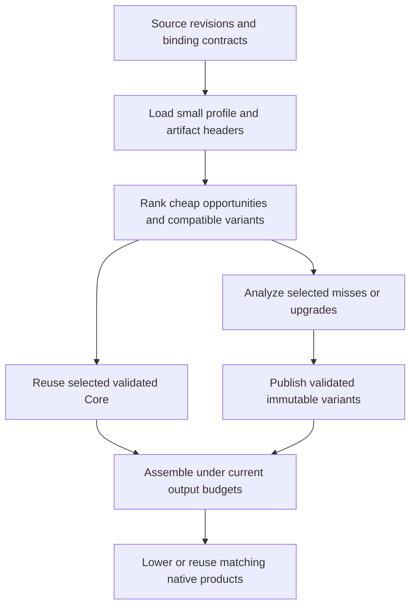

# PGO and persistent incremental optimization

This ADR is an append-only decision log. It covers profile-guided optimization
(PGO) in Core and reuse of optimized code across builds. Execution work is tracked
in [TODO.md](../../TODO.md#p2-source-closure-and-generated-code-profitability).

## D000 — 2026-09-22 — Log protocol and scope

**Status:** Adopted for this document. **Supersedes:** None.

Keep each record's date, ID, status, reasoning, and evidence unchanged after it is
committed. Append a new numbered record to accept, reject, correct, or supersede a
proposal; identify the affected record explicitly. The latest explicit decision
for a subject governs. Do not turn old proposals into accepted decisions by
editing their status. Future implementation findings belong in new records;
benchmark logs and generated artifacts remain outside tracked documentation.

The user requested VM-based PGO feeding our optimizer, reusable optimized functions
or modules, and a plan for spending additional optimization effort over time.
D001 onward propose the architecture; this ADR does not claim those features are
implemented. Creating the design does not start training, background optimization,
or a benchmark campaign.

## D001 — 2026-09-22 — Separate better decisions from reusable work

**Status:** Proposed. **Supersedes:** None.

PGO answers “where does this program execute?” Persistent optimization answers
“which compiler work can the next build reuse?” They share identities and artifact
infrastructure, but solve different problems. Meriyah can be valuable to cache
because it is unchanged across many builds, even when parser execution is a small
part of a particular application's runtime.

Current foundations, inspected at `d5861001`:

| Existing mechanism                                                              | What it already avoids                                                            | Missing capability                                                    |
| ------------------------------------------------------------------------------- | --------------------------------------------------------------------------------- | --------------------------------------------------------------------- |
| [Frontend artifacts](../../src/build-frontend-cache.ts)                         | An exact whole-program hit skips graph construction, Core, and lowering           | Reusing an unchanged library after an application edit                |
| [Dependency fragments](../../src/dependency-fragment-cache.ts)                  | Reuses development-mode dependency images; groups overlapping dependency closures | Full-optimization Core artifacts for the ordinary production pipeline |
| [Core analysis manager](../../src/compiler/core/core-analysis-manager.ts)       | Reuses results against mutation versions inside a compilation                     | Persistent identities, dependencies, and serialization across builds  |
| [Compiler artifact codec](../../src/compiler/target/compiler-artifact-codec.ts) | Restores lowered `ProgramImage` and native plans                                  | Restoring Core that can receive further optimization                  |
| [Generated-object cache](../../src/local-build.ts)                              | Reuses matching C objects                                                         | Skipping Core and emission before an object lookup                    |
| [VM profiling](../../runtime/src/profile.c)                                     | Counts execution and diagnostic events                                            | A small training format consumed by Core scheduling                   |

Build one persistent Core artifact model with optional lowered/native products,
rather than another independent compiler pipeline. Keep existing whole-image and
object hits as fast paths. Reuse valid expensive results before resolving optional
proofs, and optimize only selected misses or explicitly selected upgrades.

An “ultra optimized” artifact is a candidate with recorded costs and assumptions,
not a promise that more compiler work made it faster. Runtime, build time, code
size, and storage remain separate measurements.

## D002 — 2026-09-22 — Stable origins, exact revisions, separate validity

**Status:** Proposed. **Supersedes:** None.

Assign identities before optimization, using the frontend's coherent source
snapshot. Compilation-local function, value, instruction, and constant indexes
remain cheap integers; persistent identities map to those indexes on import.

| Identity          | Proposed contents and purpose                                                                                                                           |
| ----------------- | ------------------------------------------------------------------------------------------------------------------------------------------------------- |
| Module key        | Resolved package/workspace identity, module-relative path, module goal, and relevant resolution conditions; independent of the checkout's absolute path |
| Function key      | Module key and lexical declaration path, including a local disambiguator for anonymous or repeated declarations                                         |
| Function revision | Body, parameters, strictness, lexical binding/capture structure, and source interpretation identity                                                     |
| Site key          | Function key/revision plus a local preoptimization call-site ID; not an optimized instruction ordinal or line number                                    |
| Artifact validity | Input revision, producer/schema, semantic policy, binding contract, and every external assumption consumed                                              |
| Variant identity  | Validity manifest, optimization recipe, consumed profile slice, and resulting content digests                                                           |

V1 matches exact function revisions. An insertion outside a function should not
invalidate that function merely by shifting source lines or global function IDs.
Ambiguous lexical matching is a miss. Edits inside a function may invalidate all
its site counts initially; fuzzy matching is deferred. Normalize identifiers for
storage, not observable filesystem/module-resolution behavior. Identical package
contents may share code, while distinct resolved module instances retain separate
bindings, state, and initialization.

Keep origin and optimized-instance identity separate. An inlined clone retains its
source origin and records its caller/clone provenance. Aggregated origin counts
must not be counted once per emitted instruction. New synthetic operations have
unknown frequency unless a defined derivation is available.

Today's [profile metadata](../../src/compiler/target/profile-metadata.ts) derives
origins after lowering from source text, operation kind, and occurrence order.
Those diagnostic origins cannot serve as the new validity contract.

Profile compatibility is weaker than optimized-code validity. A graph digest
belongs in capture provenance, but must not invalidate every unchanged function's
profile after one application edit. A profile mismatch loses a scheduling hint;
an assumption mismatch prevents reuse of the affected optimized variant.

## D003 — 2026-09-22 — Minimal VM training and explicit profile consumption

**Status:** Proposed. **Supersedes:** None.

The first training mode records function entries and original call attempts. It
uses VM hooks, but does not enable the existing twelve-category diagnostic
counter allocation for every instruction. It records no receiver values, type or
target histograms, object identities, branch probabilities, or allocation traces.
Add such data only with an identified optimizer consumer.

Define counter semantics before implementing hooks:

- Count an invocation after callee/argument evaluation, including spread iteration,
  succeeds and immediately before dispatch. Include ordinary calls, construction,
  `super`, and tagged-template invocation. A failed dispatch still counts; an
  argument-evaluation throw or optional-call short circuit does not.
- Count function entry on invocation before parameter initialization can throw,
  including entry through native builtins or host callbacks. Generator and async
  invocation counts once; resumes do not count again. This measures invocation
  exposure, not generator-body execution: the parameter prologue can run even
  when the resulting generator is never resumed.
- V1 training disables optional call expansion and preserves explicit origin
  events across required lowering. Counter anchors cannot disappear through
  folding, cloning, or dead-code cleanup while their original event can execute.
  Keep training-only event semantics out of production optimization.
- Use dense bounded counter arrays and unsigned 64-bit counts. Overflow saturates
  and is reported, rather than wrapping. The manifest maps slots to stable keys.

A capture contains schema and counter-semantics versions, a unique run ID,
producer/image identity, semantic configuration, module/function revisions, site
coverage, workload group, counts, and completion/overflow information. Publish a
complete manifest only after its counter payload and checksum are available.
Record incomplete captures distinctly; V1 merge rejects them.

The user explicitly selects training inputs and merges captures into an immutable
profile. Merge deduplicates run IDs, retains provenance, and applies recorded
workload weights. Equal run weights are the initial policy; longer runs naturally
contain more events. Do not normalize by VM elapsed time or silently append every
capture found in a cache directory. Later normalization by completed work units
requires an explicit workload contract and a new decision.

Profile use reports matched, unmatched, ambiguous, uninstrumented, and observed-zero
sites separately. A missing count is never zero. A completed run's zero means
“not observed in this workload,” never “unreachable” or “safe to remove.” Training
and consumption require compatible semantic configuration, including primordial,
realm, eval, and host-surface policy.

VM counts describe exposure, not native costs. They cannot determine register
pressure, instruction-cache behavior, allocation savings, or native guard cost.
Workloads sensitive to timing, I/O, or concurrency also need holdout evidence.

## D004 — 2026-09-22 — Consult heat before expensive analysis

**Status:** Proposed. **Supersedes:** None.

Use measured call exposure in the cross-call profitability score, and use function
exposure to order cheap specialization opportunities before proof resolution.
The integration seam already exists before `opportunity.resolve()` in
[region selection](../../src/compiler/core/core-ir-region-selection.ts).

The intended flow is:



V1 heat improves ordering, not eligibility or proof strength. Estimated saved work
still subtracts retained guards and materialization costs. Without hit/miss data,
an open target has no measured success probability; keep conservative static
confidence rules. Do not multiply a measured site count by loop depth again.

Do not compare raw observed counts with arbitrary static weights as if both were
measurements. Rank matched sites on a common weighted-workload scale, and keep a
bounded, explicit allowance for unknown sites using static ordering. Its share is
a policy input to calibrate, not a hidden fallback that forces analysis everywhere.
Function-entry counts can support cheap estimates for uncounted operations, but
must not make every sibling region as hot as the function's busiest call or imply
that a generator body executed. Without body-specific observations, generator
regions retain static/unknown scheduling rather than inheriting creation counts.

Preserve lazy discovery when comparing opportunities across functions. A bounded
lookahead can prevent one admitted function from spending the budget on all its
weak siblings before another function is considered. Do not eagerly prove every
candidate to obtain an exact global ordering.

Report why each selected or skipped family received work: measured exposure,
static fallback, cached variant, exhausted work budget, incompatible assumptions,
or output-growth limit. Keep these summaries cheap; detailed per-site diagnostics
remain opt-in. Mandatory lowering and correctness checks do not depend on heat.

## D005 — 2026-09-22 — Reusable module contracts with function variants inside

**Status:** Proposed. **Supersedes:** None.

Start with a module artifact that owns initialization, imports/exports, lexical
cells, and shared data. Group initialization cycles or inseparable shared state
when required. Store function bodies separately inside that container so one
changed or upgraded function does not require rewriting a giant package blob.
The same mechanism applies to application modules and third-party packages.

Distinguish module initialization cycles from call-graph strongly connected
components (SCCs). Recursive call summaries converge together and publish
consistently, but need not force all parser functions into one permanently
indivisible artifact. A function is independently reusable only under its enclosing
module/capture contract. Never cache runtime module instances, mutable parser
state, closures, or heap objects as compiler artifacts.

Maintain two forms under one manifest model:

1. **Conservative reusable code.** Exports admit arbitrary valid callers and
   arguments; outside writes, escapes, and calls have declared conservative
   contracts. Optimize internal code under explicit language/world policy.
2. **Application-specific variants.** Narrow parameters, inline external bodies,
   remove adapters, or fold external values only with recorded dependencies on the
   particular facts that authorize those changes. Retain a conservative baseline.

This is an explicit new boundary. Current “local” passes are not automatically
context-independent: [optimizeCore](../../src/compiler/core/optimize.ts) specializes
platform constants, uses compilation facts, and prunes module/platform state.
Do not serialize an arbitrary intermediate Core object and label it reusable.

The initial persistent format stores canonical Core, symbols and relocation
tables, module contracts, typed summaries, and completed optimized variants.
Optional proven recipe payloads may be reused only when their proof contract is
portable and validated; initially, unsupported recipe families are rediscovered
on demand. Full global reachability and final plan selection remain assembly work.
Importing cached bodies must not silently run the whole local optimizer over them
again; only changed inputs or selected further work should wake those passes.

Program-global function IDs, slots, captures, strings, templates, source positions,
fact references, and specialized-entry references all need explicit relocation.
The current [attribute relocation metadata](../../src/compiler/core/core-ir.ts)
handles local IDs and is insufficient for this format. Opaque fact payloads need
typed serialization contracts. Register allocation, transient analysis handles,
mutable editor state, and solver queues are not persisted as Core artifacts.

Load small manifests and summaries first. Decode only selected bodies and required
initializers. Memoize dependency validation within a build; do not recursively
deserialize every dependency to prove a cache hit. Recompute volatile memory and
provenance analysis only for newly requested proofs. Persisting complete memory
graphs is deferred unless measurements show that loading and validating them is
cheaper than their demand-driven reconstruction.

## D006 — 2026-09-22 — Record what an optimization depended on

**Status:** Proposed. **Supersedes:** None.

An optimized function can stop mentioning the very code that made its optimization
legal. Record dependencies when a transform consumes facts, rather than trying to
recover them afterward from the optimized body.

| Change                              | Dependency retained with the variant                                                   |
| ----------------------------------- | -------------------------------------------------------------------------------------- |
| Inline a function                   | Imported body revision and its binding/environment contract                            |
| Fold a call or narrow its effects   | Consumed summary content and relevant target-set contract                              |
| Narrow a parameter from its callers | Incoming-call completeness, escape/reachability, and argument facts                    |
| Fold a global or captured value     | Binding identity, value, initializer/write-set proof, and capture layout               |
| Remove a primordial guard           | Relevant primordial/realm policy and intrinsic catalog contract                        |
| Specialize a guarded operation      | Guard, fallback, materialization requirements, and consumed static facts               |
| Omit generic code or an initializer | Current assembly's reachability/closure proof; never infer this from a package profile |

Separate baseline input, assumptions, and optimization policy/profile identity.
Use content fingerprints of consumed summaries: if a dependency changes but the
summary a caller used is identical, that caller can remain valid. An inlined caller
still depends on the imported body even when the public summary is unchanged.
Maintain reverse dependency indexes for targeted invalidation.

Start conservatively. Until fact-dependency recording is complete for a transform,
its application-specific variant depends on the full relevant compilation context
or is ineligible for cross-build reuse. A successful structural verifier does not
prove that an external assumption still holds. Validate both.

Producer/schema identity is mandatory. Existing
[producer fingerprints](../../src/compiler-cache-identity.ts) safely include
transitive compiler code. Initially an optimizer implementation change can invalidate
optimized Meriyah too, even if Meriyah's source is unchanged. Distinguish the
compiler producing an artifact from the compiler source being compiled as input.
Do not promise reuse across arbitrary compiler revisions or ignore bug fixes to
improve hit rates. Later stage-specific producer cones can preserve constructed
Core across optimizer-only changes without inventing a legacy compatibility layer.

Profile identity records only the slice and policy actually consumed by a variant.
An unrelated new training capture should not force regeneration of every body.
Changed profile guidance may make a variant less useful without making its code
incorrect; its static assumptions still determine semantic validity.

## D007 — 2026-09-22 — Progressive optimization produces immutable alternatives

**Status:** Proposed. **Supersedes:** None.

Keep a canonical baseline and publish immutable successors at completed, verified
phase boundaries. A later build can reuse a compatible successor and spend spare
work budget on additional eligible transformations. If dependencies or ordering
requirements changed, restart that work from the baseline. Never repeatedly narrow
the only stored body and assume earlier decisions can be undone.

The first upgrade implementation reruns a selected module/function family from
canonical Core with a stronger recipe. Actual continuation is a later step: record
completed phase/recipe identity, persistent input revisions and consumed-assumption
fingerprints, cumulative growth, and coarse unfinished opportunities. Process-local
Core mutation counters cannot validate a saved checkpoint. Resume only passes whose preconditions admit the stored
checkpoint. Do not persist a JavaScript closure, `CoreAnalysisManager`, active edit,
or arbitrary midpoint of a fixed-point solver.

Budget exhaustion leaves valid code and explicitly unfinished work. Distinguish
not attempted, budget-limited, disproved, unsupported, and currently unprofitable.
Negative results depend on inputs and policy; “not enough budget last time” must
not become “never try again.” Count only completed atomic transformations when
publishing a checkpoint. Wall-clock cancellation can stop at a safe boundary;
deterministic work units govern reproducible selection.

Use two ledgers:

- **Fresh compiler work:** charge lookup, validation, decoding, and analysis actually
  performed now. Do not charge a hit for the analysis that produced it previously.
- **Selected output cost:** charge cached and fresh expansions equally, including
  fallbacks, code/data growth, and selected ABI siblings. Reuse cannot bypass the
  current program's output budget. Cumulative variants record total growth from
  baseline, not just the latest upgrade's delta.

A higher-budget variant need not dominate a compact one. Retain a bounded set of
useful alternatives with assumptions, code size, construction cost, and native
results on named workloads. Selection chooses one compatible body per required
variant contract, accounting for shared code once. Limit variant count and bytes;
never grow the cache with every budget value or profile run. “More transforms” is
not a promotion criterion.

An explicit bounded improvement operation selects a module/function family and
produces a candidate variant. Defaults do not start a daemon or consume idle laptop
time. Automatic background work, if wanted later, needs a separate resource and
scheduling decision. Extending optimization may amortize across future executions
and future builds, but those benefits must be measured separately.

## D008 — 2026-09-22 — Reproducible selection and native reuse

**Status:** Proposed. **Supersedes:** None.

Use the existing content-addressed artifact store, leases, atomic publication, and
bounded pruning infrastructure. Add typed artifact families, not a parallel global
cache. A mutable index may advertise available variants; it cannot mutate code an
active build has selected. Validate imports before exposing them to optimization.
Corrupt or incompatible entries are misses with a reason.

At build start, pin profile/policy/input recipes and a snapshot of available
immutable variants. Newly selected misses or upgrades publish validated artifacts
before the resolved manifest records their output digests. Finalize that manifest
before publishing the product, and include it in final build identity. Reproducible
builds consume a supplied resolved manifest and forbid replacement or upgrades;
exploratory builds may resolve a new one and must report it. Cache warmth alone
must not silently change a pinned build's output.
A pinned evicted artifact is rebuilt with the recorded deterministic recipe and
checked against its digest, or reported unavailable; do not silently substitute a
different “best available” variant. A wall-clock-limited exploratory upgrade is
reproducible through its pinned result, not through repeating the same time limit.

Core reuse and native-object reuse are separate milestones. Current C symbols and
references contain global numeric indexes. Even an unchanged Core body can emit
different C after an application inserts a function or constant. Existing object
keys correctly include C bytes, headers, flags, target, and toolchain; weakening
those keys would be incorrect.

Introduce stable module-local symbols and explicit code/data binding at assembly
to preserve reusable C/object bytes. Existing relocatable overlays are a seam to
study, not a general module ABI already available. Keep generic call adapters and
module instantiation semantics. Compare indirection/adapter cost against rebuild
savings; do not impose a per-operation lookup table without measuring its runtime
cost. A changed caller may still request a separately keyed cross-boundary inline.
Backend-specific products additionally validate runtime ABI, feature set, toolchain,
target, lowering policy, and instrumentation identity.

First avoid repeated Core work; then demonstrate stable emission and object hits.
Caching Core alone does not promise that native compilation or linking disappears.

## D009 — 2026-09-22 — Meriyah pilot and plan of attack

**Status:** Proposed. **Supersedes:** None.

The Meriyah pilot uses resolved source contents and dependencies, not merely the
package name/version. Train on representative parsing plus a full compiler input,
with a different syntax/error corpus held back. Preserve its exports, initializer,
internal parser state, callbacks, and error behavior under the module contract.
Apply the same machinery to a stable group of our own compiler modules afterward;
there must be no Meriyah-specific optimizer branch.

The desired edit cycle is concrete:

1. Build Meriyah's conservative reusable Core once; create and measure an optimized
   variant under a declared world policy.
2. Change application code. Match Meriyah's manifest, validate only its relevant
   dependencies, import the selected artifact, and skip its original Core
   construction/optimization. Resolve current application bindings and budgets.
3. Spend this build's optional work on changed or newly hot application code.
   Unchanged Meriyah may receive an explicitly selected upgrade, but is not forced
   back through every pass just because the global budget reset.
4. Change an imported fact used by Meriyah, its own contents, or its producer
   contract. Invalidate the affected variants; use the conservative alternative or
   rebuild. A changed profile can select a different valid variant.
5. After stable native binding exists, the application edit also reuses Meriyah's
   C/object products. Before then, report Core savings and remaining backend work
   separately.

Implement in reviewable stages. PGO and reusable Core share the identity foundation
but can be developed independently after it; neither requires a resumable solver.

| Stage                           | Deliverable                                                                                              | Exit evidence before expanding scope                                                                                       |
| ------------------------------- | -------------------------------------------------------------------------------------------------------- | -------------------------------------------------------------------------------------------------------------------------- |
| 0. Identity/contracts           | Stable module/function/site origins; explicit reusable-boundary policy and cache dependency taxonomy     | Unrelated function insertion preserves keys; changed capture or resolution contract does not                               |
| 1. VM training                  | Small counter format, exact attribution, atomic captures, deterministic explicit merge                   | Known entry/call counts; throws, callbacks, generators/async, partial files, overflow and duplicate runs covered           |
| 2. Core PGO use                 | Profile-weighted cross-call ordering and heat before lazy discovery                                      | Tight-budget selection follows measured exposure; unknown/zero stay distinct; expensive skipped proof work decreases       |
| 3. Persistent Core pilot        | Portable canonical and completed optimized module artifacts; relocation and conservative boundary checks | Small module round-trips into a differently numbered program; cold/warm outputs agree; invalid assumptions cause misses    |
| 4. Meriyah and own-module reuse | On-demand summary/body import, dependency invalidation, current-budget admission                         | Application-only edits avoid dependency Core work; module initialization and closure semantics remain correct              |
| 5. Native artifact stability    | Stable code/data interfaces and cacheable C/object products                                              | Insert early functions/constants without rebuilding unchanged library objects; measure call/adapter overhead               |
| 6. Bounded upgrades             | Explicit upgrade selection, immutable variants, evidence-based promotion, pinned manifests               | Reuse upgrades across builds; enforce cumulative output/storage budgets; interrupted publication preserves prior artifacts |
| 7. Incremental continuation     | Resume supported optimization families at verified phase boundaries                                      | A second work grant advances unfinished work without replaying completed analysis or retaining stale assumptions           |

Do not combine every stage into one compiler rewrite. At stage 4, useful persistent
reuse must already work even if stages 5–7 prove unnecessary or too costly.

## D010 — 2026-09-22 — Measure the right economics and preserve counterexamples

**Status:** Proposed. **Supersedes:** None.

The benefit of an upgrade is future runtime saved plus future rebuild work avoided,
less upgrade cost and recurring lookup/validation/load overhead. Include C
compilation, storage, and peak memory. This is an accounting model for experiments,
not another expensive optimizer analysis or a license to assume future reuse.
Report the number of uses/builds needed to recover the measured upgrade cost.

Separate the effects with a static/PGO × reuse-disabled/reuse-enabled comparison.
Also compare cached baseline-quality code with cached upgraded code. Hold producer,
input, budgets, configuration, and toolchain fixed. Cold and warm behavior are
different results; a cache hit is not evidence that PGO generated faster code.

| Experiment                           | Required observations and counterexamples                                                                                                   |
| ------------------------------------ | ------------------------------------------------------------------------------------------------------------------------------------------- |
| Exact repeat / application-only edit | End-to-end time, cache validation/load bytes, avoided Core work, emission/object/link time; include an early inserted function/constant     |
| Dependency edit                      | Same version string but changed contents; changed body with unchanged summary; unchanged body with changed capture/import facts             |
| World/producer changes               | Locked to mutable primordials, eval/realm/host policy, compiler implementation, Core schema, runtime ABI, target/toolchain                  |
| Profile changes                      | Unmatched and zero sites, different caller distribution, repeated/partial captures, cold error paths, unseen dynamic targets                |
| Selected upgrade                     | Native runtime on training and holdout inputs, startup, code/data size, compilation cost, RSS, cache bytes and amortization                 |
| Shared state                         | ESM cycles/live bindings, CommonJS initialization, duplicate package instances, callbacks, exceptions, async/generator resume and GC stress |
| Publication/reproduction             | Interrupted/concurrent writers, corrupt payloads, pinned artifact eviction, cache disabled/read-only, consistent resolved manifests         |

Warm reuse must skip the claimed Core work, not merely move it into dependency
validation. Small and one-shot programs must remain able to decline persistence
when hashing, loading, and verification cost more than recomputation. Native speed
acceptance needs repeated matched runs on holdouts; one diagnostic run establishes
feasibility only. Full standards/gate campaigns follow the existing authorization
and [testing policy](../testing.md), not this document's creation.

Related primary designs inform, but do not establish, these Maligator decisions:
[ThinLTO](https://clang.llvm.org/docs/ThinLTO.html) uses compact summaries before
selective cross-module optimization and supports backend caching.
[Rust's incremental compiler design](https://rustc-dev-guide.rust-lang.org/queries/incremental-compilation-in-detail.html)
explains stable IDs, dependency fingerprints, and the cost of computing them.
[Clang's PGO workflow](https://clang.llvm.org/docs/UsersManual.html#profile-guided-optimization)
separates training, profile merging, and later compilation. We reuse those general
lessons while defining JavaScript binding, module, and proof contracts explicitly.

## D011 — 2026-09-22 — Decisions intentionally left open

**Status:** Open. **Supersedes:** None.

Resolve these through the stages above and append the resulting decisions:

- The unknown-code allowance and workload weighting defaults; do not calibrate
  exclusively on self-compilation.
- The smallest portable fact/recipe families and conservative boundary policy;
  which additional context can be fingerprinted without reading every body.
- The module-native binding ABI and whether its indirection cost is acceptable.
- Artifact variant/byte limits and promotion criteria across runtime, startup,
  code size, and build cost; no universal “highest optimization level wins.”
- Which transformation families can actually resume safely from a checkpoint,
  versus cheaply restarting selected work from canonical Core.
- Final CLI/configuration names and whether background upgrades are desirable.
  Initial operations are explicit; there is no automatic worker in this proposal.

## D012 — 2026-09-22 — First function-origin checkpoint

**Status:** Accepted and implemented for diagnostic profile publication.
**Refines:** The function-origin portion of D002 and stage 0 in D009.
**Supersedes:** None; original call-site identities and reusable-code contracts
remain proposed.

Capture function origins after module linking and before Core construction mutates
the frontend. Carry immutable source snapshots, declaration paths, effective
strictness, function kind, and symbolic external-binding owners through Core.
The escaped metadata must not retain mutable AST, scope, or binding objects.
Renumbering functions and creating optimized instances preserve the source origin.

Separate a declaration's origin from its revision. The origin identifies the
resolved module and named lexical declaration path. The revision also includes
the exact function source, parsing context, and referenced external-binding
descriptors. Moving a captured variable to another owner or retargeting a named
ESM import changes the revision, even when the reader's text stays unchanged.
Changing the imported implementation alone need not change the reader's revision:
this is a source-profile identity, **not a certificate that cached proofs remain
valid**. Persistent Core still needs the producer and consumed-dependency contracts
specified in D005–D007.

Collection is opt-in through the existing profile compilation path. Ordinary
compilation neither traverses the source for origins nor hashes function bodies.
Profile compilation captures descriptors before they can be lost, but defers body
hashing until the sidecar is published. Only functions present in the runtime image
are hashed, once per shared source record. A module's immutable source string is
shared by its functions. This deliberately accepts source retention and a frontend
scan during profiling; it does not claim the training build's overhead is measured
or that overlapping nested bodies are each hashed only once.

The existing profile sidecar now uses schema 4 and binds function identities into
its capture checksum. Runtime function indices remain indices into that exact
build's table. Published identities distinguish:

- **Known:** one runtime function represents a mapped source origin.
- **Shared:** several runtime functions represent the same source origin; this
  does not provide separate original events or a unique cross-build instance match.
- **Ambiguous:** source declarations collide; surviving optimization does not
  retroactively make the source identity unique.
- **Unknown:** no supported source identity is available, with an explicit reason.

The report includes coverage for each state. Raw sampling/counter formats and
MALW/MALC payloads are unchanged; source snapshots stay out of runtime artifacts.
Existing diagnostic site identities remain heuristic post-optimization anchors.
They must not be reinterpreted as original PGO call sites.

Portable identities require an explicit map from physical files to unique resolved
module keys. Duplicate or empty keys fail instead of merging package instances.
The fallback uses physical paths and is labeled checkout-bound. A function with
any external binding owned by a checkout-bound module is also checkout-bound.
Automatic package/lockfile resolution keys and a public CLI surface remain open.

For this checkpoint, anonymous owners, class contexts, synthetic functions, dynamic
scope, and unresolved namespace/CommonJS import owners remain explicitly unknown.
Named declarations under duplicate owners are ambiguous. Non-function block scope
descriptors include a relative source offset, which can cause conservative misses
after unrelated edits within an enclosing function. These coverage limits are
preferable to inventing a match and must be visible when evaluating training input.

Focused acceptance covers unrelated insertion with runtime renumbering, body and
capture changes, named import retargeting, portable module keys, duplicate and
unknown cases, shared instances, UTF-16 source spans, immutable snapshots, and the
ordinary-build opt-out. It also checks that changing a function identity invalidates
the capture checksum and that metadata-only Core edits reach publication. These are
identity and diagnostic integration checks, not native PGO performance acceptance.

Next, add stable original call-site records and complete the resolution/context
descriptors needed by the selected training workloads. Then introduce the small VM
entry/call-attempt capture from D003, keeping original events distinct from
optimized instances. Only after attribution tests pass should Core use those
counts to rank work. Persistent Core reuse can develop against the same identity
foundation, but admission and proof validity remain separate requirements.

## D013 — 2026-09-22 — Original call-site identity and coverage

**Status:** Accepted and implemented for source capture and diagnostic publication.
**Refines:** D002 and D012. **Supersedes:** None.

Capture invocation sites in the same pre-lowering traversal as function origins.
A call key combines the original owner's exact identity/revision with function-local
UTF-16 offsets and invocation kind. Compilation-wide numeric references connect
Core calls to this table; clones must retain the original reference rather than
reinterpret a local ordinal against their new containing function. Source-call
references are stripped before runtime lowering.

Record ordinary/optional calls, construction, `super`, and tagged-template calls.
Compiler-generated iterator, initializer, and loader helper calls do not acquire a
source call identity. Retain explicit lowering coverage: direct eval and static
CommonJS require currently lack a general ordinary-call anchor. Top-level and
unsupported lexical owners remain unknown instead of inheriting a generated
wrapper's identity. These limits constrain profile coverage, not program behavior.

The diagnostic sidecar advances to schema 5 and includes original-call records in
its capture checksum. It does not claim execution counts for these records. Stable
keys survive unrelated insertion; changing the owning function invalidates its
call keys. VM training must add independent event anchors after argument/spread
completion, preserve those anchors through lowering, and report uninstrumented
sites separately from observed zero.

## D014 — 2026-09-22 — VM training capture and explicit merge

**Status:** Implemented; focused VM and format checks passed. **Refines:** D003.
**Supersedes:** None.

Training uses a separate `MAL_PGO` runtime feature and an interpreter image. It does
not enable the diagnostic sampler, allocation histograms, or compiler timers.
Optional Core transforms and frontend self-tail-call rewriting are disabled in
training. A fresh frame increments function entry before JavaScript parameter
initialization; generator/async resumes do not increment entry again. Original
invocation markers execute after argument and spread evaluation. An invalid callee
still records an attempt; an argument throw or optional-chain short circuit does
not. Hidden spread arrays define own properties so inherited setters cannot change
training behavior.

Counters are bounded unsigned 64-bit integers, with saturating arithmetic and an
explicit overflow flag. Raw schema/semantics version 1 contains dense function and
source-site arrays plus a capture identity. Actual emitted markers determine which
sites are instrumented. Uninstrumented, unknown-owner, and observed-zero sites are
separate coverage states. Wire schema advances to 59 for the training-only marker.
Runtime function IDs remain local to the capture; source identities own merging.

A run starts with an incomplete manifest. Only successful process completion plus
validated atomic raw publication produces a complete manifest. Normal fast exits
flush explicitly, independently of optional VM teardown. Unsupported runtime image
changes or nested VM execution invalidate the capture. Dynamic-code coverage is
not inferred from existing IDs.

Use explicit commands:

```sh
node ./src/index.ts run app.mjs --pgo-train --pgo-workload representative -- input.json
node ./src/index.ts pgo merge .cache/pgo/runs/<run-id> --out .cache/pgo/selected.json
node ./src/index.ts build app.mjs --production --pgo-use .cache/pgo/selected.json
```

Merge reads only the supplied complete captures, checks raw/map identities and
checksums, deduplicates run IDs, rejects conflicting duplicates, and orders inputs
deterministically. Counts sum with equal per-run weight and saturation. Merged
profiles are immutable: publishing the same content is idempotent; a different
profile requires another path. Training and diagnostic profiling, training and
profile use, and training deployment/wire-only artifacts are mutually exclusive.
`build --pgo-train` emits a training binary and `.pgo.json` map; `run --pgo-train`
owns the complete capture lifecycle.

Focused native coverage includes callbacks, default-parameter throws, failed
calls, throwing spread iterators, optional calls, recursion, generator creation and
resumption, async continuation, constructors, super, tagged templates, and mutable
array-prototype setters. Format coverage includes exact values above 2^53, partial
files, incomplete exits, corruption, duplicate inputs, and overflow.

## D015 — 2026-09-22 — Profile exposure selects compiler work

**Status:** Implemented; focused ordering and cache checks passed. **Refines:** D004.
**Supersedes:** None.

`--pgo-use` loads a validated merged profile. A memoized adapter matches exact
source function revisions and original source-call keys against constructed Core.
It lives outside compiler facts: profile observations never justify semantic
eligibility, guard removal, representation changes, or unreachable-code deletion.
Unmatched revisions remain unknown. Generator entry does not estimate body heat.
Calls copied into another owner and new specialized function IDs remain unknown;
verified equivalent-call rewrites preserve the original call reference.

Cross-call candidates use measured attempts instead of static loop frequency in
profitability scores, retaining existing guard and generated-code costs. Measured
and unknown candidates occupy distinct ordering categories. Static-argument
specialization skips observed-zero calls before asking for static-value analysis.
Late local/direct-entry opportunities use function-entry exposure; this is an
estimate for regions, not a claim to have counted each region. Heat admission runs
before lazy specialization proof resolution. Observed-zero work does not consume
the unknown allowance.

The shared candidate service reserves 20% of compiler-work and generated-code
budgets for unknown candidates; measured candidates get the remainder. Discovery
and application both consume their category's allowance across phases. The first
policy deliberately does not transfer unused allowance. Static scoring orders the
unknown category and remains a tie-break within measured exposure. Profile digest
and the scheduling/adapter implementation identity participate in frontend cache
keys; filenames do not.

Focused checks show a measured count of two beating a static-loop count of one,
a measured count of one beating an unknown loop, and only the hotter function
requesting a proof under a tight budget. Zero exposure requests no lazy local proof.
The remaining cross-call target/bridge discovery is partly eager; this stage does
not claim all compiler analysis has become demand driven. Representative workload
coverage, quota tuning, and end-to-end performance acceptance remain later work.

## D016 — 2026-09-22 — Persistent Core module pilot

**Status:** Implemented as an explicit compiler API; focused round-trip and native
checks passed. **Refines:** D005, D006 and stage 3 of D009. **Supersedes:** None.

`loadOrCompileCoreModule` accepts one JavaScript ESM source, a logical module key,
its current diagnostic path, and an explicit cache directory. The first boundary
supports strict functions, module-private mutable globals, live exported slots,
scalar constants/arithmetic, branches, and internal calls. Imports, unresolved
external globals, captured environments, classes, suspension, templates, opaque
facts, effect refinements, target representations, guards and switches are rejected
as unsupported. The caller retains responsibility for its ordinary fallback.

The persisted record contains canonical Core and a completed `conservative-local-v1`
variant. The recipe runs the local optimizer without application facts or program
flow. Exhausted work cannot publish a completed variant. It does not persist solver
queues, register allocation, or an interrupted pass. Cache identity covers lossless
UTF-16 source content, logical module key, boundary/schema, recipe limits, and a
dedicated transitive producer fingerprint including the codec and importer.

A warm hit validates and imports the selected optimized artifact, skipping source
parsing, semantic/Core frontend construction and completed local optimization.
Canonical Core is decoded only when requested. Artifact verification and relocation
still perform work; the pilot does not claim their cost is zero. Export-slot
projection is opt-in, so ordinary builds pay no extra export-table construction.

The codec uses an explicit opcode/attribute boundary. Import relocates functions,
private globals, strings, source positions, blocks and SSA values. Special numeric
values and UTF-16 units survive serialization. It validates in temporary Core before
mutating the destination, because Core editors do not support rollback. Each import
returns an initializer and live export slots; the caller invokes the initializer
before using them. Each module instance receives separate state.

Native acceptance imports canonical, cold optimized, and warm optimized variants
behind existing function/global/string/source-position IDs. All return the same
values, and mutating one instance leaves the others unchanged. The assembly builds
its current plan and lowers normally without rerunning the completed local recipe.
Source/recipe changes and corrupt receipts miss; unsupported boundaries fail before
destination mutation. Warm evidence reports zero frontend and optimizer functions.

This is a persistent Core pilot, not automatic Meriyah or dependency-graph reuse.
Stage 4 must integrate module selection, dependency contracts, initializers and
closure boundaries into ordinary builds, then measure reuse on representative
applications before widening this boundary.

## D017 — 2026-09-22 — Ordinary-build leaf reuse and mutation-driven follow-up work

**Status:** Implemented for the admitted leaf boundary; stage 4 remains incomplete
for Meriyah and per-function loading. **Refines:** D005, D006, D009 and D016.
**Supersedes:** D016's exclusion of ordinary captured function environments.

`maligator build app.mjs --production --core-cache` explicitly selects conservative
module reuse in the normal native pipeline. The existing whole-image cache remains
first. On a miss, a static acyclic ESM graph can select import-free dependencies as
their initializers become necessary. The application entry remains fresh. Host,
CommonJS, dynamic/deferred import and direct-eval graphs use ordinary lowering;
profile/training builds cannot select this mode. An unrelated async application
function or top-level await does not expand the synchronous cached-leaf boundary.
This is opt-in until representative rebuild and runtime measurements justify a
default policy; small fixture work counts are not that evidence.

Each resolved module instance owns its relocated private globals and functions.
Linker exporter bindings point directly at the imported slots, including aliases,
re-exports and namespaces. The normal evaluation order calls each initializer once,
and a throw prevents subsequent initialization. Imports are declined before mutation
if earlier lowering has already allocated their export slots. The frontend's tables
and allocation counters remain synchronized with the imported Core tables.

Schema 2 adds ordinary captured cells and source-declared single-assignment
candidates. Function owners, captured slots and private global candidates relocate
with the body. This preserves facts for later call-target, value and memory queries;
it does not persist a solver conclusion. Synthetic loop environments remain outside
the boundary. The completed-module interface names `conservative-local-v1` explicitly,
so importing canonical Core alone cannot assert recipe completion.

A completed scalar recipe suppresses only the initial whole-body scalar queue in
construction cleanup and primary optimization. Annotation, CFG, type/range,
representation, memory, program-flow and specialization passes remain eligible.
Edits from those passes wake incremental scalar work, and selected cross-call edits
receive normal cleanup. Current output budgets still admit additional expansions;
cache reuse does not supply proof authority or bypass output planning. Skipping the
entire primary session would discard optimizations the persisted recipe never ran.

Source content, resolved module identity, stripping producer, artifact/recipe policy
and transitive compiler producer determine reuse. A dependency edit or changed
resolution selects a different artifact; an application-only edit can reuse the
existing dependency. Misses use the graph's parsed tree, including stripped
TypeScript, rather than reparsing it. Unsupported syntax is rejected before Core
construction where possible. Unsupported and budget-limited receipts avoid repeating
failed optional work under the same input and recipe; increasing the recipe budget
changes the key. An incomplete recipe never publishes completed bodies. Producer and
decoder size limits agree, and optional persistence failures leave compilation usable.
The `core-modules` family participates in existing cache accounting and pruning.

Decoded artifacts are recursively frozen after structural validation. A private
identity set lets their importer reuse that validation instead of constructing the
same scratch Core twice. Mutable caller-produced artifacts still validate before
each import; a copied or changed object cannot inherit the decoded object's receipt.

Focused checks cover source/stripper/resolution invalidation, negative receipts,
recipe exhaustion, unavailable publication, source candidates and mutation-triggered
scalar work. Native acceptance compares uncached, cold and warm builds with a diamond
import, mutable aliased exports, two resolved module instances, independent counters
and a grandchild closure. An earlier application dependency shifts imported function
IDs on a warm hit. The warm image also executes in the VM. These checks retain
whole-program verification and do not replace the deferred full gate.

The work avoided is precise: a warm leaf performs zero standalone Core construction
and zero executions of its persisted scalar recipe. It still participates in ordinary
graph parsing, semantic analysis, import validation/relocation, current-application
analysis and backend emission. One selected artifact currently decodes all its
functions; this is module selection, not per-function demand loading. Native objects
are not yet reused through a stable module ABI.

Meriyah's current single-file ESM bundle is import-free but exceeds this boundary.
The next codec work is generic support for class/derived-constructor metadata,
exception handlers and parameters, switch edges/constants, heap/property/constructor/
iterator operations and literal tables. Keep these boxed and relocate their typed
references before persisting any application-dependent proofs. After that, demonstrate
an actual Meriyah hit across an application edit and measure both saved Core work and
remaining backend cost before calling stage 4 complete.

## D018 — 2026-09-22 — Reuse Meriyah through the conservative boxed boundary

**Status:** Implemented; per-function demand loading and performance acceptance
remain open. **Refines:** D016 and D017. **Supersedes:** The exclusion of classes,
exception handlers, switches and literal tables from the reusable format.

Schema 3 preserves class and derived-constructor metadata, boxed exception
parameters, handler edges and switch cases. Generic object, property, constructor,
spread and iterator operations have a closed attribute contract. Optional property
flags retain their absence rather than receiving guessed defaults. Function owners,
private globals, string keys and switch string constants relocate with the module.
Synthetic loop environments, asynchronous functions and generators remain outside
this boundary; synthetic owners need their own destination allocation contract.

Literal templates carry their packed words and arbitrary-precision bigint constants
use canonical decimal strings. Import validates template roots and embedded pool
references, then relocates both embedded constants and instruction offsets. The
frontend synchronizes all imported pools so later lowering cannot overwrite them.
Ordinary instantiation retains fresh objects on each call. Corrupt artifacts fail
before mutating destination Core.

Decode special numeric tags only at numeric literal instructions and numeric switch
cases. A general JSON reviver would visit every string code unit, packed template
word and SSA index even though none admits a special number. Structural and Core
verification still run; reducing that unused decoding work does not waive checks.

This expands serialization, not proof authority. Mutable global lookups remain
runtime lookups. Regex literals retain their RegExp intrinsic; replacing the global
constructor still affects ordinary source calls. Proof-bearing attributes, effect
refinements, guard facts and target representations remain rejected. The recipe is
still the conservative local scalar pass: full standalone optimization would first
require explicit exported-call roots and arbitrary external arguments.

The import-free Meriyah dependency now fits the format, including its derived error
class, large literal tables, captured environments, handlers and iterator paths.
An application edit can reuse its completed scalar bodies while current-program
analysis and backend emission remain active. This does not yet cache native objects
or bypass the ordinary graph's parse and semantic analysis.

Focused acceptance covers cache-off, cold and application-edit warm execution against
Node, with Unicode, locations, comments/tokens, class/private/async parser input,
invalid syntax, invalid regexes, throwing callbacks and mutable global RegExp.
A dependency inserted before Meriyah shifts function, global, string, bigint and
literal pools; the warm image also runs through the VM. Format tests cover string
switches, handler relocation and malformed literal/constant references. Full gates
and repeated representative performance acceptance remain separate work.

The next loading boundary must avoid constructing Core twice while retaining
validation before destination mutation. Current warm loading validates the optimized
variant in scratch Core, then imports it into destination Core. Stage validated
function storage for relocation and attachment rather than dropping verification.
A small manifest with separately addressable variants should also keep canonical
alternatives available without reading them on the ordinary warm path. Splitting
payloads alone does not remove the duplicated Core construction. Function-level
loading and further persisted recipes remain separate completion claims.

## D019 — 2026-09-22 — Attach the Core storage already built for validation

**Status:** Implemented with focused verification; repeated performance acceptance
remains open. **Refines:** D017 and D018. **Supersedes:** Rebuilding function bodies
during the first import of a decoded artifact.

Decoding still validates the entire selected artifact in isolated Core, including
cross-function references and constant tables. A private weak map retains that
prepared program alongside the immutable decoded artifact. First import consumes
its function storage after preparing every relocation. Subsequent imports construct
independent storage from the immutable artifact; mutable caller-created artifacts
receive fresh verification. Failed preparation leaves the prepared program usable
and does not change destination tables, functions, versions or analysis journals.

Transfer preserves function-local blocks, instructions, SSA values, normal use
chains and exception-use chains. It changes function ownership and program-level
references: function IDs, global slots, constant pools, source positions and source
metadata. The closed opcode contract checks those references before attachment.
Local graph structure therefore retains its existing verification; attachment does
not repeat CFG and SSA verification. Facts and effect refinements remain excluded.

The Core store owns this transfer primitive. Relocation callbacks must be pure.
Metadata, changed attributes, switch cases and combined tables are prepared before
either owner changes. Source functions must be finished with inactive editors and
writable identity fields. An active destination initializer editor is allowed.
Function identity remains ordinary data properties so self-hosted hot reads do not
gain accessor dispatch. The source relinquishes its functions, and each attached
function records all change domains in the destination's program-flow journal.
Destination generation remains unchanged; existing analyses observe the append and
subsequent edits through the normal version machinery.

Focused tests observe actual function creation and retained store identity across
decode and attachment. They cover repeated imports into different generations,
independent edits, analysis refresh against a fresh analysis manager, and failure
after partial relocation preparation. Native and VM acceptance retain Meriyah's
Node output parity. Matching before/after MALW digests check that this storage
change preserves output selection rather than trading away optimization.

This removes the second function-body materialization at the cache boundary.
Ordinary later optimization and construction compaction still run. Loading still
reads both artifact variants, and table preparation still copies immutable pool
contents. Separately addressable variants, sharing immutable table entries and
function-level loading remain distinct opportunities; this change does not claim
that all cached-module analysis or allocation has disappeared.

## D020 — 2026-09-22 — Load only the selected persistent Core variant

**Status:** Implemented with focused verification; repeated performance acceptance
remains open. **Refines:** D018 and D019.

Receipt schema 2 stores each cache key in one directory, with a small manifest and
digest-addressed canonical and optimized payloads. Payloads publish atomically
before the manifest. Concurrent writers cannot expose partial bodies or mix a
manifest with another generation's contents. Temporary files stay within the entry
and are removed after publication attempts. Optional persistence failures still
leave the freshly compiled result usable.

An ordinary hit reads, hashes, decodes and verifies only the optimized payload.
Canonical access loads and verifies that variant on demand, memoizing successful
decoding. A missing or corrupt canonical variant throws when explicitly requested;
it does not invalidate a usable optimized result or trigger hidden compiler work.
An unusable optimized variant remains a cache miss before destination mutation.
Only validated digest names can select files within the entry.

The cache manager counts and prunes the directory as one module, preserving both
variants together. Successful positive and negative hits refresh entry recency.
Negative receipts remain small manifests with exact unsupported/budget-limited
statuses. The format change invalidates previous receipt identities rather than
adding a compatibility reader. Function-body demand loading remains separate.

## D021 — 2026-09-22 — Share Core-owned immutable constant table snapshots

**Status:** Implemented with focused verification; isolated timing acceptance remains
open. **Refines:** D019.

The Core store records ownership of frozen table arrays, string rows and source
position records in a private weak set. Constructing or configuring another program
can reuse these snapshots directly. Merged outer arrays still receive a fresh frozen
snapshot, but their already-owned entries retain identity. Appending constants or
positions replaces the outer snapshot, leaving other programs and earlier readers
unchanged.

Caller-provided objects still receive defensive copies. A frozen outer array does
not prove its entries immutable, and frozen accessor-bearing records can still
return changing values. Ownership, rather than a shallow frozen check, is the
sharing authority. The frontend retains imported readonly rows and position records
when it resumes lowering instead of copying them back into mutable entries only to
freeze them again at finalization. Literal words that embed relocated pool references
still require remapping.

Focused checks cover caller mutation after construction/configuration, frozen
outer arrays with mutable entries, frozen getters, independent program appends and
reconfiguration, and the identity of shared immutable snapshots. Native and VM
parity and unchanged MALW bytes retain the existing output contract.

## D022 — 2026-09-22 — Build temporary decoder operands only for forward references

**Status:** Implemented with focused verification. **Refines:** D019.

Selected-artifact materialization registers all block parameters before operations.
An operation whose inputs already exist now attaches their real use links directly.
Only a reference to a not-yet-materialized instruction creates a placeholder and a
pending operand repair. A function with no forward references allocates no dummy
instruction or value, and zero-input operations need no pending record.

Serialized block order need not follow dominance order, so the forward-reference
fallback remains necessary. All pending inputs must resolve, and ordinary Core
verification still rejects cyclic or non-dominating uses before import. This changes
temporary construction work, not proof authority or the selected optimization
recipe. Focused tests cover direct operands, valid reordered blocks, unresolved and
cyclic references, followed by native/VM output parity.

## D023 — 2026-09-22 — Persist completed scalar and structural cleanup

**Status:** Implemented with focused verification; representative performance
acceptance remains open. **Refines:** D017–D022. **Supersedes:** The scalar-only
`conservative-local-v1` recipe.

`conservative-structural-v2` first completes scalar cleanup, then runs block-parameter
simplification, forwarding-block elimination, linear-block merging and unreachable
block removal with scalar wakeups until the scheduler drains. These passes consume
function-local CFG/SSA and literal constants. They do not admit application facts,
cross-call assumptions, proof attributes or target representations. Canonical Core
is captured before the recipe, and optimized capture retains full format validation.
One rule registry, feature index, analysis scratch pool and instrumentation-off
report serve the module's functions.

Completion is a control-flow contract, independent of diagnostic reporting. Strict
passes throw a typed budget error when scheduling exhausts, a candidate cannot fit,
or a final edit batch exceeds its allowance. Strict scalar drains also report an
eligible two-edit rewrite that cannot fit the remaining budget. Cache compilation
catches only the typed budget failure and publishes a negative receipt, never a
completed partial variant. Ordinary stop-mode pass scheduling remains unchanged.
The configured limits apply per structural pass and per scalar invocation; they are
not an aggregate module CPU or edit allowance. Larger limits produce a distinct key.

Import records all function-version domains after relocation. After construction
annotations, an unchanged imported body skips only the initial construction
normalization component. An edited body runs ordinary cleanup and retains the full
primary scalar seed. Primary canonicalization, later CFG/proof/memory work and their
mutation wakeups remain enabled for every body. The completion witness is not carried
as a version comparison across the dense-generation boundary.

Structural simplification can expose large string constants to scalar comparisons.
Both consumers now use the Core store's bounded UTF-16 decoder and text cache rather
than spreading all code units into a host call. Focused coverage includes a long
string with a lone surrogate, strict budget failures with reporting disabled,
edited-import invalidation, primary-pass eligibility, and native/VM branches,
signed zero, NaN, loops and nested exception/finally effects against Node.

Moving cleanup before serialization reduces the selected artifact and avoids its
repeated initial scans. It increases cold recipe work; cold and warm results must be
reported separately. The earlier recipes remain historical decisions only, with
their identities invalidated rather than maintained as parallel readers.

## D024 — 2026-09-22 — Discover type-proof consumers before solving global types

**Status:** Planned; not implemented or accepted as a performance improvement.
**Refines:** Demand-driven analysis admission in stages 2–4.

Cross-call folding currently requests program value kinds before discovering which
instructions can consume them, and can refresh them only to decide whether another
wave should run. Split observation discovery from proof evaluation. Discover eligible
`typeof`, boolean-negation and strict-equality observations without first solving
global value kinds. Preserve folds already justified by function-local information.

For unresolved observations, trace value dependencies through moves, block parameters
and relevant operations. Request global propagation when a dependency reaches an
input that it can refine: formal parameters, receivers or script-call results.
Fixed-result operations and opaque loads do not become global proof demands merely
because they occur in a function with calls. Unclassified dependencies retain the
existing conservative path. The first implementation should gate the existing full
solver; narrowing its transfer set is a separate change with a separate contract.

Demand must be reconsidered after edits that introduce or change observations or
their dependencies. Use the existing function-version and analysis invalidation
mechanisms. A continuation check must not request global value kinds when no pending
consumer needs them. Profile heat and remaining budget can select work, but neither
supplies a semantic fact or permits dropping a useful local fold.

Acceptance covers no-observation functions, locally decidable observations, opaque
loads, and global folds through parameters, receivers, calls, moves and block
parameters. Edits that introduce demand must match a fresh analysis run. Measure
actual avoided solver evaluations and matched output alongside end-to-end compile
time; time attributed to the current solver is an upper bound, not a promised gain.

## D025 — 2026-09-22 — Solve global types only for consumed SSA dependencies

**Status:** Implemented with focused verification; broad performance acceptance
remains open. **Implements:** D024. **Refines:** Its full-solver admission boundary.

Each cross-call wave first discovers observations and evaluates program-independent
kinds along their value dependencies. The reader uses the solver's existing transfer
rules. It distinguishes fixed unknown kinds from inputs that need global propagation;
cycles conservatively request the existing solver. Publicly reachable parameters and
receivers remain unknown, and opaque calls do not trigger propagation that cannot
refine them. Successful local folds remain eligible without a global query. Committed
caller edits retain the next wave without solving global types merely to schedule it.
Readers are recreated each wave so changes to call targets cannot leave stale demand.

Admission alone does not remove the dominant work when any useful global consumer
remains. Global type evaluation therefore builds transfers only for the dependencies
of values its consumers read: reachable return operands, consumed outgoing arguments
and strict receivers, wildcard call inputs, and values queried by the observation
evaluator. Observations include live instructions in unreachable blocks, matching
the existing folding contract. Surplus call arguments and callee identities are not
type demands. Root lists and call-site indexes are reused within one propagation
solve; they are rebuilt for the next solve under ordinary invalidation.

Dependency collection follows the same operation rules and all existing CFG
predecessors, including exceptional handler-argument offsets. Values are marked
before following dependencies, then the ordinary monotone worklist solves their
cycles. This changes the transfer set, not the lattice or convergence rules.
Ordinary local analysis still solves its complete value set and retains lazy integer
proofs. Global snapshots expose only kind and lattice-mask queries and do not build
integer-proof recipes that none of their consumers use.

A global snapshot owns solved masks and computed-value membership. Reading an
unrequested value throws instead of returning lattice bottom and silently narrowing
a summary. Snapshots retain no function, CFG, call-target or current-summary handles;
older results remain stable after edits. Later consumers must extend the explicit
root contract before querying more values. The bounded Core string decoder also
serves observation constants, avoiding host argument-count limits during admission.

Focused acceptance covers local arithmetic and joins, opaque inputs, strict receivers,
cyclic joins, demand introduced in a later wave, delayed versus fresh propagation,
unused SSA chains becoming consumed after edits, old snapshot stability, local integer
proofs and long UTF-16 constants. Exact matched MALW and generated-C comparisons
accompany work and timing measurements; function-evaluation counts alone do not measure
the reduction in values and transfers.

## D026 — 2026-09-22 — Project GC roots for representation-only direct entries

**Status:** Implemented with focused verification; no established end-to-end speedup.
**Refines:** Reuse of analysis results during selected-entry lowering.

Direct entries share the base function's physical registers, instructions, control
flow and safepoint locations. Their representation assignment changes only registers
whose base representation is boxed. Edge-copy repair may restore those registers to
boxed, but never widens a base scalar register into a traced one. String registers
remain traced.

Physical-register liveness equations are independent for each register. Lowering
therefore derives each entry's roots by filtering the already computed base roots to
the entry's boxed and string registers. This replaces a complete liveness solve for
every direct entry with filtering the consumed root lists. The derived arrays remain
independently owned. Any future entry transformation that changes instructions,
control flow, safepoints or widens base scalar representations must recompute roots
instead of applying this projection.

Verification continues to reconstruct expected roots from the supplied body and
representations. It does not trust the emitted root lists. Execution objects remain
mutable at runtime, so a cache keyed only by function or block identity cannot safely
replace that reconstruction. Generator and async frame-exit roots retain their
separate portable demand and existing handler and trailing-root-use semantics.

Focused acceptance compares real lowered entries with fresh reconstruction, checks
that numeric roots disappear while string roots remain, rejects forged entry maps,
and exercises native and portable execution under GC stress. Matched MALW and C
parity covers both portable roots and native entry masks. Removed solves establish
the work reduction; end-to-end performance acceptance remains separate.

## D027 — 2026-09-23 — Transfer compact Core storage across construction generations

**Status:** Implemented with focused verification; representative performance
acceptance remains open. **Refines:** Persistent optimized Core import in stage 4.

Finalizing a construction generation previously rebuilt every function, including
imported optimized functions whose columns contain no deleted rows. Transfer their
column ownership to a fresh function wrapper and kernel when all storage capacities
match live counts and operations precede terminators. Functions with holes or
interleaved terminators retain the existing compaction and relocation path. The
new wrapper keeps the same Core IDs and receives the usual version increments.

Old function handles remain retired. An old kernel loses access to its columns
when its owner retires, avoiding a per-read check in active kernels. Suspended
iterators reject retirement before reading transferred storage. The transfer does
not promise the compactor's topological renumbering: later optimization can choose
a different but verified instruction layout. Compare execution and output size as
well as construction cost.

The warm Meriyah probe found 243 compact functions among 244 and reduced the
generation-finalization interval from roughly 25–30 ms to 1–2 ms. Four native
Core-cache tests passed, including Node output parity on Meriyah. One emitted
function changed layout and the wire was three bytes smaller. Warm frontend timing
on battery is provisional; cache-disabled controls also moved during the samples.
